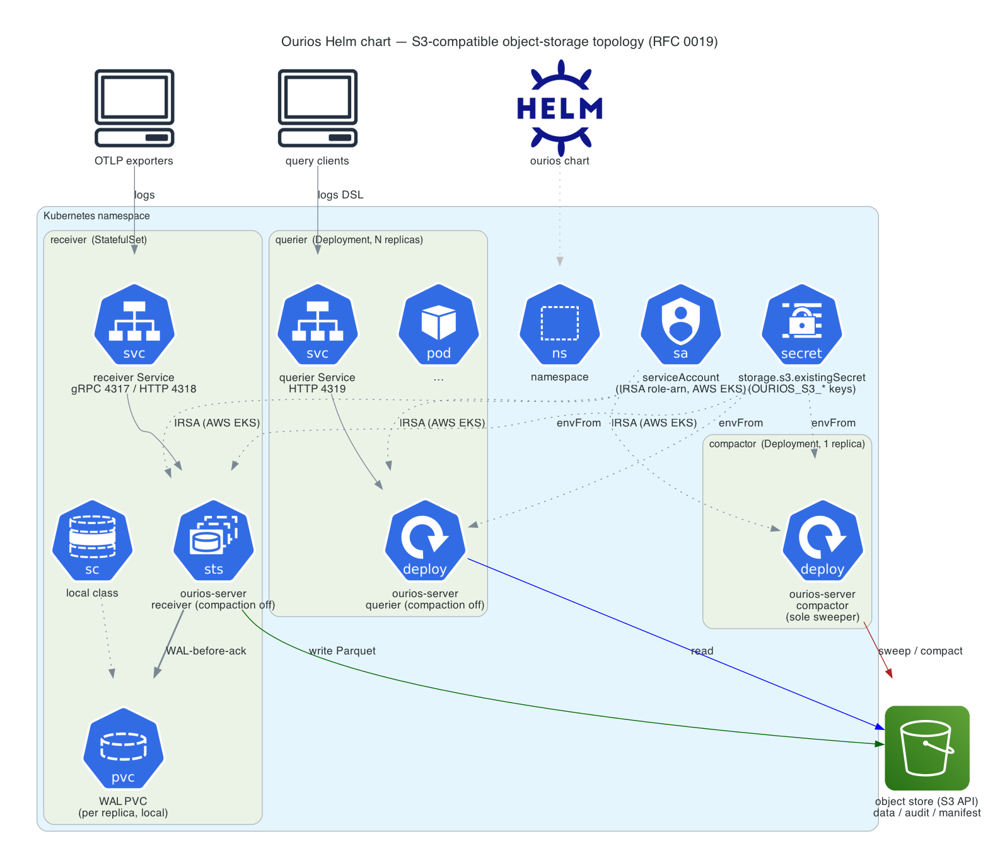

# Ourios Helm chart

Deploys [Ourios](https://github.com/jensholdgaard/ourios) — a log storage and
query backend on Apache Parquet, a Drain-derived template miner, and Apache
DataFusion — backed by **S3-compatible object storage** (RFC 0019).

"S3" here means the S3 API, **not AWS specifically**: the store works with AWS
S3 and any S3-compatible provider — MinIO, Cloudflare R2, Hetzner Object
Storage, Ceph/RADOS Gateway, Google Cloud Storage via its S3 interop endpoint,
and so on. Point `storage.s3.endpoint` at a non-AWS provider (see
[Credentials](#credentials)).

Ourios is one binary (`ourios-server`) running three roles. This chart deploys
them as three workloads sharing a data + audit store on object storage:

- **receiver** — OTLP log ingest, a **StatefulSet** with a per-replica
  write-ahead-log PVC;
- **querier** — the logs-DSL query API, a stateless **Deployment** that scales
  independently and reads the store (no PVC);
- **compactor** — the always-on background compactor, a singleton
  **Deployment**.

## Topology



Diagram source: [`docs/topology.py`](docs/topology.py) (mingrammer
[`diagrams`](https://diagrams.mingrammer.com/), k8s node set). Regenerate from
this chart directory with `python docs/topology.py` (or
`python deploy/helm/ourios/docs/topology.py` from the repo root; needs Graphviz +
`pip install diagrams`). A text fallback follows for terminal / `helm show readme`:

```
            OTLP                         query
              │                            │
   ┌──────────▼──────────┐     ┌───────────▼───────────┐
   │ receiver StatefulSet │     │  querier Deployment    │
   │  4317/gRPC 4318/HTTP │     │      4319/HTTP         │
   │  WAL PVC per replica │     │  stateless (N replicas)│
   └──────────┬──────────┘     └───────────┬───────────┘
              │  Parquet write              │  read
              └──────────────┬──────────────┘
                             ▼
                   ┌───────────────────┐        ┌──────────────────────┐
                   │  object store     │◀───────│ compactor Deployment  │
                   │  (S3 API)         │ sweep  │     (1 replica)       │
                   │ (data/audit/man.) │        │                      │
                   └───────────────────┘        └──────────────────────┘
```

Only the data/audit/manifest live on object storage. The **WAL is always a
local durable PVC, never object storage** (CLAUDE.md §3.4 WAL-before-ack / §3.6
object storage is the source of truth).

## Install

**S3 backend on AWS (production):**

```sh
helm install ourios deploy/helm/ourios \
  --set image.tag=<release> \
  --set storage.backend=s3 \
  --set storage.s3.bucket=my-ourios-bucket \
  --set storage.s3.region=us-east-1 \
  --set storage.s3.existingSecret=ourios-s3   # OR use IRSA (see below)
```

**S3-compatible backend (MinIO / R2 / Hetzner / Ceph / … — production):** the
same, plus `storage.s3.endpoint`:

```sh
helm install ourios deploy/helm/ourios \
  --set image.tag=<release> \
  --set storage.backend=s3 \
  --set storage.s3.bucket=my-ourios-bucket \
  --set storage.s3.endpoint=https://<provider-s3-endpoint> \
  --set storage.s3.region=auto \
  --set storage.s3.existingSecret=ourios-s3
```

The chart **fails to render** an `s3` backend with no `storage.s3.bucket`, so a
broken store can never install.

**Local backend (the default — single-node / dev only):**

```sh
helm install ourios deploy/helm/ourios        # storage.backend=local
```

`local` provisions one shared `ReadWriteOnce` PVC mounted by all three
workloads. That is coherent **only on a single node** (the pods must
co-schedule) **or with a `ReadWriteMany` StorageClass** — on a typical
multi-node RWO cluster some workloads will stay `Pending`. It is intended for
kick-the-tires / dev; **use `s3` in production**, where the workloads share the
store over object storage and scale independently.

Verify:

```sh
helm test ourios
```

> The image tag defaults to `latest` (no image is published for the
> pre-release `0.0.0` app version); pin a released tag via `image.tag` in
> production.

## Credentials

Credentials are **never** chart config as plaintext. Static credentials use the
**S3-named** keys Ourios reads (`OURIOS_S3_*`, RFC 0019 §3.4) — not AWS-specific;
they work against AWS S3 and every S3-compatible provider (MinIO, R2, Hetzner,
Ceph, …). Supply exactly one of:

1. **`storage.s3.existingSecret`** — the name of a `Secret` holding
   `OURIOS_S3_ACCESS_KEY_ID` and `OURIOS_S3_SECRET_ACCESS_KEY` (and optionally
   `OURIOS_S3_SESSION_TOKEN`). Injected via `envFrom`. Works for AWS S3 **and any
   S3-compatible provider**. Create it yourself:

   ```sh
   kubectl create secret generic ourios-s3 \
     --from-literal=OURIOS_S3_ACCESS_KEY_ID=... \
     --from-literal=OURIOS_S3_SECRET_ACCESS_KEY=...
   ```

2. **IRSA** (AWS EKS only) — leave `storage.s3.existingSecret` empty and set the
   role ARN on the service account (this path uses the AWS credential chain):

   ```sh
   --set serviceAccount.annotations."eks\.amazonaws\.com/role-arn"=arn:aws:iam::<acct>:role/<role>
   ```

   The pod assumes the role; no static keys exist anywhere. This mode is
   AWS-specific; on other providers use `storage.s3.existingSecret`. It requires
   `serviceAccount.create=true` (the default) so the chart renders the
   ServiceAccount and applies the annotation — the chart fails render if a
   role-arn is set with `serviceAccount.create=false`. To use an existing SA,
   annotate it out-of-band instead.

Setting **both** `storage.s3.existingSecret` and the IRSA `role-arn` annotation
**fails render** — the static keys would shadow the web-identity credentials, so
exactly one mode must be chosen.

For a **non-AWS provider**, also set `storage.s3.endpoint` to its S3 endpoint URL
(e.g. `http://minio:9000`, a Cloudflare R2 / Hetzner endpoint, …) and
`storage.s3.region` to the provider's region (or a placeholder like `us-east-1`
if it has none).

## Compactor topology

The `ourios-server` binary runs the compaction role by default. To avoid every
pod sweeping, the receiver and querier workloads set `OURIOS_COMPACTION_ENABLED=0`,
so a **single dedicated `compactor` Deployment (1 replica)** is the only sweeper.

Scaling that compactor `Deployment` past 1 replica is **safe but unnecessary**:
the manifest publish-CAS commit (RFC 0009 §3.2 / RFC0013.3–.4) makes concurrent
sweeps correct — a losing sweeper's consolidated file is just an orphan a later
sweep reclaims — but it duplicates the per-interval object listing for no gain.
A `replicas: 1` Deployment self-heals (k8s reschedules a dead pod; a brief gap
in this background maintenance is harmless), so leader election isn't needed and
is intentionally out of scope. Tune the cadence via `compactor.intervalSecs`.

## Key values

| Key | Default | Description |
| --- | --- | --- |
| `image.repository` | `ghcr.io/jensholdgaard/ourios` | Image repository. |
| `image.tag` | `""` (→ `latest`) | Image tag; pin a released tag in production. |
| `storage.backend` | `local` | `local` (single-node/dev) or `s3` (production — the S3 API, AWS or any S3-compatible provider). |
| `storage.s3.bucket` | `""` | **Required for s3** (`OURIOS_S3_BUCKET`); render fails if empty. |
| `storage.s3.endpoint` | `""` | S3-compatible endpoint URL — set for any non-AWS provider (MinIO/R2/Hetzner/Ceph/LocalStack); empty targets AWS. |
| `storage.s3.region` | `""` | Bucket region; drives both `OURIOS_S3_REGION` and `AWS_DEFAULT_REGION`. |
| `storage.s3.prefix` | `""` | Key prefix within the bucket. |
| `storage.s3.existingSecret` | `""` | Secret with the S3-named credential keys (`OURIOS_S3_ACCESS_KEY_ID`/`OURIOS_S3_SECRET_ACCESS_KEY`), injected via `envFrom`. Used by any S3-compatible provider. |
| `storage.local.bucketRoot` | `/var/lib/ourios/data` | Data dir for the local backend. |
| `storage.local.size` | `10Gi` | Local data PVC size. |
| `receiver.enabled` | `true` | OTLP ingest StatefulSet (gRPC `:4317` + HTTP `:4318`). |
| `receiver.replicas` | `1` | Receiver replicas (each gets its own WAL PVC). |
| `receiver.wal.size` | `2Gi` | WAL PVC size (`OURIOS_WAL_ROOT`, always local). |
| `receiver.wal.storageClassName` | `""` | WAL StorageClass (`""` = cluster default). |
| `querier.enabled` | `true` | Querier Deployment (HTTP `:4319`). |
| `querier.replicas` | `2` | Querier replicas (scales independently, no PVC). |
| `querier.defaultWindowSecs` | `3600` | Default look-back for a query with no `range(...)`. |
| `compactor.enabled` | `true` | Dedicated singleton compactor Deployment. Setting `false` **fails render** (the only sweeper — hazard #4). |
| `compactor.intervalSecs` | `300` | Compaction sweep cadence (used only by the dedicated compactor). |
| `serviceAccount.annotations` | `{}` | AWS EKS IRSA `eks.amazonaws.com/role-arn` goes here (alternative to `storage.s3.existingSecret`). |
| `otel.exporterEndpoint` | `""` | OTLP endpoint for Ourios's own self-telemetry. |
| `extraEnv` | `[]` | Extra env vars (e.g. `OTEL_*`). No plaintext creds. |

The image runs as nonroot (uid 65532) with a read-only root filesystem; the
chart sets `fsGroup` so the process can write the WAL PVC.

## Probes

The binary exposes no HTTP health route yet (the OTLP and query endpoints are
POST-only), so the chart uses **TCP socket probes** on the bound role ports
(receiver `:4318`, querier `:4319`). The compactor has no listening port and
no probe; it is supervised by the process. Swap these for HTTP probes once a
`/healthz` endpoint lands.
