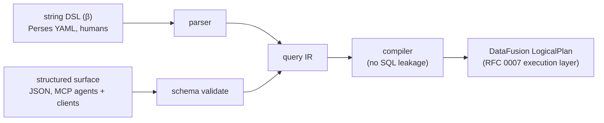

# RFC 0002 — Query DSL

> **Status note.** The prior decision (§3) is **resolved**: the predicate
> sublanguage takes **Branch B** (distance from OTTL), on the
> **β** (pipe-composable) top-level surface. Decided 2026-06-07 from the
> audience analysis in §3.6 (primary: Perses dashboard authors; future:
> MCP agents). This RFC is now `specified` — §6 gives the design, §7 the
> grammar, §5 the testable acceptance criteria. It advances to `red` →
> `green` as the parser/compiler lands (the RFC 0007 execution layer it
> targets is already implemented and tested — RFC 0007 §5), and to
> `accepted` after the §9 validation.
> Hazard 6 (`CLAUDE.md` §4.6 — no DataFusion/SQL leakage) constrains the
> whole design.

## 1. Summary

Ourios exposes a logs query DSL that does **not** leak DataFusion/SQL to
users (hazard `CLAUDE.md` §4.6). This RFC specifies it:

- **Predicate sublanguage — Branch B (distance from OTTL).** An
  Ourios-native, query-ergonomic syntax over the OTel *data model* (the
  ingest contract): bare top-level fields (`body`, `severity`,
  `trace_id`), `resource.` / `attr.` prefixes, bare-identifier severity
  (`severity >= error`), first-class template + OTel-canonical primitives.
- **Top-level surface — β (pipe-composable).** A predicate followed by
  pipe stages: `… | range(-1h, now) | count by template_id | sort count
  desc | limit 10`. Compact, single-line, and embeddable as a YAML scalar
  in Perses dashboards.
- **Two front-ends, one core.** The string DSL (for humans, esp. Perses
  YAML) and a **structured JSON surface** (for MCP agents + programmatic
  clients) parse to the same query IR and compile to the same DataFusion
  `LogicalPlan`. Agents emit JSON, not syntax.

The design rests on `ourios-querier` (RFC 0007), whose execution layer
(predicate pushdown, tenant isolation, `QueryStats`) is already
implemented and tested (RFC 0007 §5 criteria all live; the RFC itself
stays `specified` pending this DSL); this RFC adds the *user-facing
language* in front of it.

## 2. Motivation

### 2.1 Why a DSL at all?

`CLAUDE.md` §4.6 commits Ourios to a DSL that does not leak DataFusion SQL.
The reasons are **stability** (evolve the backend without breaking user
queries), **safety** (full SQL exposes cross-tenant joins, unbounded
scans, recursive CTEs we cannot audit), and **fit** (logs are a narrow
domain; a narrow DSL is more ergonomic than a general one). This is
branch-agnostic.

### 2.2 Why the prior decision mattered

"OTTL-inspired" was not a free decision. Borrowing OTTL syntax in a query
context promises OTTL-literate users that their mental model transfers; if
the syntax looks the same but behaves differently (OTTL mutates; a query
filters), the surface actively misleads. §3 records how that decision was
made.

## 3. The prior decision (resolved): distance from OTTL

Both positions were defensible; §3.1–3.4 keep the honest case for each for
the record. §3.5 records the resolution; §3.6 the reasoning.

### 3.1 The case for borrowing (Branch A) — not chosen

- **Positive transfer for Collector-literate SREs.** Engineers who write
  Collector/OTTL pipelines reuse that mental model at zero onboarding.
- **Reduces bikeshed surface.** A pinned external spec inherits decisions
  rather than re-litigating them.
- **Ecosystem alignment.** Diverging on surface syntax in the OTel orbit
  can read as gratuitous.
- **OTTL's path grammar is correct about the data model**, which any
  alternative must address anyway.

### 3.2 The case for distancing (Branch B) — chosen

- **The OTTL-literate population is a minority of OTLP users** — most emit
  logs via an SDK and never touch OTTL.
- **Collector ergonomics become query verbosity.**
  `resource.attributes["service.name"] == "api"` is loud in a query.
- **Shared syntax + different semantics misleads.** Unfamiliar syntax is a
  safer failure mode than almost-familiar-but-wrong.
- **No evolving external spec to track** (OTTL has had breaking changes).
- **Design freedom** for query-context idioms (`severity >= error`,
  `attr.foo`).

### 3.3 What is shared regardless of branch

- The OTel **data model** is the schema of log records (the ingest
  contract, not a design choice): attributes, resources, severity, body,
  timestamps, trace context.
- The **template + correctness primitives** (`template_id`, `confidence`,
  `lossy`; drift-alias membership via `resolves_to`) are first-class
  (§6.3).
- The **compilation target** is a DataFusion `LogicalPlan`, no SQL leakage
  (§6.5).

### 3.4 Consequences

| Dimension | Branch A (borrow) | Branch B (distance) |
|---|---|---|
| Onboarding for Collector-literate SREs | Near-zero | Mild (new syntax, familiar semantics) |
| Onboarding for SDK / dashboard users | Same (OTel data model) | Same |
| Maintenance cost | Track pinned OTTL, amend on bumps | Own the grammar |
| Same-syntax/different-meaning confusion | Real | Avoided |
| Spec size | Smaller | Larger (owned) |
| Ecosystem signalling | Aligned with OTel | Independent (in the data model: still aligned) |
| Design freedom | Constrained by OTTL | Free within the OTel data model |

### 3.5 Resolution

**Branch B (distance from OTTL), surface β (pipe-composable).** Decided
2026-06-07 by the maintainer, on the audience analysis in §3.6 in lieu of
the formal user research originally gated here (§9 now scopes that
research to the `accepted` gate, not `specified`).

### 3.6 Why — the two audiences

The decision turns on two audiences that re-weight §3.1–3.4:

1. **Primary — Perses dashboard authors (declarative YAML/CRDs).** Queries
   live as **string scalars in versioned YAML**. Brevity and low
   bracket/quote density win (readable scalars, clean diffs); the audience
   thinks in *dashboard* query languages (PromQL/LogQL), not OTTL. Branch
   B's flat syntax + the β pipe surface embed cleanly on one line; Branch A
   on surface α would be multi-line and bracket-heavy.
2. **Future — MCP agents.** Borrow-but-diverge (Branch A + the §6
   divergence list it required) is the **worst case for LLMs**: strong
   public-OTTL priors pull a model toward real-OTTL constructs we do not
   support → plausible-but-invalid queries. A small, self-owned grammar
   (Branch B) has no priors to fight, is cheaper to embed in an MCP tool
   schema, and is enforceable with grammar-constrained decoding. And —
   decisively — agents need not generate syntax at all: they target the
   **structured surface** (§6.4).

The one strong case for Branch A (onboarding + signalling for
Collector-literate SREs) lands on the audience that is *not* primary here,
while its costs (semantic-confusion in the overlap zone; an
externally-driven breaking cadence against long-lived dashboards + cached
agent schemas) land squarely on these two. Distancing on *surface syntax*
costs little ecosystem goodwill because we stay faithful to the OTel
**data model** (§3.3) and because bespoke query syntax is the norm (LogQL,
PromQL, CloudWatch Insights all diverge from any transformation language).

The full audience analysis is the drafting-assistance recommendation that
informed this decision; its three OTel-ecosystem questions (is there an
OTel *query* language to align with? is OTTL the expected *querying*
surface? Perses+OTel query conventions?) are folded into §9.

## 4. Design principles

1. **Familiarity beats cleverness.** A first-time reader understands a
   query within 30 seconds without a reference. No heavy sigils.
2. **No DataFusion/SQL leakage** (hazard `CLAUDE.md` §4.6). If explaining a surface
   form requires naming a DataFusion type, the form is wrong.
3. **Predicate, then pipeline.** A query is a *predicate* (the `where`)
   followed by ordered *stages* (range, aggregate, sort, limit, project).
   Each reads independently.
4. **Template + OTel-canonical fields are first-class vocabulary**, not
   pseudo-columns: `template_id`, `confidence`, `lossy` (drift-alias
   membership via `resolves_to`);
   `service`, `trace_id`, `span_id`, `scope` (the primary
   correlation/query dimensions per OTel maintainer guidance, §6.2).
5. **Every query has a time range** — explicit `range(...)` or a
   tenant-configurable default window. Never an unbounded scan.
6. **One core, two surfaces.** The string DSL and the structured surface
   are equivalent front-ends over one IR (§6.4); neither can express a
   query the other cannot.
7. **YAML-embeddable.** A query is expressible as a single-line scalar
   that survives a YAML round-trip — a first-class constraint for the
   Perses audience, not an afterthought.
8. **The grammar is owned and versioned by this RFC** (§7), not "inspired
   by" anything. Compatibility pledges are written, not implied.

## 5. Acceptance criteria

> `Given/When/Then`, ids greppable from tests (`RFC0002.<n>`, referenced
> verbatim in each test's leading doc comment). These specify the
> parser + compiler that front-ends the (already-implemented, RFC 0007 §5)
> execution layer.

- **RFC0002.1 — A Branch-B predicate parses and compiles to a filter `[CLAUDE.md §4.6]`**
  - **Given** a Branch-B predicate (e.g. `template_id == 42 and severity >= error`)
  - **When** it is parsed and compiled
  - **Then** it yields the query IR and a DataFusion `Filter`. Predicates
    over RFC 0007 §4.3's pushdown keys prune the scan per that section's
    split — `template_id` skips row groups (B1), `time_unix_nano` prunes
    partitions and row groups, `tenant_id` prunes partition directories
    (not row groups); for the subset the current `ourios_querier`
    structured request can express (template + time) the DSL result is
    identical to it. Severity compiles via the §6.2/RFC0002.5
    `severity_number` mapping (the column is RFC 0005's `severity_number`),
    not the `severity_text` equality the current request supports, and
    predicates
    over non-indexed fields (`service`, `attr.*`) compile to a correct
    `Filter` with no row-group-pruning claim (indexed `service.name`
    pushdown would be a future RFC 0005 §3.6 amendment).

- **RFC0002.2 — String DSL and structured surface compile to the same plan `[§6.4]`**
  - **Given** a query expressed both as a β string and as the structured
    JSON surface
  - **When** both are compiled
  - **Then** they produce the *same* query IR (and hence the same
    `LogicalPlan`) — the one-core/two-surfaces invariant.

- **RFC0002.3 — No DataFusion/arrow/SQL leakage `[CLAUDE.md §4.6]`**
  - **Given** the public DSL API (parse, compile, error types)
  - **When** a query parses, compiles, or fails
  - **Then** no `datafusion`/`arrow`/SQL type or message appears in any
    public signature or error string (compile- and string-level boundary
    test, mirroring RFC0007.3).

- **RFC0002.4 — A query without an explicit range gets the tenant default window `[§4 P5]`**
  - **Given** a query with no `range(...)` stage
  - **When** it is compiled in a tenant context with a default window W
  - **Then** the plan carries a time-column filter equal to W — never an
    unbounded scan.

- **RFC0002.5 — Bare-identifier severity maps to its SeverityNumber `[§6.1]`**
  - **Given** `severity >= error` (and `warn`, `info`, `debug`, `trace`,
    `fatal`)
  - **When** compiled
  - **Then** each maps, case-insensitively, to the §6.1 `SeverityNumber`
    for that level (`error` → 17, etc.) and compiles identically to the
    numeric form (`severity >= 17`). The name→number mapping is the
    documented §6.1 one (Ourios's, aligned with the OTel ranges) — not an
    OTel-standardised threshold.

- **RFC0002.6 — First-class OTel-canonical fields resolve correctly `[§6.2]`**
  - **Given** `service`, `trace_id`, `span_id`, `scope` used as bare
    fields
  - **When** compiled
  - **Then** each resolves to the RFC 0001 §6.1 column / resource-attribute
    it names (`service` → `resource["service.name"]`), with no
    string-flattening required of the user.

- **RFC0002.7 — Parse/serialise round-trip is idempotent**
  - **Given** any well-formed query (property-generated)
  - **When** parsed → serialised → parsed
  - **Then** the second parse equals the first (AST idempotence).

- **RFC0002.8 — A malformed query yields a specific, leak-free error**
  - **Given** a syntactically or semantically invalid query
  - **When** parsed/compiled
  - **Then** it returns a specific error citing the offending
    token/clause and the §7 grammar — never a panic, never a DataFusion
    message.

- **RFC0002.9 — Template primitives compile `[§6.3]`**
  - **Given** `template_id == 42`, `resolves_to(42)`, `lossy == true`,
    `confidence < 0.7`
  - **When** compiled
  - **Then** each compiles to the documented plan (`resolves_to` expands
    to the alias-set membership of RFC 0001 §6.7), without leaking the
    underlying representation.

- **RFC0002.10 — A query is a YAML-safe single-line scalar `[§4 P7]`**
  - **Given** the canonical serialisation of any well-formed query
  - **When** embedded as a YAML scalar and round-tripped through a YAML
    parser
  - **Then** the recovered string parses to the same query (the Perses-
    embedding guarantee).

- **RFC0002.11 — The structured surface validates against its published schema `[§6.4]`**
  - **Given** the structured (MCP) query surface
  - **When** a request is validated against the published JSON schema
  - **Then** well-formed requests pass and compile; malformed ones are
    rejected by the schema before reaching the planner.

## 6. Design

### 6.1 Predicate sublanguage (Branch B)

A predicate is a boolean expression over **paths**, **operators**, and
**literals** against the OTel log data model.

**Paths.**

- **Top-level fields** are bare identifiers mapping to the OTel log
  data-model fields: `body` (Body — an OTel `AnyValue`: string, bool, int,
  double, bytes, array, or kvlist/map), `severity` (SeverityNumber), `ts`
  (Timestamp), `observed_ts`
  (ObservedTimestamp), `trace_id` (TraceId), `span_id` (SpanId), `scope`
  (InstrumentationScope name), `flags` (TraceFlags). (Backend treatment of
  structured `body` vs `attr.*` is not uniform across the ecosystem; the
  DSL keeps the split explicit rather than flattening.)
- **Resource attributes**: `resource.<key>` where `<key>` is the OTel
  attribute key taken literally including dots (`resource.service.name` →
  resource attribute `"service.name"`). Bracketed form
  `resource["k8s.pod.name"]` for keys with characters outside the
  bare-identifier set.
- **Log-record attributes**: `attr.<key>` (`attr.http.status_code` →
  attribute `"http.status_code"`); bracketed `attr["k"]` when needed.
- **Severity**: `severity` compares against a **bare severity name**
  (`severity >= error`), case-insensitive, or a **numeric** form
  (`severity >= 17`). All severity comparisons — **including ordering**
  (`<`/`<=`/`>`/`>=`) — are defined on the OTel **`SeverityNumber`**,
  **never** on the free-form `severity_text` (per the OTel *comparing
  severity* guidance). Bare names map to the **floor of the matching OTel
  `SeverityNumber` range**: `trace`→1, `debug`→5, `info`→9, `warn`→13,
  `error`→17, `fatal`→21. The spec standardises the *ranges* and says to
  compare on `SeverityNumber`; this name→number mapping is **Ourios's**,
  aligned with those ranges, not separately mandated by OTel.

**Operators.** Comparison: `==`, `!=`, `<`, `<=`, `>`, `>=`, `=~`
(regex match), `!~` (regex non-match). Boolean: `and`, `or`, `not`, with
terse aliases `&&`, `||`, `!`; grouping with `()`.

**Literals.** Double-quoted strings (`"api"`), numbers (`500`, `0.7`),
booleans (`true`/`false`), `null`, duration literals (`30s`, `1h`, `1d`,
`1w`), and RFC 3339 timestamps.

**Functions** (read-only, bespoke names tuned for queries) — boolean
predicate terms: `matches(path, regex)`, `contains(path, s)`,
`starts_with(path, s)`, `ends_with(path, s)`. (Scalar-returning functions
such as `len(path)` are **deferred**: the grammar admits a call only as a
boolean term, so a numeric `len(...) > n` would need a scalar-comparison
form — added under a future minor version when a need surfaces.)

**Worked predicate.**

```text
service == "api" and severity >= error and attr.http.status_code == 500
```

### 6.2 First-class OTel-canonical fields

Per OpenTelemetry maintainer guidance (the primary dimensions a log
backend is judged on), these get **named, bare** surface rather than
hand-written attribute lookups, resolving the last open question of the
prior draft:

| Surface | Resolves to (RFC 0001 §6.1) |
|---|---|
| `service` | `resource["service.name"]` |
| `trace_id`, `span_id` | the dedicated columns (log↔trace correlation) |
| `scope` | `scope_name` |
| `severity` | `severity_number` (via the §6.1 mapping) |
| `ts` | `time_unix_nano` (the event timestamp; what `range(...)` filters) |
| `observed_ts` | `observed_time_unix_nano` |

`trace_id` / `span_id` literals are **hex strings** (32 and 16 hex digits
respectively, no separators), **parsed case-insensitively** so uppercase
OTLP/JSON ids are accepted; the canonical/serialised form is lowercase.
The compiler hex-decodes them to match the stored byte columns — the
OTLP/JSON id convention, consistent with RFC0003.6.

### 6.3 Template + correctness primitives

First-class vocabulary — **Ourios-specific** extensions (RFC 0001
§6.3/§6.7), **not** OpenTelemetry log-data-model fields; they live in the
Ourios schema + query layer alongside the OTel-canonical fields of §6.2:

- `template_id == 42` — exact template; resolves to the `template_id` column.
- `resolves_to(42)` — `X` plus its drift aliases (the RFC 0001 §6.7 drift
  question); compiles to alias-set membership over `template_id`.
- `confidence` — miner confidence (e.g. `< 0.7`); the `confidence` column.
- `lossy` — the lossy-reconstruction flag; resolves to the RFC 0001 /
  RFC 0005 **`lossy_flag`** column (`lossy == true`).
- `render` (pipe stage, §6.5) reconstructs the original line, honouring
  `lossy`.

The drift *question* is answered by `resolves_to` (alias membership). A
bare `drift` predicate ("has this template drifted?") is **deferred**:
per RFC 0001 §6.7 drift is an audit-stream property, not a column in the
RFC 0005 data files, so it needs an audit-stream query path — a future
capability, not a row predicate in this grammar.

### 6.4 Two front-ends, one core



- **String DSL (surface β)** is the human surface (esp. Perses YAML). A
  query is a predicate optionally followed by `|`-separated stages:

  ```text
  service == "api" and severity >= error
    | range(-1h, now)
    | count by template_id
    | sort count desc
    | limit 10
  ```

  Stages: `range(from, to)` (relative durations or RFC 3339; defaults per
  §4 P5), `count [by <field, …>]` (comma-separated, per the §7
  `field_list`) and other aggregations (`sum`, `min`,
  `max`, `avg` over a path), `sort <field-or-aggregate> [asc|desc]`
  (the §7 `sort_key` — a field or an aggregate output like `count`),
  `limit <n>`,
  `project <field, …>` / `render`. The whole query is expressible on one
  line (the `|` newlines above are cosmetic) — the §4 P7 YAML constraint.

- **Structured surface** is the machine contract (MCP tool schema +
  programmatic clients): a top-level object
  `{ "predicate": <node>, "stages": [ <stage>, … ] }` (`stages` optional,
  default `[]`). A **`<node>`** is a leaf **comparison node**
  `{ "field": …, "op": …, "value": … }`, a **call node**
  `{ "call": "<fn>", "args": [ … ] }` (the §6.1 functions + `resolves_to`,
  matching the §7 `fn_name` set), or a **boolean node**
  (`{ "and": [ <node>, … ] }` / `{ "or": [ <node>, … ] }` with a child
  array; `{ "not": <node> }` **unary**, per §7). Each **`<stage>`** is a
  tagged object mirroring a pipe stage
  (`range`/`count`/`sort`/`limit`/`project`).
  Its **JSON Schema is published and versioned with the parser** (snapshot-
  tested like the §7 grammar; RFC0002.11), and it compiles to the same IR
  as the string surface (RFC0002.2). It is the formalised, extended
  successor to the existing `ourios_querier::QueryRequest` (the RFC 0007
  structured API) and is the stable surface agents target — no grammar
  generation required.

Both parse/validate to the **same query IR** and compile identically
(RFC0002.2). The tenant is **not** expressed in either surface — it is
supplied by the executing context (`CLAUDE.md` §3.7 multi-tenancy;
enforced per RFC0007.5); a query
without a tenant is an API usage error, not a cross-tenant scan.

### 6.5 Compilation target

Every construct compiles to a DataFusion `LogicalPlan`:

| DSL construct | DataFusion logical node |
|---|---|
| implicit `from logs` | `TableScan` on the tenant's log table |
| predicate / `range` | `Filter` (range → time-column predicate) |
| `count` / aggregations | `Aggregate` |
| `sort` | `Sort` |
| `limit` | `Limit` |
| `project` | `Projection` |
| `render` | custom projection honouring the three-zone reconstruction model |
| `resolves_to(42)` | custom node expanding to alias-set membership |

All but `render` and `resolves_to` are DataFusion's built-in algebra;
those two are the only Ourios extensions, both surface-independent.

### 6.6 Stability and versioning

The grammar (§7) is owned and versioned by this RFC. Additions (new
functions, new first-class fields) are minor versions. Behavioural changes
that could alter a query's result set are major versions, require an
amending RFC + a deprecation window, and — because the Perses/MCP
audiences persist queries (git-versioned dashboards, cached agent schemas)
— ship with a documented migration. There is no external spec to shadow,
so major versions are deliberate, not inherited.

## 7. Grammar specification (owned by this RFC)

A compact EBNF; the canonical machine-readable grammar lives beside the
parser and is snapshot-tested (§8). Kept small and regular so it doubles
as a constrained-decoding grammar for the MCP surface (§3.6).

```ebnf
query        = predicate , { "|" , stage } ;
predicate    = or_expr ;
or_expr      = and_expr , { ("or" | "||") , and_expr } ;
and_expr     = unary , { ("and" | "&&") , unary } ;
unary        = [ "not" | "!" ] , ( comparison | call | "(" , predicate , ")" ) ;
comparison   = severity_cmp | scalar_cmp ;
severity_cmp = "severity" , cmp_op , ( severity_name | number ) ;
scalar_cmp   = scalar_path , cmp_op , literal ;
cmp_op       = "==" | "!=" | "<" | "<=" | ">" | ">=" | "=~" | "!~" ;
call         = fn_name , "(" , [ arg , { "," , arg } ] , ")" ;
fn_name      = "matches" | "contains" | "starts_with" | "ends_with"
             | "resolves_to" ;
arg          = path | literal ;
path         = field | "resource" , key_tail | "attr" , key_tail ;
scalar_path  = nonsev_field | "resource" , key_tail | "attr" , key_tail ;
field        = nonsev_field | "severity" ;
nonsev_field = "body" | "ts" | "observed_ts" | "trace_id" | "span_id"
             | "scope" | "flags" | "service" | "template_id"
             | "confidence" | "lossy" ;
key_tail     = ( "." , dotted_key ) | ( "[" , string , "]" ) ;
dotted_key   = ident , { "." , ident } ;
stage        = "range" , "(" , time , "," , time , ")"
             | "count" , [ "by" , field_list ]
             | agg_fn , "(" , path , ")" , [ "by" , field_list ]
             | "sort" , sort_key , [ "asc" | "desc" ]
             | "limit" , integer
             | "project" , field_list
             | "render" ;
agg_fn       = "sum" | "min" | "max" | "avg" ;
field_list   = field , { "," , field } ;
sort_key     = field | ident ;          (* ident = an aggregate output, e.g. count *)
literal      = string | number | boolean | "null" | duration | timestamp ;
severity_name = "trace" | "debug" | "info" | "warn" | "error" | "fatal" ;  (* case-insensitive; only as a `severity` RHS *)
time         = "now" | ( [ "-" ] , duration ) | timestamp ;   (* e.g. now , -1h *)
integer      = digit , { digit } ;
(* lexical: ident = letter , { letter | digit | "_" } ;
   string = '"' , { char | escape } , '"' ;
   char   = any Unicode scalar except '"' , '\' , or a line terminator
            (a literal newline must be written as the \n escape — queries
            are single-line, §4 P7 / RFC0002.10) ;
   escape = '\' , ( '"' | '\' | "n" | "t" | "r" | ( "u" , 4 * hex ) ) ;
   number = integer | float ;  float = integer , "." , digit , { digit } ;
   boolean = "true" | "false" ;
   duration = integer , ( "s"|"m"|"h"|"d"|"w" ) ;  timestamp = RFC 3339 ;
   hex = digit | "a".."f" | "A".."F"
   — strings are double-quoted with backslash escapes; YAML embedding
   (RFC0002.10) wraps the whole query in a single-quoted YAML scalar so
   these double quotes need no YAML-level escaping *)
```

## 8. Testing strategy

Mapping to `CLAUDE.md` §6.2 and `docs/verification.md` §3 (red→green
two-loop: `#[ignore]`'d stubs first, implementations second).

- **Unit tests** — every grammar production has a positive and negative
  parse test.
- **Property tests** — generate well-formed queries; assert the §5
  round-trip idempotence (RFC0002.7) and that every generated query is a
  YAML-safe single-line scalar (RFC0002.10).
- **Compilation golden tests** — every construct has a golden `LogicalPlan`
  (debug-rendered) checked in; the no-leakage boundary (RFC0002.3) is a
  compile + string test.
- **Equivalence tests** — string vs structured surface compile to the
  same IR (RFC0002.2); a DSL query and the equivalent `ourios_querier`
  structured request return identical results + `QueryStats` (RFC0002.1).
- **Grammar snapshot** — the EBNF / parser grammar is committed and
  snapshot-tested so changes are PR-visible (Branch B owns its grammar).
- **End-to-end** — against the `docs/benchmarks.md` §1 corpora, pinned
  expected results for a query set spanning each construct.

## 9. Open questions

*Narrowed by the §3 resolution. Must be resolved before `accepted`.*

- [ ] **Pre-`accepted` validation.** The §3.6 audience analysis stands in
      for instinct, not for evidence: before `accepted`, run a readability
      pass on 10–20 sample queries with non-author reviewers, and a
      migration sketch from LogQL/Insights into β. (Replaces the prior
      §9 user-research gate; not required for `specified`.)
- [x] ~~**OTel ecosystem alignment**~~ *Resolved:* OpenTelemetry defines
      the logs data model + API/SDK but **no standard query/read
      language**, and **OTTL is a Collector *transformation* language, not
      a querying surface** (OTTL README and the OTel logs spec, §11). There
      is no canonical OTel read syntax, and no Perses-specific query
      convention, to align to. Bespoke query syntax over the OTel data
      model is the norm (LogQL, PromQL, CloudWatch Insights), so Branch B
      carries no ecosystem-divergence cost — the alignment that matters is
      at the **field semantics**, which §6.1/§6.2 honour
      (`ts`/`observed_ts`/`trace_id`/`span_id`/`flags`/`body`/`scope`/
      `severity` → canonical data-model fields; `severity` ordering on
      `SeverityNumber`).
- [ ] `--sql` advanced-mode escape hatch — gated + sandboxed, or never?
      (Currently: never; reconsider under a separate RFC.)
- [ ] Custom user functions — out for v1 (sandboxing is its own project).
- [ ] `params[N]` positional access vs named parameters via the template
      schema.
- [ ] In-path query cost estimator ("this will scan 400 GB") before run.
- [ ] Pagination / streaming surface for large result sets (mirrors
      RFC 0007 §8).

Resolved by this RFC (were open in the draft): branch (B), top-level
surface (β), severity-text casing (case-insensitive, §6.1), agent-
friendliness (the structured surface, §6.4), and first-class OTel-
canonical fields (§6.2).

## 10. Alternatives considered

Alternatives that would replace the whole design, not just one branch.

- **Pure SQL (DataFusion dialect)** — zero parser cost, but violates
  hazard `CLAUDE.md` §4.6 (cross-tenant joins, unbounded scans) and binds the user
  surface to DataFusion. Rejected as default; possible future gated,
  sandboxed escape hatch under a separate RFC.
- **LogQL clone** — label selectors are less expressive than the OTel log
  record; adopting them flattens structure and lies about the ingest
  contract. Rejected as the full DSL; its top-level shape survives as the
  chosen β surface.
- **CloudWatch Insights clone** — proprietary, no open spec; attribute
  model differs from OTel. Rejected; its verb-per-line readability is the
  γ alternative we did not pick.
- **Branch A (borrow OTTL) on any surface** — see §3; not chosen for the
  Perses/MCP audiences.

## 11. References

- OpenTelemetry log data model:
  https://opentelemetry.io/docs/specs/otel/logs/data-model/
- OpenTelemetry severity text conventions:
  https://opentelemetry.io/docs/specs/otel/logs/data-model/#field-severitytext
- OTTL (reference-only under Branch B):
  https://github.com/open-telemetry/opentelemetry-collector-contrib/tree/main/pkg/ottl
- LogQL: https://grafana.com/docs/loki/latest/query/
- CloudWatch Logs Insights:
  https://docs.aws.amazon.com/AmazonCloudWatch/latest/logs/CWL_QuerySyntax.html
- Perses (CNCF dashboards-as-code): https://perses.dev/
- Apache DataFusion logical-plan documentation.
- RFC 0001 §6.1/§6.3/§6.7 (the columns + template/drift primitives);
  RFC 0007 (the execution layer this DSL targets); `CLAUDE.md` §4.6
  (no-leakage hazard) and `CLAUDE.md` §3.7 (multi-tenancy).

