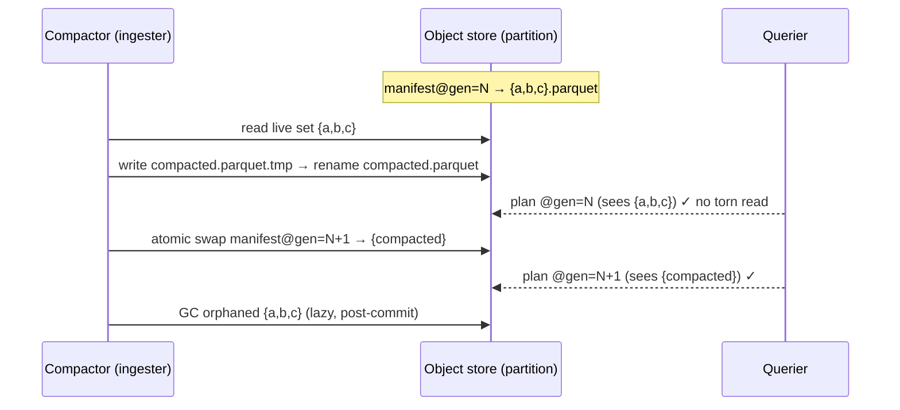

# RFC 0009 — Background compaction: small-file consolidation

> **Status note.** **`validated`** (2026-06-15) — the RFC0009.7 D2/D3/B2-post
> benches were measured authoritatively on `baseline-8vcpu-32gib`
> (`benchmarks.md` §9.7, git `4d52288`): **D3** PASS (a band-scale compaction
> output lands at 456.7 MiB, IN the 256 MiB–2 GiB H4 band, 0% under 128 MiB);
> **D2** compaction throughput 166.8 MiB/s single-partition (≫ any
> per-partition seal rate → backlog drains); **B2-post** query latency
> 12.78 ms → 2.10 ms (≈6.1×) as 32 files / row groups collapse to 1. The
> sustained-ingest soak (D2's literal one-hour window at D1's rate) and D1
> itself remain unrun — the throughput is the RFC0009.7 D2 measure, not that
> soak. Before that, **`green`** (2026-06-15) — every RFC0009 §5 acceptance
> criterion has a live, passing test: **.1** small-file count collapses
> (`rfc0009_1_*`), **.2** row conservation (`compaction_conserves_every_row`
> proptest), **.3** atomic publish / no torn read (`atomic_publish_…` +
> the `ourios-querier` `rfc0009_3_*` manifest tests), **.4** crash safety
> (`rfc0009_4_*` — `gc_orphans` reclaims orphans, reads stay at a clean
> generation), **.5** tenant/partition isolation (`rfc0009_5_*` — a
> mis-partitioned input aborts on the §3.9 row-vs-path check), **.6**
> union-schema merge across an amendment (`rfc0009_6_*`). The atomic-publish
> protocol (§3.4) is the per-partition manifest + atomic generation swap;
> the querier resolves live files reader-first (glob-fallback when absent);
> the runner lives in `ourios-ingester` (`run_sweep`/`Compactor`) with the
> §3.6 OTel metrics + audit event.
>
> **RFC0009.7 — measured.** The D2/D3 `criterion` benches (compaction
> throughput, small-file size band) + the post-compaction B2 re-run live in
> `ourios-bench`'s `compaction` bench — CI-indicative via
> `compaction-bench.yml`, authoritative on `baseline-8vcpu-32gib` in §9.7.
> Its *structural* half (file count falls under compaction, every row
> conserved) is also pinned deterministically by RFC0009.1 /
> `compaction_conserves_every_row`.
>
> **Open follow-ups (§7, post-`validated`):** the full D2 sustained-ingest
> soak (backlog-returns-to-zero in a one-hour window at D1's rate) + a
> measured D1; late-arriving data re-flagging an already-compacted partition
> (the manifest is authoritative, so a new write into such a partition must
> be picked up by the candidate scan / folded into the manifest — confirm
> `plan_candidates` covers it); the S3 atomic-swap primitive + single-writer
> lease for object storage (local FS uses `rename`); and the RFC 0004 cadence
> defaults.

## 1. Summary

Ourios's writers land many small Parquet files per tenant per hour
(one per writer flush / time-rotated partition; `docs/hazards.md`
H4). This RFC introduces a **background, per-tenant, per-partition
compaction** pass that consolidates the small `*.parquet` files of a
*sealed* partition into one (or few) files inside the RFC 0005 §3.5
size targets, **without changing a single stored row** and **without
any query ever seeing a row twice or missing one**. Compaction reuses
the existing `ourios-parquet` `Reader`/`Writer` and the atomic-publish
convention (write to `*.parquet.tmp`, commit by rename); the live set
of a partition is named by a small per-partition **manifest** so the
commit is a single atomic object swap. It is the mitigation for
hazard H4 and the lever the RFC 0007 §6 / PR #92 B2 bench identified:
query latency there is dominated by *per-file footer reads*, not data
scanning, so fewer/larger files is the next query-latency win.

## 2. Motivation

### 2.1 The small-file problem is now measured, not theoretical

`docs/hazards.md` H4 predicted it; the B2 latency bench
(`crates/ourios-bench/benches/b2.rs`, RFC 0007 §6, landed in PR #92)
measured it. With result size held constant while the corpus grows
1×/10×/50×, query latency grew **sub-linearly but not flat** (~0.95 ms
→ ~1.55 ms → ~4.36 ms). The structural B2 test
(`rfc0007_2_template_exact_work_scales_with_result_not_corpus`) proves
the *scanned* row groups and bytes stay flat; the residual wall-clock
growth is per-file footer/metadata reads, because file count scales
with corpus. Compaction is the direct lever on that residual: collapse
N small files' N footer reads into one.

### 2.2 RFC 0005 explicitly deferred it here

RFC 0005 §3.5 says the writer's job is to "land at the bottom of [the
file-size] range or below on its own … compaction is deferred," and
§4.5 parks background compaction as "a post-MVP RFC." Two writer
behaviours guarantee small files even at steady state and so *require*
a sweeper: (a) **time-rotated partitions** — an hour partition that
receives a trickle of late or low-volume traffic produces a sub-128
MiB file; (b) **end-of-day audit files** (RFC 0005 §3.4) are
inherently small. H4's detection threshold ("fewer than 5 % of files
below 128 MiB at steady state") cannot be met by writer sizing alone.

### 2.3 Why at this layer

Compaction is a **write-path / storage** concern, not a query-path
one: the querier (RFC 0007, hazard §4.6) must stay a pure reader, and
the WAL→Parquet flush sizing (RFC 0005/0008) is a separate mechanism
(it sizes files *as they are first written*; this RFC re-consolidates
files *already published*). Doing it as a background pass keeps it off
the ack-latency hot path (WAL-before-ack, `CLAUDE.md` §3.4 is
untouched).

## 3. Proposed design

### 3.1 Scope

**In scope.** Background consolidation of the published, committed
`*.parquet` data files of a single sealed partition
(`data/tenant_id=<enc>/year=YYYY/month=MM/day=DD/hour=HH/`, the
RFC 0005 §3.4 Hive layout) into one or a few files meeting RFC 0005
§3.5 size targets, preserving every stored row exactly. The same mechanism applies to the audit-event series
(`audit/…`, day-granular).

**Out of scope.** WAL→Parquet flush sizing (RFC 0005/0008);
retention/expiry/TTL (no compaction-driven deletion of *data* — only
of inputs it has just rewritten); cross-partition or cross-tenant
merges; re-mining or re-templating (compaction copies rows, it does
not touch the miner); query-side caching.

### 3.2 Where it runs

A background task hosted in the **ingester** role (it already owns the
write path, the bucket credentials, and per-tenant context), with its
own bounded concurrency knob so it never starves ingest. The
compaction logic itself is a new `compaction` **module in
`ourios-parquet`** (it is Parquet-file manipulation — read many via
`Reader`, write one via `Writer`); no new crate. Driving it from a
dedicated `compactor` role is a deployment-scaling evolution captured
in §4, not an MVP requirement.

### 3.3 What is eligible: sealed partitions

Compaction only ever touches a **sealed** partition — one no longer
receiving writes — so it never races an active writer for the same
input set. A data partition (`…/hour=HH/`) is sealed once wall-clock
time passes the end of its hour plus a `compaction_grace` margin
(default 15 min, tunable per RFC 0004) that absorbs late-arriving
records. A sealed partition is a **candidate** when it has more than
`compaction_min_files` files (default 4) **or** holds files below
128 MiB. This is a **partition-local trigger heuristic** — distinct
from H4's *tenant-level* detection metric (the per-tenant file-size
histogram / "fewer than 5 % of files below 128 MiB at steady
state", §3.6), which is the cluster signal compaction's job is to
keep satisfied. Late data that
arrives after a partition is compacted lands as a new small file and
re-flags the partition as a candidate — compaction is idempotent and
re-runnable (§3.5).

### 3.4 The atomic-publish protocol — per-partition manifest

A query (RFC 0007) plans over a partition by enumerating its committed
`*.parquet` files. If compaction publishes the consolidated file
*before* deleting its inputs, a concurrent query double-counts; if it
deletes inputs first, a query misses rows. Object storage (the source
of truth, `CLAUDE.md` §3.6) offers no atomic multi-object operation,
so a glob-the-directory reader **cannot** be made correct under
compaction.

**The commit mechanism is a per-partition manifest.** Each partition
carries a small `manifest.json` naming the **live set** of data files
(UUIDv7 names) plus a monotonically increasing generation number. The
read path (RFC 0007) resolves a partition's files through the
manifest, not a raw glob; absence of a manifest means "glob all
`*.parquet`" — so pre-compaction partitions and the current querier
keep working, and the reader gains manifest support *before* any
compactor writes one (the reader-first sequencing in §7). Compaction:

1. reads the live set, writes the consolidated `*.parquet.tmp`;
2. `rename`s it to its committed `*.parquet` name (still not
   referenced by any manifest, so invisible to queries);
3. writes `manifest.json.tmp` naming *only* the new file at
   `generation + 1`, and **atomically swaps** it into place (single-
   object rename / conditional put) — this is the commit point;
4. lazily deletes the now-orphaned input files (a crash here leaves
   harmless orphans that a GC sweep reclaims; correctness already
   committed at step 3).

A query reads a consistent generation: either the pre-compaction set
or the post-compaction set, never a mix (RFC0009.3). This is the
Iceberg/Delta "atomic metadata swap" idea reduced to one flat file per
partition — deliberately *not* a full table format; the generation-
subdirectory and glob-the-directory-reader alternatives were weighed
and rejected in §4.



This protocol is an interaction with **RFC 0007** (the querier must
read through the manifest) and a small extension to **RFC 0005** (the
manifest is a new per-partition artifact — additive, optional,
back-compatible). Both are recorded as resolved decisions in §7.

### 3.5 Correctness, idempotency, crash safety

- **Row conservation.** Compaction preserves every **row value**
  exactly — including the raw `body` bytes — but does *not* promise
  byte-identical Parquet files: the physical encoding may differ
  (row groups re-packed to the §3.5 sizes, compression re-applied,
  rows possibly reordered within the partition). The logical
  guarantees hold: same RFC 0005 schema, same partition ⇒ row-vs-
  path validation §3.9 still holds; bit-identical *body*
  reconstruction §3.3 is preserved because rows are copied, never
  re-mined. Total row count and per-`template_id` counts are
  invariant across a compaction (RFC0009.2).
- **Idempotency.** Re-running compaction on a partition with a single
  already-large file is a no-op (not a candidate per §3.3).
- **Crash safety.** The only commit point is the atomic manifest swap
  (step 3). A crash before it leaves the prior generation
  authoritative — no acknowledged data lost (mirrors the WAL
  crash-recovery discipline, `CLAUDE.md` §3.4). Temp files and
  post-commit orphans are reclaimed by an idempotent GC sweep.
- **Heterogeneous input schemas.** Inputs spanning a schema amendment
  (some files with an added OPTIONAL column) merge to the union schema
  and stay readable per RFC 0005 §3.9 (the same forward-compatible
  read RFC0007.4 already tests).

### 3.6 Audit + observability

#### Audit event

Every committed compaction emits an **audit event** to the RFC 0005
§3.7 audit stream — the "nothing happens silently to stored data"
stance applied to file lifecycle (`CLAUDE.md` §3.1), the same way a
template merge is audited. The event records the partition, the input
file set, the consolidated output file, the row count (which must be
conserved, RFC0009.2), and the committed manifest generation.

> **Open question (§7):** the existing audit schema (RFC 0005 §3.7) is
> shaped for *template* events — `event_kind` is a bounded ordinal
> mapping with no compaction member, and the template-specific columns
> (`old_template`, `positions_widened`, …) are **non-nullable**. A
> compaction event can reuse the common envelope (`tenant_id`,
> `timestamp`, `event_kind` / `event_type`, `reason`) but (a) needs a
> new `compaction` member in the `event_kind` mapping and (b) has no
> applicable value for the non-nullable template columns, nor a place
> for the file set / generation. This is an implementation detail to
> settle when the compaction audit-emit code lands — not a design
> blocker, so it does not gate `red` (tracked in §7). The two routes:
>
> - **structured `reason`** — carry the file set / generation as a
>   structured `reason` payload. Avoids new columns, but still needs
>   the `event_kind` member *and* forces placeholder values into the
>   non-nullable template columns (or making them nullable, which is
>   itself a schema change), so "no schema change" is not quite free.
> - **additive OPTIONAL columns** — add OPTIONAL compaction columns
>   and relax the template columns to OPTIONAL (an RFC 0005 §3.8
>   additive, back-compatible amendment); old readers ignore unknown
>   columns per RFC 0005 §3.9.
>
> The non-nullability tilts this toward the additive route; settle it
> against RFC 0005 §3.7 when that code lands, not here.

#### Metrics (OpenTelemetry semantic conventions)

Instrumented as **OpenTelemetry meters** and exported via the **OTel
SDK's OTLP metric exporter** (push over OTLP to a collector /
endpoint) — the OTel SDK pipeline end-to-end. No `prometheus` client
crate and no Prometheus scrape endpoint (maintainer direction,
2026-06-03, superseding the earlier `opentelemetry-prometheus`
exporter note in roadmap §5; any Prometheus compatibility is a
downstream collector concern, not Ourios's). The names below follow
the OTel metric-naming guidelines — dotted/namespaced, no
`_total`/unit suffixes, UCUM units (including UCUM curly-brace
**annotations** such as `{sweep}` / `{file}` for dimensionless counts,
which annotate the unit `1`), dimensions as attributes — and are
exported **verbatim** over OTLP (no exporter-side name mangling).

| Metric | Instrument | Unit | Attributes | Source |
|---|---|---|---|---|
| `ourios.compaction.sweeps` | Counter | `{sweep}` | `ourios.compaction.result` | RFC 0009 §3.2 |
| `ourios.compaction.partitions` | Counter | `{partition}` | — | partitions consolidated |
| `ourios.compaction.files` | Counter | `{file}` | — | input files merged away (H4) |
| `ourios.compaction.rows` | Counter | `{row}` | — | rows rewritten (RFC0009.2) |
| `ourios.compaction.io` | Counter | `By` | `ourios.io.direction` | bytes read / written |
| `ourios.compaction.duration` | Histogram | `s` | `ourios.compaction.result` | sweep wall-clock |
| `ourios.compaction.orphan.files` | Counter | `{file}` | — | inputs left un-GC'd (`gc_failures`) |
| `ourios.compaction.backlog` | UpDownCounter | `{partition}` | `ourios.tenant` | sealed-but-uncompacted (lag) |
| `ourios.storage.parquet.file.size` | Histogram | `By` | `ourios.tenant` | **H4 detector** — alert when > 5 % of files < 128 MiB |

Attributes (namespaced per the conventions):

- `ourios.tenant` (string) — tenant id. Cardinality is bounded by the
  tenant count; on the per-file-size histogram it is the dimension H4
  detection needs ("*per-tenant* file-size histogram").
- `ourios.io.direction` (string, `read` | `write`) — mirrors
  `disk.io.direction`; one `io` counter with a direction attribute
  rather than two `_in`/`_out` metrics.
- `ourios.compaction.result` (string, `committed` | `noop` | `error`)
  — sweep / partition outcome (`noop` = candidate that consolidated
  nothing; `error` = a partition skipped per the resilient sweep).

The H4 "file-count grows sub-linearly with bytes" signal is a derived
alert over `ourios.storage.parquet.file.size` (count) and ingested
bytes, not a base metric.

> **Validation gate.** This set is the OpenTelemetry semantic-
> conventions **registry** at `semconv/registry/`, validated by
> `weaver registry check` in CI (the `semconv` job, a required check)
> — so the names/units/attributes stay spec-adherent and can't drift.
> Compaction is the first place these conventions are pinned; RFC 0001
> §6.8's Prometheus-style names get the same OTel-source treatment in
> its own amendment (roadmap §5).
>
> **Code generation.** Instrumentation does not hand-type these names:
> `weaver registry generate` renders the registry into a dependency-
> free leaf crate **`ourios-semconv`** (`const &str` per metric /
> attribute, mirroring upstream `opentelemetry-semantic-conventions`),
> which every instrumented crate depends on. The generator template
> lives at `templates/registry/rust/`; regenerate with the same command
> CI runs (`--future` matches `weaver registry check --future`):
>
> ```sh
> weaver registry generate rust crates/ourios-semconv/src \
>     -t templates -r semconv/registry --future
> cargo fmt -p ourios-semconv
> ```
>
> The same `semconv` CI job regenerates and fails on any diff (it also
> catches new untracked files), so the constants cannot drift from the
> registry. This new leaf crate extends the `CLAUDE.md` §7 layout; the
> commitment is blessed here, the same way `ourios-telemetry` was
> blessed in RFC 0001 §6.8.

## 4. Alternatives considered

- **No compaction (rely on writer flush sizing).** Rejected: §2.2 —
  time-rotated low-volume partitions and end-of-day audit files are
  small by construction, so H4's <5 % threshold is unmeetable without
  a sweeper, and PR #92 measured the latency cost.
- **Glob-the-directory reader, delete-after-publish (no manifest).**
  Rejected: object storage has no atomic multi-object op, so there is
  always a window where a query double-counts (publish-then-delete) or
  misses rows (delete-then-publish). §3.4.
- **Full table format (Apache Iceberg / Delta Lake).** Rejected for
  now: Pillar 1 commits Ourios to plain Parquet end-to-end (RFC 0005
  §4.6 rejects even a second *file* format); a full manifest-of-
  manifests, snapshot log, and schema-registry is far more machinery
  than one flat per-partition manifest needs. The atomic-swap idea is
  borrowed from them (§3.4); the bookkeeping is not.
- **Compaction in the querier.** Rejected: the querier is a pure
  reader (hazard §4.6); a read path that mutates storage breaks that
  contract and the multi-reader model.
- **Dedicated `compactor` role/binary.** A viable evolution for
  isolating compaction CPU/IO from ingest at scale; deferred — the
  MVP hosts it as a bounded background task in the ingester (§3.2),
  and the role split is a later, non-breaking change.
- **Generation subdirectories instead of a manifest** (`…/gen=K/`,
  querier reads the highest). Rejected: it leaks generation into the
  partition path (a second pruning axis the querier must learn) and
  complicates partition discovery; the flat manifest (§3.4) keeps the
  path stable and confines the change to one optional per-partition
  file. (This was the leading alternative; the manifest won on
  read-path simplicity.)

## 5. Acceptance criteria

> `Given / When / Then / And`; ids greppable from tests. These
> realise hazard H4 and the affected invariants.

- **RFC0009.1 — small-file count falls below the H4 threshold `[H4
  detection]`**
  - **Given** a sealed partition with many sub-128 MiB files
  - **When** compaction runs to completion
  - **Then** the partition holds files inside the RFC 0005 §3.5 size
    range, and at steady state fewer than 5 % of a tenant's files are
    below 128 MiB.

- **RFC0009.2 — row conservation `[§3.3 / data integrity]`**
  - **Given** any set of input files in a partition
  - **When** they are compacted
  - **Then** the multiset of stored rows is identical
    (total row count and per-`template_id` counts unchanged), and each
    row still reconstructs bit-identically (RFC 0005 §3.3).

- **RFC0009.3 — query atomicity (no double-count, no miss) `[H4 /
  RFC0007]`**
  - **Given** a query planned concurrently with a compaction of the
    same partition
  - **When** it executes
  - **Then** it observes exactly one generation's file set — every
    row exactly once — never a torn mix of pre- and post-compaction
    files.

- **RFC0009.4 — crash safety `[§3.4 discipline]`**
  - **Given** a compactor killed at any point
  - **When** the system recovers
  - **Then** no acknowledged row is lost: the partition reads as
    either the pre- or post-compaction generation, and orphaned
    temp/input files are reclaimable.

- **RFC0009.5 — tenant + partition isolation `[§3.7]`**
  - **Given** multi-tenant data
  - **When** compaction runs
  - **Then** it never merges files across tenants or across partition
    keys; a compacted file's rows all share the partition's
    `tenant_id` and time bucket (RFC 0005 §3.9 row-vs-path holds).

- **RFC0009.6 — forward-compatible merge `[§3.5 / RFC0007.4]`**
  - **Given** inputs spanning a schema amendment (some with an added
    OPTIONAL column)
  - **When** compacted
  - **Then** the output carries the union schema and reads without
    error per RFC 0005 §3.9.

- **RFC0009.7 — file count sub-linear in bytes `[H4 / benchmarks
  D3]`**
  - **Given** sustained ingest with compaction running
  - **When** bytes ingested grow
  - **Then** file count grows sub-linearly, and template-exact query
    latency (RFC 0007 §6 B2 bench) does not grow proportionally to the
    pre-compaction file count.

## 6. Testing strategy

Mapped to `CLAUDE.md` §6.2:

- **Property (`proptest`)** — RFC0009.2: over arbitrary input file
  sets (varied templates, row counts, schemas), compaction preserves
  the row multiset and per-template counts. The reconstruction
  property test (RFC 0005 §3.3) runs on compacted output too.
- **Integration** — RFC0009.1/.5/.6: build a multi-file partition via
  the `ourios-parquet` writer, compact, assert file-size/count and
  that a `Querier` returns identical results before and after.
- **Concurrency** — RFC0009.3: interleave a query with a compaction
  commit (drive the manifest swap mid-plan) and assert the row count
  is exactly correct for one generation.
- **Crash recovery** — RFC0009.4: `SIGKILL` the compactor before and
  after the manifest swap; assert recovery loses no rows and GC
  reclaims orphans (the WAL crash-recovery test is the template).
- **Corpus** — RFC0009.1: file-size histogram on the otel-demo
  corpora before/after compaction.
- **Bench (`criterion`)** — RFC0009.7 / benchmarks D2 (compaction
  throughput) + D3 (file count under load); re-run the RFC 0007 §6 B2
  latency bench post-compaction to show the per-file footer-read
  residual (§2.1) shrinks.

## 7. Open questions

**Resolved at `specified`** (the design forks; recorded here so the
history is legible):

- [x] **Manifest vs. generation-subdirectories vs. glob-the-directory
  reader.** Decided: a per-partition `manifest.json` with an atomic
  generation swap (§3.4); the generation-subdirectory and
  glob-the-directory-reader alternatives are rejected in §4.
- [x] **RFC 0007 read-path change.** Decided: the querier resolves a
  partition's files through the manifest, glob-fallback when absent.
  Sequenced **reader-first** — the RFC 0007 amendment + querier PR
  (reader tolerates a manifest) lands *before* any compactor writes
  one, so no flag day.
- [x] **RFC 0005 artifact ownership.** Decided: the manifest is
  specified here in RFC 0009 and is **additive, optional, and
  back-compatible** to the RFC 0005 layout (absent ⇒ glob), so it
  needs no breaking RFC 0005 amendment; RFC 0005 §3.4 is cross-
  referenced, not rewritten.

**Open** (implementation details; none block `red`):

- [ ] **Manifest serialization + atomic-swap primitive.** Local FS:
  `rename` is atomic. S3: needs conditional-put / versioned-put or a
  single-writer lease. Which object-store abstraction (and does
  `object_store` give us the primitive portably)?
- [ ] **Single-writer-per-partition.** Lease, or rely on the ingester
  being the sole writer by construction? (Interacts with the eventual
  horizontally-scaled ingester.)
- [ ] **Late-arriving data into a compacted partition.** Direction
  decided: a new small file re-flags the partition as a candidate
  (§3.3), not re-opening the compacted file; confirm the
  `compaction_grace` default.
- [ ] **Cadence + concurrency defaults** (RFC 0004): scan interval,
  `compaction_min_files`, `compaction_grace`, max concurrent
  partitions.
- [ ] **Audit partition compaction** (day-granular) — same protocol,
  or simpler given lower volume?
- [ ] **Retention/expiry interplay** — explicitly deferred; note the
  seam so a later TTL RFC composes with the manifest.
- [ ] **Audit-event shape (§3.6).** Carry the compaction file set /
  generation in a structured `reason` payload vs. OPTIONAL audit
  columns (RFC 0005 §3.8 additive amendment). Per §3.6 the template
  columns are non-nullable and `event_kind` has no compaction member,
  so the structured-`reason` route is not schema-free either; leaning
  the **additive OPTIONAL** route.
- [ ] **Metric semconv validation (§3.6).** Run the §3.6 metric
  names/units/attributes through the OpenTelemetry semantic-conventions
  check (OTel assistant / `weaver` / rego policy packages) and fix any
  divergence before instrumentation lands.

## 8. References

- `docs/hazards.md` H4 (small-file problem) — the hazard this
  mitigates; `CLAUDE.md` §4 hazard 4.
- RFC 0005 §3.4 (partitioning + atomic publish), §3.5 (size targets),
  §3.9 (reader contract / forward-compat), §4.5 (compaction deferral),
  §3.7 (audit stream).
- RFC 0007 §6 + `crates/ourios-bench/benches/b2.rs` (PR #92) — the B2
  latency finding that quantifies the small-file cost; RFC 0007 §4.6
  (querier stays a pure reader); RFC0007.4 (forward-compatible reads).
- RFC 0008 (WAL) — crash-recovery discipline (`CLAUDE.md` §3.4) the
  compactor's commit protocol mirrors.
- RFC 0004 (configuration policy) — where the cadence/grace/concurrency
  knobs live.
- `docs/benchmarks.md` D2 (WAL→Parquet compaction keeps up), D3
  (small-file count under sustained load).
- Apache Iceberg / Delta Lake atomic metadata-swap commit — design
  inspiration for §3.4 (the idea, not the machinery).
