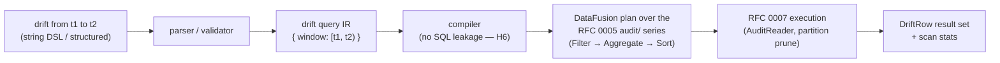

# RFC 0010 — Audit-stream queries & template drift

> **Status note.** **`specified`.** The dedicated `drift` surface (a
> contained query head, not the general aggregation pipeline) was
> maintainer-confirmed 2026-06-09. This RFC fills the audit-stream
> query gap that RFC 0002 §6.3 deferred ("drift is an audit-stream
> property, not a column in the RFC 0005 data files, so it needs an
> audit-stream query path — a future capability"). It specifies a
> first-class, contained **`drift`** query over the per-tenant RFC 0005
> `audit/` Parquet stream, encapsulating the fixed aggregation that
> RFC 0001 §6.7 wrote out as SQL "for spec clarity". The §5 criteria
> below flip RFC 0001 scenario **H5.3**
> (`crates/ourios-miner/tests/hazards.rs::h5_3_drift_query_returns_templates_that_gained_a_version`,
> currently `#[ignore]` / `todo!()`). This RFC **extends** RFC 0002 (it
> does not reopen or renumber it; RFC 0002 stays `green`) and **reads**
> the RFC 0005 audit schema (it does not redefine it). Hazard 6
> (`CLAUDE.md` §4 — no DataFusion/SQL leakage) constrains the surface:
> drift is exposed through the DSL, never as raw SQL.

## 1. Summary

Ourios records every template structural change as a durable audit event
(RFC 0001 §6.4, persisted by RFC 0005's `audit/` Parquet series). RFC 0001
§6.7 specifies the operator-facing **drift query** — "templates that
gained a new version in the window `[t1, t2)`" — but writes it out as SQL
"for spec clarity", explicitly deferring the user-visible form to "the
RFC 0002 DSL, not raw SQL". RFC 0002 in turn deferred the audit-stream
query surface as "a future capability" (§6.3). This RFC is that future
capability. It specifies a single, contained DSL query head — **`drift`**
— that scans the per-tenant audit stream over a time window, aggregates
the widening/type-expansion events per template, and returns one drift row
per affected template. It deliberately does **not** require RFC 0002's
deferred general `count` / aggregation pipeline: drift is the one fixed
aggregation §6.7 names, so it ships as a closed form rather than as a
worked example of a general audit-stream aggregation engine.

## 2. Motivation

### 2.1 The gap, precisely

Three existing RFCs (RFC 0001 `specified`, RFC 0002 `green`, RFC 0005
`drafted`) leave a single hole between them:

- **RFC 0001 §6.7** ("Drift detection as a first-class query") gives the
  exact semantics as SQL over a `template_audit` relation, then says: *"SQL
  shown for spec clarity; the user-visible form is the RFC 0002 DSL, not
  raw SQL — see hazard H6."* The user-visible form was never specified.
- **RFC 0002 §6.3** lists the drift *question* and resolves the membership
  half (`resolves_to(X)` answers "what is template X aliased to"), but
  explicitly **defers** the windowed "did this template gain a version"
  half: *"drift is an audit-stream property, not a column in the RFC 0005
  data files, so it needs an audit-stream query path — a future
  capability, not a row predicate in this grammar."*
- **RFC 0005 §3.4 / §6** already persists the audit events to a queryable
  `audit/` Parquet series with the columns the §6.7 query reads
  (`event_type`, `template_id`, `old_version`, `new_version`, `timestamp`,
  …), and `ourios-parquet` ships `ParquetAuditSink` / `AuditReader` /
  `audit_schema()`. The data is on disk and readable; nothing turns it into
  an operator query.

The miner's RFC 0001 scenario **H5.3** is the visible symptom: it is a
red-gate `#[ignore]` / `todo!("RFC 0001 §6.7")` stub
(`crates/ourios-miner/tests/hazards.rs`) precisely because there is no
specified query path to assert against. RFC 0001 §9 records the same as a
pending cross-RFC contract ("the DSL surface required to expose drift
detection").

### 2.2 Why at this layer, and why now

Drift detection is hazard **H5** (`docs/hazards.md` H5, "Template schema
evolution across deploys"): a sudden cluster of `template_widened` events
correlated with a deploy is the H5 detection signal, and the §3.5 invariant
("Parquet schema changes require a migration plan") is the data-side
sibling. The audit stream is the only place that signal lives — it is not a
column on the data rows. So the query must be an *audit-stream* query, and
it belongs to the querier (RFC 0007, pillar #3) because that is where a
compiled query becomes a partition-pruned DataFusion scan.

Now, because the three dependencies are in place: RFC 0001 §6.7 fixed the
semantics, RFC 0005 persists the events with predicate-pushable columns,
and RFC 0007 is `green` (the execution layer exists). The only missing
piece is the surface and the aggregation that binds them — small enough to
ship as a closed form without reopening RFC 0002's broader deferred work.

## 3. Scope

### 3.1 In scope

- A first-class DSL query head, **`drift`**, over the per-tenant RFC 0005
  `audit/` stream (§6.1, §6.2).
- The fixed aggregation of RFC 0001 §6.7 (§6.3), its result row shape
  (§6.4), and its tenancy + window semantics (§6.5).
- Compilation to a DataFusion plan over the RFC 0005 audit files, executed
  by RFC 0007 (§6.6).
- The §5 acceptance criteria, including the H5.3 flip.

### 3.2 Out of scope (stated explicitly)

- **General audit-stream aggregation.** Arbitrary `GROUP BY` / `count` /
  `sum` over audit events — i.e. RFC 0002's deferred `count` /
  aggregation-stage pipeline applied to a generic audit source — stays
  deferred. `drift` is one closed query, not a general engine (§8
  alternative A; the dedicated form may later be *re-expressed on top of*
  that engine without a surface change).
- **The `rejected_degenerate` event.** `drift` counts widenings and
  type-expansions only, exactly as RFC 0001 §6.7's
  `event_type IN ('template_widened', 'template_type_expanded')` filter
  specifies. `template_widening_rejected_degenerate` (RFC 0005 ordinal 2)
  records a *non*-change and must not count toward `widening_count`
  (RFC0010.3). The `compaction` event (RFC 0005 ordinal 3) is likewise not
  a template change and is excluded by the same `event_type` filter.
- **Alias / `resolves_to` membership.** "Is template X aliased to Y" is
  the *cross-alias* axis already served by RFC 0002 `resolves_to` over the
  RFC 0001 §6.7 alias map. `drift` is the orthogonal *cross-version* axis
  ("did leaf X gain a version in `[t1, t2)`"); see §8 alternative B.
- **Raw SQL / DataFusion passthrough.** Rejected per hazard H6
  (`docs/hazards.md` H6): the DataFusion SQL surface is never exposed. `drift`
  is DSL-only (§8 alternative C).
- **The compaction-event query surface.** RFC 0005 routes `compaction`
  events through the same audit stream; querying those is a separate
  future need, not folded in here.

## 4. Background: what is already on disk

This RFC reads, and does not redefine, the RFC 0005 audit schema. The
relevant facts, cited so the design below is unambiguous:

- **Partition layout (RFC 0005 §3.4).** Audit files live at
  `<bucket>/audit/tenant_id=<tenant_id>/year=YYYY/month=MM/day=DD/<flush_uuid>.parquet`
  — a parallel series to the `data/` logs, keyed by `tenant_id` then a
  day-granularity time bucket derived from `timestamp`. `tenant_id` is a
  row-level REQUIRED column *and* the leading Hive partition key, so a
  per-tenant scan is a partition prune, not a post-filter (§6.5).
- **Columns (RFC 0005 §6).** `event_type` (REQUIRED `STRING`, the
  predicate-pushdown surface RFC 0005 names "for the RFC 0001 §6.7 drift
  query"), `event_kind` (REQUIRED `INT32` ordinal), `template_id`
  (`INT64`, OPTIONAL but required-by-convention for the template kinds),
  `old_version` / `new_version` (`INT32`), `timestamp`
  (`TIMESTAMP(NANOS, UTC)`, REQUIRED), and the template-detail columns
  (`old_template`, `new_template`, `positions_widened`, `slots_expanded`,
  `triggering_line_*`, `reason`). Drift reads only
  `tenant_id`, `event_type`, `template_id`, `old_version`, `new_version`,
  and `timestamp`.
- **Event-kind mapping (RFC 0005 §6).** `0 → template_widened`,
  `1 → template_type_expanded`, `2 → template_widening_rejected_degenerate`,
  `3 → compaction`. Drift's `event_type` filter selects ordinals 0 and 1.
- **Reader (`ourios-parquet`).** `AuditReader::open_partition` is the
  production query path; `audit_schema()` is the canonical Arrow schema.
  This RFC's compile target (§6.6) consumes that reader.

## 5. Acceptance criteria

Normative scenarios, in the `docs/rfcs/README.md` Required-sections
acceptance-criteria format (Given / When / Then / And). Each carries a greppable id referenced from the test code. Where a
scenario discharges a sibling RFC's criterion, both ids are listed so the
mapping stays greppable from either side.

- **RFC0010.1 — Drift query returns templates that gained a version in
  the window (discharges RFC 0001 H5.3) `[RFC 0001 §6.7]`, hazard H5**
  - **Given** a tenant's audit stream containing `template_widened` and/or
    `template_type_expanded` events for template A and for template B,
    all with `timestamp` inside `[t1, t2)`
  - **When** the drift query `drift from <t1> to <t2>` runs in that
    tenant's context
  - **Then** the result contains exactly one row for A and one row for B
  - **And** each row's `widening_count` equals the number of that
    template's qualifying events in `[t1, t2)`
  - **And** this is the criterion that flips the RFC 0001 H5.3 stub
    (`crates/ourios-miner/tests/hazards.rs::h5_3_drift_query_returns_templates_that_gained_a_version`),
    which is owned by RFC 0001 and satisfied here.

- **RFC0010.2 — Window boundary excludes out-of-window events `[§6.5]`**
  - **Given** a qualifying event whose `timestamp` is strictly before `t1`,
    a second strictly after the window's upper bound, and a third exactly
    on each boundary
  - **When** the drift query over `[t1, t2)` runs
  - **Then** the out-of-window events do not contribute to any
    `widening_count`
  - **And** boundary inclusion is half-open `[from, to)` — the lower
    bound `from` is included, the upper bound `to` is excluded — so a
    template with only a boundary event is present iff that boundary is
    the included (lower) one.

- **RFC0010.3 — `event_type` scoping excludes non-widenings `[RFC 0001 §6.7]`,
  §3 (out of scope)**
  - **Given** a template C with only `template_widening_rejected_degenerate`
    and/or `compaction` events in `[t1, t2)` (and no `template_widened` /
    `template_type_expanded`)
  - **When** the drift query over `[t1, t2)` runs
  - **Then** template C does **not** appear in the result
  - **And** for a template D with both qualifying and `rejected_degenerate`
    events, `widening_count` counts only the qualifying ones.

- **RFC0010.4 — Tenant isolation `[CLAUDE.md §3.7]`, RFC0007.5**
  - **Given** qualifying audit events for tenant X and qualifying audit
    events for tenant Y in the same window
  - **When** the drift query runs in tenant X's context
  - **Then** no row attributable to tenant Y's events appears, enforced at
    the partition-prune layer (the `tenant_id` Hive key), and a drift query
    without a tenant is a usage error, not a cross-tenant scan.

- **RFC0010.5 — Empty result is empty, not an error `[§6.4]`**
  - **Given** a tenant with no qualifying events in `[t1, t2)` (no audit
    files for the window, or only excluded event types)
  - **When** the drift query over `[t1, t2)` runs
  - **Then** it returns an empty result set, not an error.

- **RFC0010.6 — Result ordering is `widening_count` descending `[RFC 0001 §6.7]`**
  - **Given** templates whose qualifying-event counts in `[t1, t2)` differ
  - **When** the drift query over `[t1, t2)` runs
  - **Then** rows are ordered by `widening_count` descending, matching
    RFC 0001 §6.7's `ORDER BY widening_count DESC`
  - **And** the tie-break among equal counts is deterministic (ascending
    `template_id`) so the result is stable for golden-test pinning.

- **RFC0010.7 — Aggregate version/time bounds per template `[RFC 0001 §6.7]`**
  - **Given** template A with qualifying events spanning versions
    `v_lo … v_hi` and timestamps `ts_lo … ts_hi` inside `[t1, t2)`
  - **When** the drift query over `[t1, t2)` runs
  - **Then** A's row carries `min_old_version = v_lo`,
    `max_new_version = v_hi`, `first_seen = ts_lo`, `last_seen = ts_hi`,
    matching RFC 0001 §6.7's
    `MIN(old_version), MAX(new_version), MIN(timestamp), MAX(timestamp)`.

- **RFC0010.8 — No DataFusion/SQL leakage `[H6]`, RFC0007.3**
  - **Given** the public `drift` surface (string DSL and structured form)
  - **When** a malformed or SQL-shaped drift query is submitted
  - **Then** neither the accepted grammar nor any error `Display` exposes
    DataFusion or SQL types/identifiers; the drift head is DSL-only, as
    `resolves_to` and `render` are (RFC 0002 §6.5).

## 6. Proposed design

### 6.1 A dedicated `drift` query head, not a general pipeline

RFC 0002's pipeline is `predicate { | stage }` over the **`data/`** log
table (`from logs` is implicit; RFC 0002 §6.5). Drift is structurally
different in three ways that make it a poor fit for that pipeline as-is:

1. **Different source.** It scans `audit/`, a different Parquet series with
   a different schema, not `data/`.
2. **A fixed aggregation.** RFC 0001 §6.7 fully specifies the projection,
   grouping, and ordering. There is exactly one drift query shape.
3. **No log predicate vocabulary.** `service`, `severity`, `body`,
   `template_id` predicates etc. (RFC 0002 §7 `nonsev_field`) are
   log-record fields; they have no meaning over audit rows.

So rather than (a) adding a general audit source plus the deferred
aggregation stages and then expressing drift as one instance, this RFC
introduces a **closed query head**:

```ebnf
drift_query = "drift" , "from" , time , "to" , time ;
```

`time` is the **exact RFC 0002 §7 `time` production** — `now`, a signed
relative `duration` (`-1h`, `-7d`, …), or an RFC 3339 timestamp — reused
verbatim, so the window vocabulary an operator already knows from
`range(...)` carries over. The head is a top-level alternative to RFC 0002's
`predicate { | stage }` query, not a stage within it; a drift query is its
own well-formed query, and it admits no further `|` stages (the projection,
grouping, and ordering are fixed by §6.3, so there is nothing to compose).

**Why this surface (`drift from <t1> to <t2>`) over `audit | drift(...)`.**
RFC 0002's pipeline reads as `source | transform | …`. A bare `drift`
*verb head* reads as a single declarative question — "drift, from t1 to
t2" — which matches how the operator thinks ("show me drift since the
deploy") and keeps the fixed, non-composable nature of the query honest:
there is no `audit` source to further filter or aggregate, because the only
audit-stream question this RFC answers is drift. An `audit | drift(...)`
form would imply a general `audit` source and a composable `drift` stage,
which is precisely the broader engine this RFC declines to build (§8
alternative A); choosing the verb head avoids promising composition the
grammar does not deliver. The cost is one more top-level query shape in the
grammar; that is paid once and is cheaper than a misleading pipeline.

The structured surface (RFC 0002 §6.4, the MCP/agent contract) carries the
same query as a tagged object:

```json
{ "drift": { "from": "-7d", "to": "now" } }
```

`from` / `to` are RFC 0002 §7 lexical `time` strings (relative duration,
`"now"`, or RFC 3339), exactly as the structured surface already carries
durations and timestamps. As with the string head, no `predicate` or
`stages` keys are accepted alongside `drift` — it is a distinct top-level
object, validated by its own published JSON Schema fragment (versioned with
the parser, snapshot-tested like the RFC 0002 §7 grammar).

### 6.2 Example queries

```text
drift from -7d to now
```

> "Which templates gained a version in the last seven days?" — the
> post-deploy H5 check.

```text
drift from 2026-06-01T00:00:00Z to 2026-06-02T00:00:00Z
```

> Drift confined to a single UTC day (an absolute window straddling one
> deploy), the form an operator pins in a Perses panel.

### 6.3 Semantics — RFC 0001 §6.7, verbatim

The drift query is the closed form of RFC 0001 §6.7's specification. Over
the executing tenant's audit stream:

1. **Filter** to `event_type IN ('template_widened', 'template_type_expanded')`
   (RFC 0005 ordinals 0 and 1) **and** `timestamp` in the window
   (§6.5).
2. **Group by** `template_id`.
3. **Project** per group:
   - `widening_count = COUNT(*)`
   - `min_old_version = MIN(old_version)`
   - `max_new_version = MAX(new_version)`
   - `first_seen = MIN(timestamp)`
   - `last_seen = MAX(timestamp)`
4. **Order by** `widening_count` descending, then `template_id` ascending
   (the deterministic tie-break of §5 RFC0010.6; RFC 0001 §6.7 leaves ties
   unspecified, this RFC pins them for stable golden tests).

Equivalent to RFC 0001 §6.7's SQL, restated here only to anchor the column
names this RFC's result shape uses:

```sql
SELECT template_id,
       COUNT(*)          AS widening_count,
       MIN(old_version)  AS min_old_version,
       MAX(new_version)  AS max_new_version,
       MIN(timestamp)    AS first_seen,
       MAX(timestamp)    AS last_seen
FROM   audit                       -- the per-tenant RFC 0005 audit/ stream
WHERE  event_type IN ('template_widened', 'template_type_expanded')
  AND  timestamp >= $t1 AND timestamp < $t2
GROUP  BY template_id
ORDER  BY widening_count DESC, template_id ASC
```

(SQL is shown for spec clarity only, mirroring RFC 0001 §6.7; the
user-visible form is the §6.1 `drift` head, never raw SQL — hazard H6 /
§8 alternative C.)

### 6.4 Result shape

A drift query returns a typed result set of **drift rows**, distinct from
the log result rows RFC 0007 returns. One row per affected template:

```rust
pub struct DriftRow {
    pub template_id: u64,
    pub widening_count: u64,
    pub min_old_version: u32,
    pub max_new_version: u32,
    pub first_seen: SystemTime,
    pub last_seen: SystemTime,
}
```

The columns map one-to-one onto the §6.3 projection. The carrier follows
the RFC 0007 `QueryResult` shape (typed rows plus scan stats:
`row_groups_scanned` / `row_groups_pruned` / `bytes_read`). An empty result
is an empty row set (`RFC0010.5`), never an error. The drift result is its
own variant so it cannot be confused with a log-row result; making the two
result shapes distinct keeps invalid mixes unrepresentable.

### 6.5 Tenancy and window semantics

- **Tenant scoping (`CLAUDE.md` §3.7, RFC0010.4).** The tenant is supplied by the
  executing context, exactly as for RFC 0002/RFC 0007 log queries — never
  expressed in the query text. It compiles to a `tenant_id` partition-key
  filter over the `audit/tenant_id=…` Hive layout (RFC 0005 §3.4), so
  isolation is a partition prune, not a post-scan filter (RFC 0007 §6.5).
  A drift query with no tenant is a usage error, not a cross-tenant scan.
- **Window boundaries (RFC0010.2).** `drift` defines its window as
  **half-open `[from, to)`** — lower bound included, upper bound excluded.
  (RFC 0002's `range(from, to)` stage does not pin its boundary semantics
  today; RFC 0010 defines half-open for the drift window independently.)
  `from`/`to` reuse the RFC 0002 §7 `time` grammar
  (relative durations resolve against query-evaluation `now`; RFC 3339
  timestamps are absolute).
- **Window → partition prune.** The window's resolved `[t1, t2)` bounds
  drive `year`/`month`/`day` partition pruning over the audit layout
  (day-granularity per RFC 0005 §3.4), then an exact `timestamp` predicate
  trims the boundary days. This is the RFC 0007 partition-prune model
  applied to the audit series.

### 6.6 Compilation and execution



The drift head parses (string surface) or validates (structured surface)
to a small drift IR carrying only the resolved window; both surfaces lower
to the **same** IR (the RFC 0002 §6.4 "two front-ends, one core"
discipline). The compiler lowers the IR to a DataFusion plan over the
RFC 0005 `audit/` files — registered through the `ourios-parquet`
`AuditReader` / `audit_schema()` surface — as `Filter` (event-type +
tenant + window) → `Aggregate` (group by `template_id`, the §6.3
aggregates) → `Sort` (§6.3 ordering). Lowering is the only place DataFusion
types appear; they never reach the caller (RFC0010.8 / RFC 0007 §6.5).
Execution is RFC 0007's: partition pruning on `tenant_id` and the time
keys, `event_type` predicate pushdown (RFC 0005 §6 names `event_type` as
the pushdown surface for exactly this query), scan stats surfaced on the
result.

The querier today scans only the `data/` series and rejects `Count` / `Agg`
stages (`crates/ourios-querier/src/compile.rs`). This RFC adds the audit
source and the one closed aggregation the drift head needs — it does **not**
unblock the general `Count` / `Agg` stages over `data/`, which remain the
RFC 0002 deferred work (§8 alternative A).

## 7. Testing strategy

Mapping to `CLAUDE.md` §6.2 and `docs/verification.md` (red→green two-loop:
`#[ignore]`'d stubs first, implementations second). Every §5 scenario is a
test; ids are greppable from the test code.

- **The H5.3 flip (RFC0010.1).** The existing
  `crates/ourios-miner/tests/hazards.rs::h5_3_drift_query_returns_templates_that_gained_a_version`
  stub is replaced by a real test driving the `drift` query over a seeded
  audit stream and asserting templates A, B and their counts. Because the
  query path lives in `ourios-querier`, the integration test seeds an
  audit partition via the `ourios-parquet` `ParquetAuditSink` and runs the
  compiled drift query; the miner-side `hazards.rs` test asserts the same
  end-to-end behaviour through the public surface (so RFC 0001's H5.3 and
  this RFC's RFC0010.1 reference one mechanism).
- **Unit / parse tests.** Positive and negative parse tests for the
  `drift_query` production and the structured `{ "drift": … }` object,
  including rejection of trailing `|` stages and of a `predicate`/`stages`
  sibling key (the closed-form constraint, §6.1).
- **Boundary tests (RFC0010.2).** Events placed before, on, and after each
  window bound; assert the half-open `[from, to)` inclusion this RFC
  defines (§6.5) — lower bound included, upper bound excluded.
- **Scoping tests (RFC0010.3).** `rejected_degenerate` and `compaction`
  events seeded alongside qualifying ones; assert exclusion and correct
  `widening_count`.
- **Tenant-isolation test (RFC0010.4).** Two tenants' audit partitions;
  assert tenant X's drift never sees tenant Y, and the no-tenant usage
  error — mirrors RFC0007.5.
- **Empty-result test (RFC0010.5).** No qualifying events / no audit files;
  assert empty, not error.
- **Ordering / aggregate golden tests (RFC0010.6, RFC0010.7).** A seeded
  multi-template audit set with a pinned expected `DriftRow` ordering and
  per-row version/time bounds (golden, like RFC 0002's compilation goldens
  and RFC 0007's end-to-end pins).
- **No-leakage test (RFC0010.8).** Compile + error-`Display` string test
  that no DataFusion/SQL identifier escapes the drift surface; the same
  technique as RFC0002.3 / RFC0007.3.

## 8. Alternatives considered

- **A. General audit-stream aggregation pipeline.** Implement RFC 0002's
  deferred `count` / `agg` / `group by` stages plus a generic `audit`
  source, then express drift as a normal aggregation query
  (`audit | range(...) | count by template_id | sort count desc`). More
  general and reusable — it would answer many audit questions, not just
  drift — but it is a substantially larger surface, it reopens RFC 0002's
  deliberately-deferred aggregation work (and its grammar/versioning
  contract), and it over-delivers for the one fixed query H5.3 needs. The
  dedicated head ships the H5 signal now with a closed, testable surface.
  It is a fair trade only because drift is the *single* audit question on
  the table; the dedicated `drift` head can later be **re-expressed on top
  of** the general engine (same `DriftRow` output, same `drift` surface)
  without a user-visible change, so choosing it now does not foreclose the
  general path — it sequences it after a proven need. Hence A is the
  rejected-for-now primary alternative, not a dead end.
- **B. `resolves_to` only.** RFC 0002 already ships `resolves_to(X)`, which
  answers "what `template_id`s are aliased to X" (cross-alias membership;
  RFC 0001 §6.7). One might argue drift is already covered. It is not:
  `resolves_to` is a *membership* test on the operator-asserted alias map,
  answering "are these the same template", whereas drift is the *windowed
  rate-of-change* signal "did leaf X gain a version in `[t1, t2)`" — the
  cross-version axis RFC 0001 §6.7 keeps explicitly disjoint from the alias
  axis. The two are orthogonal; `resolves_to` cannot express a time window
  or count events, so it cannot answer H5.
- **C. Raw SQL / DataFusion passthrough.** Expose the §6.3 SQL (or a
  general SQL endpoint) directly. Zero surface-design cost. Rejected per
  hazard H6 (`docs/hazards.md` H6, "do not leak DataFusion specifics through to
  users") and RFC 0002 §10's standing rejection of a SQL default: it binds
  the user surface to DataFusion and reopens the cross-tenant /
  unbounded-scan risks the DSL exists to contain.
- **D. A `template_drift` boolean column on the data rows.** Materialise a
  per-row "this template drifted" flag so drift becomes a data-file
  predicate. Rejected: drift is a property of the *audit* timeline, not of
  any single log row; the flag would be window-relative (drift is always
  "in `[t1, t2)`"), so it cannot be precomputed at write time, and it would
  bloat every data row for a low-frequency query. RFC 0002 §6.3 already
  rules this out ("not a column in the RFC 0005 data files").

## 9. Open questions

*Must be resolved before `accepted`; none block `specified`.*

- [ ] **Surface fork — confirm the verb head.** §6.1 picks
      `drift from <t1> to <t2>` (a top-level verb head) over
      `audit | drift(...)` (a stage on a general audit source). Maintainer
      to confirm the verb head is the intended surface, given it forecloses
      composing further stages onto a drift query (by design).
- [ ] **Re-use of `range` vs a head-local window.** §6.1 reuses the
      RFC 0002 `range(from, to)` *bounds* via a `from … to …` clause rather
      than admitting a literal `| range(...)` stage on the drift head.
      Confirm the dedicated clause is preferable to reusing the `range`
      stage token.
- [ ] **Default window.** Log queries get a tenant-default window when
      `range` is omitted (RFC 0002 §4 P5 / RFC0002.4). Should `drift`
      *require* an explicit window (current spec: `from`/`to` are
      mandatory), or inherit the same tenant default? Current choice:
      mandatory, because a default-windowed drift is rarely what an operator
      means (drift questions are deploy-relative).
- [ ] **Tie-break stability.** §6.3 pins ties as ascending `template_id`
      beyond RFC 0001 §6.7's `ORDER BY widening_count DESC`. Confirm this
      is the desired stable order (vs. e.g. `last_seen DESC`).
- [ ] **`old_version` / `new_version` on type-expansion rows.** RFC 0005
      stores these for both template kinds; `min_old_version` /
      `max_new_version` therefore mix widening and type-expansion version
      deltas. Confirm that aggregating across both kinds is the intended
      §6.7 semantics (RFC 0001 §6.7's SQL groups both, so this RFC follows).

## 10. References

- **RFC 0001 §6.7** — "Drift detection as a first-class query" (the SQL
  semantics this RFC closes over) and §6.4 (the audit event model); RFC 0001
  scenario **H5.3** (the red-gate stub this RFC discharges) and §9 (the
  pending DSL-surface contract).
- **RFC 0002** — the base DSL this RFC extends (`predicate { | stage }`,
  the §6.4 two-surface model, the §7 `time` production reused here, the
  §6.5 compilation discipline). RFC 0002 §6.3 explicitly deferred the
  audit-stream query path; that deferral is **resolved by this RFC**. RFC
  0002 stays `green` and is not edited here.
- **RFC 0005 §3.4 / §6** — the `audit/` partition layout and audit-event
  schema this RFC reads (`event_type`, `template_id`, `old_version`,
  `new_version`, `timestamp`; the event-kind mapping table). This RFC does
  not redefine the schema.
- **RFC 0007** — the querier execution layer (DataFusion, partition prune,
  scan stats) that runs the compiled drift query; criteria RFC0007.3
  (no-leakage) and RFC0007.5 (tenant isolation) are the siblings of
  RFC0010.8 and RFC0010.4.
- `CLAUDE.md` §3.5 (schema migration), §3.7 (multi-tenancy); `docs/hazards.md`
  H5 (schema evolution / drift) + H6 (no DataFusion/SQL leakage).
- `ourios-parquet` `ParquetAuditSink` / `AuditReader` / `audit_schema()`
  (the persisted, readable audit surface this RFC queries).
