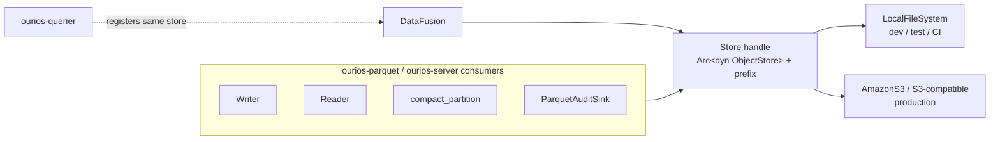

# RFC 0013 — Object-storage backend (S3-compatible) for the Parquet store

> **Status note.** **`drafted`** (2026-06-15). The first shipping-milestone
> spine: today the writer/reader/compactor/audit-sink address a single local
> filesystem `bucket_root: &Path`, but `CLAUDE.md` §3.6 declares object
> storage the source of truth. This RFC abstracts the storage seam behind
> the Apache `object_store` crate (already in our tree via DataFusion) so the
> RFC 0005 data + audit Parquet and the RFC 0009 manifest live on an
> S3-compatible bucket in production and on local disk in dev/test —
> **without changing the on-disk layout or a single stored row**. §§1–4, 7–8
> are filled for `drafted`; §5/§6 are preliminary and finalised at
> `specified`.

## 1. Summary

Ourios's storage layer addresses a single local-filesystem `bucket_root:
&Path`, threaded through `ourios-parquet` (writer, reader, compaction,
manifest, audit sink) and `ourios-server`. `CLAUDE.md` §3.6 makes object
storage — "Parquet on S3" — the source of truth, with local disk only a
cache and the WAL horizon. This RFC introduces an **object-storage backend**
behind that seam by adopting the Apache Arrow [`object_store`] crate (one
trait over `LocalFileSystem` and `AmazonS3`/S3-compatible stores), so the
same code path targets local disk for dev/test/CI and an S3-compatible
bucket in production. It pins how the RFC 0009 atomic-publish (manifest
generation swap) maps onto object stores that lack POSIX `rename`
(discharging RFC 0009 §7's deferred S3 atomic-swap + single-writer lease).
It changes **where** bytes live, never the RFC 0005 schema or the Parquet
bytes themselves.

## 2. Motivation

### 2.1 §3.6 is currently unmet — and it gates deployment

`CLAUDE.md` §3.6: *"Local disk is cache and WAL. Parquet on S3 is the truth.
Never design a feature that requires local disk to be durable beyond the WAL
horizon."* Today the store is **local-filesystem only** — `grep` finds no
`object_store`/S3 usage; every consumer takes a `&Path` bucket root. That is
fine for the thesis-proving MVP (which ran on single hosts), but it makes
Ourios undeployable to a cluster: pods are ephemeral, and acknowledged data
must outlive any one node. Durable shared object storage is the spine of the
first shipping milestone; nothing else (container image, Helm chart) matters
if the data evaporates with the pod.

### 2.2 Why at this layer, and why `object_store`

The seam is narrow and already uniform: a `bucket_root: &Path` (plus the
per-partition Hive key layout from RFC 0005 §3.4) threaded through the
writer, reader, `compact_partition`, the manifest, and the audit sink.
Abstracting it **once** behind a backend handle leaves every consumer's
logic unchanged. The natural abstraction is the Apache Arrow
[`object_store`] crate — and it is **already in our dependency tree
(`v0.13.2`) transitively via DataFusion**, our query engine (pillar #3).
DataFusion's own table providers read through `object_store`, so adopting it
also aligns the **read path**: the querier can register the same
`ObjectStore` with DataFusion instead of handing it local file paths. One
abstraction, used end to end, that we already ship.

### 2.3 Why now

The thesis is proven (B1/B2/C1/C2 pass on baseline; `benchmarks.md` §3) and
the RFC ladder is green-or-beyond. The next milestone is **deployability**,
and this is its load-bearing, architectural-pillar-level prerequisite —
hence an RFC (`CLAUDE.md` §5.1) rather than a PR.

## 3. Proposed design

### 3.1 Scope

In scope: the **read and write of the RFC 0005 data + audit Parquet series
and the RFC 0009 `manifest.json`** through an object-storage backend, with
two concrete backends — `LocalFileSystem` (dev/test/CI; preserves today's
behaviour) and `AmazonS3` (production; covers S3-compatible stores — MinIO,
Cloudflare R2, etc. — via an endpoint override). Out of scope: the **WAL**
(stays local — it *is* the §3.4 durability horizon, §3.5 below); any change
to the RFC 0005 on-disk schema or Parquet encoding; a table format
(Iceberg/Delta — rejected in RFC 0005 §4.1); a local read cache (a future
perf concern, §7).

### 3.2 The `object_store` abstraction

Adopt `object_store::ObjectStore` (async `put`/`get`/`list`/`delete` over an
`object_store::path::Path` — a UTF-8, `/`-delimited key). The RFC 0005 Hive
layout (`data/tenant_id=…/year=…/…/<uuid>.parquet`,
`audit/tenant_id=…/…`) maps **directly** onto object keys under a configured
prefix — no layout change. A thin `Store` handle wraps an `Arc<dyn
ObjectStore>` + a key prefix and is threaded where `bucket_root: &Path` is
today.

### 3.3 The seam migration

Replace `bucket_root: &Path` with the `Store` handle across the writer,
reader, `compact_partition`, manifest, and audit sink. Writes go to a
temporary key and become live via the §3.4 publish; reads are `list` +
`get` by key. The change is mechanical and consumer-logic-preserving — the
existing RFC 0005/0009 tests re-run against the `LocalFileSystem` backend to
prove no behavioural regression (RFC0013.2).

### 3.4 Atomic publish without POSIX `rename`

The hard part. RFC 0009's atomic publish and the writer's
`.parquet.tmp`→final both rely on POSIX `rename`, which object stores do not
provide. Map the **manifest generation swap** onto object stores via
**conditional PUT**: S3 now supports `If-None-Match` (create-if-absent) and
`If-Match` (compare-and-swap on ETag), surfaced by `object_store` as
`PutMode::Create` / `PutMode::Update{ETag}`. A new manifest generation is
written with a precondition on the current generation, giving
single-writer-wins semantics — exactly the property `compact_partition`
needs so a query never double-counts or misses a row. Data/audit objects are
written to a `_tmp/` key and made live solely by the manifest swap (no
rename). The RFC 0009 §7 **single-writer lease** (so two compactors don't
race a partition) is realised by the same conditional-PUT contention or a
dedicated lease object (§7 open question).

### 3.5 What stays local

The **WAL** stays on local disk: it is the §3.4 WAL-before-ack durability
horizon, and §3.6 explicitly permits local disk up to that horizon. Recovery
(RFC 0008) replays the local WAL into the object store on startup. No feature
introduced here requires local disk to be durable beyond the WAL horizon, so
the §3.6 invariant holds.

### 3.6 Schema / compatibility

No change to the RFC 0005 schema, the Parquet bytes, the partition layout, or
the reader's §3.9 forward-compat contract. This RFC is purely about *where*
the bytes are stored; an operator's existing data semantics are untouched.

### 3.7 Crate shape

The backend lives behind a `Store` type in `ourios-parquet` (it owns the
writer/reader), exposed to `ourios-server` and `ourios-querier`. Whether this
warrants a dedicated `ourios-store` crate (a `CLAUDE.md` §7 architectural
commitment) or a module is §7's first open question. Configuration (endpoint,
region, bucket, prefix, credentials) flows through RFC 0004.

## 4. Alternatives considered

- **Hand-rolled `aws-sdk-s3` client.** Direct control, but reimplements what
  `object_store` already gives — multi-backend, retries, multipart, and the
  local/test backend — and diverges from DataFusion's own storage layer.
  Rejected: more code, less reuse, two storage abstractions in one tree.
- **Network filesystem (EFS/NFS) mounted into pods, keep `&Path`.** Avoids
  the S3 work, but violates the §3.6 "S3 is the truth" pillar, inherits
  NFS's dicey `rename`/close-to-open consistency, and is operationally worse
  and costlier than object storage at log volumes. Rejected.
- **An object-store-as-filesystem shim (s3fs/goofys).** Keeps the `&Path`
  code, but inherits non-atomic `rename` and read-after-write pitfalls — the
  exact correctness hazards §3.4 must avoid. Rejected.
- **A table format (Iceberg/Delta) on object storage.** Already rejected in
  RFC 0005 §4.1 (the manifest in RFC 0009 is the minimal piece we actually
  need). Out of scope; not reopened here.

## 5. Acceptance criteria (preliminary — finalised at `specified`)

- **RFC0013.1 — S3 round-trip.** *Given* a `MinedRecord` batch *when* written
  and read through the `AmazonS3` backend (a MinIO/localstack testcontainer)
  *then* rows + bytes match the local backend byte-for-byte.
- **RFC0013.2 — local backend, no regression.** The existing RFC 0005 / 0009
  suites pass unchanged against the `LocalFileSystem` backend after the seam
  refactor.
- **RFC0013.3 — atomic publish under contention.** Two concurrent
  `compact_partition` runs on one partition → exactly one manifest generation
  wins; no torn, doubled, or lost rows; the loser retries or no-ops.
- **RFC0013.4 — manifest swap via conditional PUT.** Generation publish uses
  create-if-absent + compare-and-swap, with no `rename` dependency.
- **RFC0013.5 — tenant isolation across the key prefix** (`CLAUDE.md` §3.7).
- **RFC0013.6 — WAL stays local** (`CLAUDE.md` §3.4): the backend carries
  data/audit/manifest only.
- **RFC0013.7 — S3-compatible endpoints** (MinIO/R2) work via endpoint
  override, configured through RFC 0004.
- **RFC0013.8 — reader forward-compat** (RFC 0005 §3.9) holds over the object
  store.

## 6. Testing strategy (preliminary)

`testcontainers` (MinIO or localstack) for the S3 integration scenarios
(RFC0013.1/.3/.4/.5/.7/.8); the existing RFC 0005/0009 tests re-run against
both backends via a parametrised harness (RFC0013.2); a `proptest` for the
conditional-PUT race (RFC0013.3). The `LocalFileSystem` backend keeps the
current fast unit/proptest path so CI stays corpus-free and quick.

## 7. Open questions

- [ ] **Crate shape** — a dedicated `ourios-store` crate (§7 architectural
  commitment) or a module in `ourios-parquet`?
- [ ] **Single-writer lease** — is conditional-PUT contention on the manifest
  sufficient, or is a separate lease object needed (RFC 0009 §7)?
- [ ] **Conditional-PUT portability** — do `If-None-Match`/`If-Match` cover
  the compare-and-swap on every targeted store (S3, R2, MinIO, GCS via
  `object_store`)? What is the fallback where a store lacks it?
- [ ] **Multipart threshold** — RFC 0009 outputs are 256 MiB–2 GiB; pick the
  multipart-upload threshold.
- [ ] **Credentials** — IAM role (IRSA on k8s) vs static keys via RFC 0004 /
  k8s Secrets.
- [ ] **Local read cache** for hot Parquet — defer (perf, not correctness)?
- [ ] **Migration** — is a local-FS-store → object-store copy tool needed, or
  is it N/A pre-release (no production data yet)?

## 8. References

- `CLAUDE.md` §3.6 (object storage is the source of truth), §3.4
  (WAL-before-ack / durability horizon), §3.7 (multi-tenancy partitioning),
  §5.1 (RFC-required for a pillar), §7 (new-crate commitment).
- RFC 0005 — the on-disk Parquet contract being relocated (unchanged).
- RFC 0009 — the atomic-publish manifest; §7 deferred the S3 atomic-swap +
  single-writer lease, discharged here.
- RFC 0004 — configuration policy (endpoint, region, bucket, prefix, creds).
- [`object_store`] — the Apache Arrow object-storage abstraction, already a
  transitive dependency via DataFusion.
- S3 conditional writes — `If-None-Match` / `If-Match` precondition PUTs.

[`object_store`]: https://crates.io/crates/object_store
