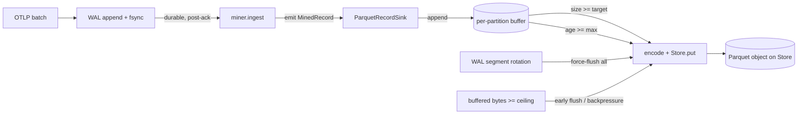

# RFC 0014 — Ingest write path: record sink and flush policy

> **Status note.** **`specified`** (2026-06-17). The conspicuous gap in the
> ingest stack: today the miner (RFC 0001) emits each mined `MinedRecord`
> into a `RecordSink`, and **production wires `NoOpRecordSink` — the records
> are dropped.** Every other layer is built and tested (OTLP → WAL → miner;
> Parquet writer/reader; compaction; the RFC 0013 object-storage seam with a
> buffer-and-put `Writer`), but nothing carries a mined record to a Parquet
> object on the store. This RFC specifies the missing piece: a buffering
> `RecordSink` and the **flush policy** that governs when buffered records
> become a Parquet object — a `CLAUDE.md` §4 (small-file) / §3.4
> (WAL-durability) / §3.7 (multi-tenancy) decision that no existing RFC covers.
>
> **Scope is deliberately narrow:** the flush policy + the sink. Wiring the
> server to construct/inject a `Store` (RFC 0004 config, local vs S3) and
> migrating compaction's manifest publish to `Manifest::publish_cas` on S3
> (RFC0013.3/.4) are **follow-on** work, tracked as open questions, not part
> of this RFC's acceptance.
>
> **`specified`** finalizes the §5 acceptance criteria (RFC0014.1–.6,
> greppable + testable) and §6 testing strategy, and settles the two
> criteria-shaping design questions: rotation force-flushes **every** partition
> (§3.2, RFC0014.3), and the memory ceiling is **hard** — `emit` blocks rather
> than exceed it (§3.4, RFC0014.4). The remaining §7 questions (defaults,
> early-flush victim, rotation-hook surface, size estimation) are tuning /
> implementation detail, decided across the `red`/`green` PRs.

## 1. Summary

A buffering `RecordSink` implementation — the production data write path —
accumulates mined `MinedRecord`s per partition and flushes each partition to a
Parquet object on the RFC 0013 `Store` seam. The flush policy is **hybrid**: a
partition flushes when its buffered bytes reach a size target (toward RFC 0005
§3.5's file-size band) **or** its oldest buffered record reaches a max age,
**and** every partition force-flushes when the WAL segment rotates (RFC 0008).
Total buffered bytes are bounded by a hard ceiling: exceeding it forces an
early flush (and, at the hard limit, applies backpressure to ingest). The sink
reuses RFC 0008's batch-window / rotation machinery rather than inventing a
parallel cadence. Records reach the sink only after the WAL is durable
(`CLAUDE.md` §3.4), so an un-flushed buffer is always recoverable by WAL replay.

## 2. Motivation

**Why this change now.** The first-shipping-milestone thesis is "OTLP in,
queryable Parquet out." The query path reads Parquet that the ingest path must
produce — but the ingest path stops at the miner: `RecordSink` exists with only
`NoOpRecordSink` (drop), `InMemoryRecordSink` (test), and `SharedRecordSink`
(test) impls. RFC0013.6 ("WAL stays local; only Parquet/manifest reach the
store") cannot be greened because nothing writes data to the store during
ingest. Closing this gap completes the ingest half of the thesis.

**Why at this layer.** The flush policy sits between the miner (RFC 0001, which
emits records one at a time and must not own I/O policy) and the Parquet store
(RFC 0005, which specifies the *file format and row-group sizing* but
explicitly **not when records are flushed to a file** — confirmed a genuine
gap). It is the natural home for three hazards that no other RFC binds
together:

- **`CLAUDE.md` §4 small-file problem.** Flush too eagerly and the store fills with tiny
  Parquet objects that defeat predicate pushdown and lean entirely on
  compaction (RFC 0009) to recover. The flush policy is the first line of
  defence; compaction is the second.
- **`CLAUDE.md` §3.4 WAL-before-ack durability.** The sink buffers *acknowledged* data in
  memory. The buffer must never be the durability of record — that is the
  WAL's job. A crash mid-buffer must lose nothing acknowledged.
- **`CLAUDE.md` §3.7 multi-tenancy.** Buffers are keyed by `PartitionKey`, which carries
  `tenant_id`; flushing one partition must never touch another tenant's data.

**Why not defer to compaction.** Compaction *fixes* small files after the
fact; it does not remove the cost of creating them (every tiny object is a
store PUT, a manifest churn, and a footer read until compacted). Right-sizing
at write time is cheaper than over-producing and consolidating.

## 3. Proposed design

### 3.1 The sink

A `ParquetRecordSink` implements `RecordSink::emit(&mut self, record:
MinedRecord)`. It owns:

- **Per-partition buffers.** A map `PartitionKey → PartitionBuffer`, where a
  `PartitionBuffer` accumulates `MinedRecord`s plus a running estimate of its
  encoded size and the wall-clock time of its oldest record. The
  `PartitionKey` (RFC 0005 §3.4) carries `tenant_id`, so buffers are
  tenant-scoped by construction (`CLAUDE.md` §3.7).
- **A handle to the `Store`** (RFC 0013) — the flush target.
- **Flush configuration** (RFC 0004): the size target, the max buffer age,
  and the global buffered-bytes ceiling.

`emit` derives the record's `PartitionKey`, appends it to that partition's
buffer, updates the size estimate, and evaluates the flush triggers (§3.2).

### 3.2 Flush triggers (the hybrid policy)

A partition flushes when **any** of:

1. **Size** — its buffered (estimated) bytes reach the size target. The target
   sits inside RFC 0005 §3.5's 256 MiB–2 GiB file band so a single buffer
   becomes one right-sized object.
2. **Age** — its oldest buffered record's age reaches `max_buffer_age`
   (inclusive: flush when age ≥ the configured max). This
   bounds the staleness of low-volume tenants/partitions whose size trigger
   would otherwise never fire.
3. **WAL segment rotation** — when the WAL segment seals (RFC 0008's rotation
   hook), **every** partition force-flushes, *including* sub-threshold
   low-volume partitions (no size gate). This aligns the published-Parquet
   horizon with a WAL boundary: once a segment is sealed *and* its mined
   records flushed, recovery never needs that segment for data (only the
   still-open tail's records are buffered-but-un-flushed), and the
   acknowledged-but-unpublished data is capped at roughly one segment. The
   cost — small files from tiny partitions — is deliberately accepted and left
   to compaction (RFC 0009) to consolidate; the clean recovery invariant is
   worth more than avoiding a few small objects.

A flush encodes the partition's buffered records to a Parquet object
(`encode_records_to_parquet` + `Store.put`, the RFC 0013 buffer-and-put path,
UUIDv7-named per RFC 0005 §3.4) and clears the buffer.

### 3.3 Reusing the WAL machinery (not a parallel cadence)

The age and rotation triggers reuse RFC 0008's existing batch-window /
segment-rotation mechanism rather than standing up a second timer/coordinator.
The ingest pipeline already has a rotation hook (RFC 0009 §6.9 wires snapshot
writes to it); the sink subscribes to the same hook for trigger 3, and the
age sweep piggybacks on the batch-window tick. One cadence, one source of
truth for "time has passed / a segment sealed."

### 3.4 Memory ceiling and backpressure

The sink tracks total buffered bytes across all partitions against a hard
ceiling:

- **Soft pressure (early flush).** As the total approaches the ceiling, the
  sink force-flushes the largest (or oldest) partition(s) ahead of their size
  trigger, reclaiming memory without blocking ingest.
- **Hard limit (backpressure).** If early flush cannot keep the total under
  the ceiling (e.g. a flush is slow or the store is unavailable), `emit`
  **blocks** until an in-flight flush frees enough memory — so the buffer can
  **never exceed** the ceiling (a hard, not soft, bound). Because the OTLP ack
  already happened (post-WAL), this blocks only *mining/flushing* throughput,
  not durability — no acknowledged data is at risk; the cost is added ingest
  latency under sustained overload.

This makes the in-memory buffer a bounded, best-effort accelerator on top of
the WAL, never an unbounded liability (cf. §3.2's hazard list).

### 3.5 Durability and crash recovery (`CLAUDE.md` §3.4)

Records reach the sink **only after** the WAL has durably committed them
(`ourios-ingester` pipeline: append + fsync → ingest gate → miner → sink — the
ordering is already in place). Therefore:

- A crash with a non-empty buffer loses no *acknowledged* data: every buffered
  record came from a WAL frame that is on disk. Recovery re-mines the WAL tail
  (the un-flushed records) and re-buffers them.
- The flush itself is **not** crash-durable beyond the store's own semantics
  (object PUT atomicity, no fsync) — identical to the RFC 0005 writer / RFC
  0013 store contract. The WAL remains the crash-survival horizon.

### 3.6 What this RFC does *not* change

- Not the on-disk Parquet format or partition layout (RFC 0005) — the sink
  produces ordinary `<uuid>.parquet` objects.
- Not the WAL (RFC 0008) — the sink consumes its rotation/tick signals; it
  does not alter WAL durability or batching.
- Not the manifest/compaction (RFC 0009) — flushed files are live immediately
  via the `*.parquet` glob; compaction consolidates them later as today.

## 4. Alternatives considered

**Pure size+time window (no rotation trigger).** Option 1+2 without 3. Gives
right-sized files but decouples the published-Parquet horizon from the WAL,
so crash-recovery reasoning must independently bound "how far behind can the
buffer be." The rotation trigger is cheap insurance that makes the horizon
argument trivial; we keep it.

**WAL-segment-rotation only.** Flush exactly when a segment seals. Simplest
recovery story (Parquet boundary ≡ WAL boundary) and bounded buffering, but
file size is hostage to the WAL rotation cadence — tuned for *durability
latency*, not for the `CLAUDE.md` §4 256 MiB–2 GiB target. Rejected as the *sole* trigger;
kept as the force-flush bound in the hybrid.

**Stream per batch (the A1-bench pattern).** Open a `Writer` per partition,
append each OTLP batch, close on rotation. Minimal sink logic, but produces
many small files between compactions — it leans the entire `CLAUDE.md` §4 mitigation onto
compaction and pays the small-file cost (PUTs, manifest churn, footer reads)
in the interim. Rejected for production; it remains the bench's expedient.

**No sink-side ceiling (trust the size+time triggers).** Simpler, but a slow
store or a burst across many partitions could grow the buffer without bound
between triggers. The hard ceiling + backpressure is the difference between a
bounded accelerator and an OOM risk; we keep it.

## 5. Acceptance criteria

> Normative scenarios; ids `RFC0014.<m>` are referenced from the test code
> (`docs/verification.md` §2). One scenario per hazard/invariant this RFC
> touches (`CLAUDE.md` §4 small-file, §3.4 WAL-durability, §3.7 multi-tenancy).

> **RFC0014.1 — Size trigger**
> - **Given** a partition whose buffered records reach the size target
> - **When** the next record is emitted
> - **Then** the partition flushes to exactly one Parquet object sized within
>   the RFC 0005 §3.5 band
> - **And** the buffer is cleared

> **RFC0014.2 — Age trigger**
> - **Given** a low-volume partition below the size target
> - **When** its oldest record's age reaches `max_buffer_age`
> - **Then** it flushes on the next batch-window tick

> **RFC0014.3 — Rotation force-flush (`CLAUDE.md` §4)**
> - **Given** buffered records across several partitions, including low-volume
>   sub-threshold ones
> - **When** the WAL segment rotates
> - **Then** every partition flushes
> - **And** no buffered record predates the sealed segment

> **RFC0014.4 — Bounded memory (`CLAUDE.md` §4)**
> - **Given** buffered bytes approaching the ceiling
> - **When** more records arrive
> - **Then** the sink early-flushes to stay under it
> - **And** at the hard limit `emit` blocks until a flush frees memory, so
>   total buffered bytes never exceed the ceiling

> **RFC0014.5 — No acknowledged-data loss (`CLAUDE.md` §3.4)**
> - **Given** a non-empty buffer
> - **When** the process crashes
> - **Then** WAL replay re-mines every un-flushed acknowledged record
> - **And** no acknowledged record is lost

> **RFC0014.6 — Tenant isolation (`CLAUDE.md` §3.7)**
> - **Given** buffered records for tenants X and Y
> - **When** one partition flushes
> - **Then** the produced object holds only that partition's (single tenant's)
>   rows
> - **And** no buffer or flush crosses tenants

## 6. Testing strategy

> Mapped to `CLAUDE.md` §6.2.

- **Unit tests** for each flush trigger (RFC0014.1–.3) and the ceiling
  (RFC0014.4), driving the sink with synthetic `MinedRecord` streams and a
  `LocalFileSystem`-backed `Store`.
- **Property test** (`proptest`) for RFC0014.5/.6: for any interleaving of
  emitted records across tenants and any sequence of triggers, every emitted
  record lands in exactly one flushed object under its own tenant's partition,
  and the multiset of flushed rows equals the multiset emitted (modulo the
  still-buffered tail).
- **Crash-recovery test** (RFC0014.5) in `ourios-ingester`: kill mid-buffer,
  recover, assert WAL replay reproduces the un-flushed records — extends the
  existing RFC 0008 crash-recovery harness.
- The end-to-end "only Parquet/manifest reach the store; WAL stays local"
  assertion (RFC0013.6) is greened by the follow-on server-wiring work, not
  this RFC's acceptance.

## 7. Open questions

> The two criteria-shaping questions (rotation force-flush scope, backpressure
> mechanism) were resolved at `specified` — see the status note and §3.2/§3.4.
> What remains is tuning + implementation detail, decided across `red`/`green`:

- [ ] Default values: size target, `max_buffer_age`, and the buffered-bytes
      ceiling (tune against representative corpora; RFC 0004 config knobs).
- [ ] Early-flush victim selection at the ceiling: largest partition vs oldest
      vs a hybrid; and the soft-pressure threshold below the hard ceiling.
- [ ] Exact integration surface with RFC 0008's rotation hook and batch-window
      tick — does the sink subscribe, or does the pipeline drive it?
- [ ] Size estimation: cheap running estimate vs encoding to measure; accuracy
      vs cost on the hot path.
- [ ] **Follow-on (out of this RFC's acceptance):** server constructs/injects a
      `Store` (local vs S3 via RFC 0004); compaction's manifest publish adopts
      `Manifest::publish_cas` on S3 (RFC0013.3/.4); together these green
      RFC0013.6.

## 8. References

- RFC 0001 — template miner; `RecordSink` and the `emit` contract.
- RFC 0003 — OTLP receiver; WAL-before-ack ordering, response semantics.
- RFC 0004 — configuration policy; the flush-config knobs.
- RFC 0005 — Parquet storage; row-group (§3.5) and file-size targets, partition
  layout (§3.4), the buffer-and-put `Writer`.
- RFC 0008 — WAL; batch-window, segment rotation, crash-recovery harness.
- RFC 0009 — compaction; the small-file second line of defence.
- RFC 0013 — object-storage `Store` seam; `encode_records_to_parquet`,
  `Store.put`, `Manifest::publish_cas`.
- `CLAUDE.md` §2 (pillars), §3.4 (WAL-before-ack), §3.7 (multi-tenancy),
  §4 (small-file problem, hazards).
