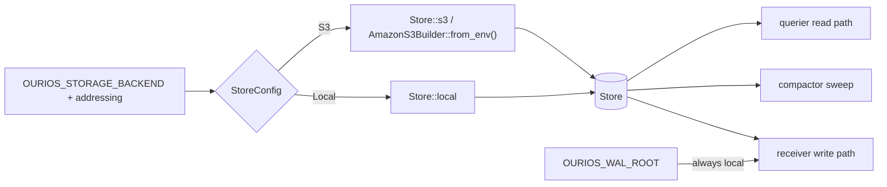

# RFC 0019 — Storage-backend selection: wiring the server to choose local vs S3

## 1. Summary

`ourios-server` always constructs `Store::local(OURIOS_BUCKET_ROOT)` today,
even though `ourios-parquet` already exposes `Store::s3(S3Config)` (RFC 0013,
`green`). This RFC wires **backend selection** through the server: an operator
picks `local` or `s3` via config, and the chosen `Store` is threaded into all
three roles. To make S3 actually usable, the querier and the compactor — which
still address the bucket through raw `std::fs` — are migrated onto the
`Store` / `object_store` abstraction the receiver already uses. The
write-ahead log stays local always (`CLAUDE.md` §3.6). This is the follow-on
RFC 0014 §7 and RFC 0013 §7 named; it is the prerequisite for an
object-storage-native deployment (and the `CLAUDE.md` §3.6-correct Helm chart).

## 2. Motivation

`CLAUDE.md` §3.6 makes object storage the source of truth: *"Local disk is
cache and WAL. Parquet on S3 is the truth."* RFC 0013 built the storage seam
(`Store`, `S3Config`, conditional-PUT atomics) and proved it on localstack, but
deferred the **selection** at the server config layer. The consequence today is
concrete: a deployment cannot put data on S3, so the first Helm chart had to
back the data store with a local `ReadWriteOnce` volume and a single replica —
a stopgap that contradicts `CLAUDE.md` §3.6 and blocks horizontal querier
scaling. Doing
selection at this layer, now, unblocks the architecturally-correct shipping
shape and exercises the RFC 0013 S3 path end-to-end through the real server.

The work is at this layer (the server + the querier/compactor read paths)
because that is the only place the bucket is still addressed as a local path;
the receiver write path (RFC 0014) already goes through `Store`.

## 3. Proposed design

### 3.1 Configuration (extends RFC 0004)

A new **startup configuration surface** — the storage backend and its
addressing — is added under RFC 0004's governance (its validation +
secret-hygiene rules). It is *not* an RFC 0004 **tunable** in the strict sense:
a tunable is global-with-per-tenant-override, whereas backend selection is
necessarily **process-wide** (one store per process). Credentials are not
Ourios configuration at all: they are operator secrets resolved by the standard
AWS credential chain (see §3.4 below).

| Env var | Backend | Meaning | Default |
| --- | --- | --- | --- |
| `OURIOS_STORAGE_BACKEND` | both | `local` or `s3` | `local` |
| `OURIOS_BUCKET_ROOT` | local | data + audit store root (existing) | — (required for `local`) |
| `OURIOS_S3_BUCKET` | s3 | bucket name | — (required for `s3`) |
| `OURIOS_S3_ENDPOINT` | s3 | S3-compatible endpoint (MinIO, R2) | unset (AWS) |
| `OURIOS_S3_REGION` | s3 | region | unset |
| `OURIOS_S3_PREFIX` | s3 | key prefix within the bucket | unset (bucket root) |

`OURIOS_WAL_ROOT` is unchanged and remains a **local** path under every
backend (`CLAUDE.md` §3.6 — the WAL is never an object-store key). "Local" here
means **fsync-durable local-filesystem semantics, not ephemeral storage**: the
WAL is the recovery mechanism (WAL-before-ack, `CLAUDE.md` §3.4), so the path
MUST be backed by storage that survives a process/pod crash — i.e. a persistent
volume, never a scratch/`emptyDir`-style mount. S3 is deliberately *not* used
for the WAL: it offers no atomic append or fsync and would put S3 PUT latency on
the ack path, defeating `CLAUDE.md` §3.4's batched-fsync latency/durability
knob; S3 is the truth for the *flushed* Parquet, which is all `CLAUDE.md` §3.6
requires. The WAL's durability obligation is bounded by the flush horizon
(`CLAUDE.md` §3.6 — local disk need not be durable *beyond* it). Surviving the
loss of the volume itself (node/AZ failure) is a separate, out-of-scope tier —
WAL **replication / archiving**, which `CLAUDE.md` §3.4 reserves as an addition
to the WAL, not a replacement, and which a future RFC may add. The
prior art is the PostgreSQL model (CloudNativePG's Barman Cloud,
`barman-cloud-wal-archive`): a hot fsync'd WAL on a local persistent volume,
*plus* asynchronous archiving of completed segments to object storage for
off-node recovery (§8).

### 3.2 The `StoreConfig` seam

`ourios-server` replaces the `bucket_root: PathBuf` it threads to each role
with a resolved, validated descriptor:

```rust
enum StoreConfig {
    Local(PathBuf),   // OURIOS_BUCKET_ROOT
    S3(S3Config),     // OURIOS_S3_* (S3Config is the RFC 0013 type)
}
```

`config_from_env` parses `OURIOS_STORAGE_BACKEND` and fails fast on a missing
required field (`OURIOS_S3_BUCKET` when `s3`; `OURIOS_BUCKET_ROOT` when
`local`) or an unknown backend. `StoreConfig::open() -> Result<Store, …>`
dispatches to `Store::local` / `Store::s3`. The receiver, compactor, and
querier each take a `StoreConfig` (or a constructed `Store`) instead of a
`PathBuf`.



### 3.3 Migrating the querier and compactor onto `Store`

- **Querier.** The bulk Parquet scan moves to DataFusion's native
  object-store support: register the `Store`'s `object_store` on the
  `SessionContext` and address tables by object-store URL rather than a local
  `ListingTableUrl` path. The audit-stream helpers that read with `std::fs`
  (`audit_scan`, `alias_store::derive_alias_map`,
  `template_registry::derive_template_registry`) move to `Store::list` /
  `get_blocking`. `Querier::new` takes a `Store` (or `StoreConfig`).
- **Compactor.** The filesystem walks (`tenants`, `plan_candidates`,
  `compact_partition`, `gc_orphans`) move to `Store::list` + the
  `ourios-parquet` `Store`-based read/write/delete. The manifest swap adopts
  `Manifest::publish_cas` (conditional PUT, RFC0013.3/.4) so concurrent or
  retried sweeps cannot clobber a generation. `Compactor::new` takes a `Store`.

Both migrations preserve the on-disk layout and the partition key scheme
(RFC 0005 §3.4) byte-for-byte — only the *addressing* changes (a local path
vs. an object-store key under the prefix), so historical local stores and the
existing reader/writer remain valid (RFC 0013 §3.2).

### 3.4 Credentials and secret hygiene

`S3Config` resolves credentials via `AmazonS3Builder::from_env()` — i.e. the
standard AWS chain: `AWS_ACCESS_KEY_ID`/`AWS_SECRET_ACCESS_KEY` (static keys,
delivered as a k8s Secret), a shared profile, IRSA, or instance metadata. No
Ourios-specific credential config is introduced. **Credential and secret
values** MUST never appear in logs, error messages, or metric attributes:
Ourios never reads `AWS_*` itself (the AWS chain does), `StoreError` withholds
backend internals, and a missing-S3-config error names only the *key*
(`OURIOS_S3_BUCKET`), never a credential. Non-secret config values (an
addressing knob, an interval) MAY be echoed in a resolution error for
diagnosability — e.g. the existing `OURIOS_COMPACTION_INTERVAL_SECS` parser
reporting the offending value — since those carry no secret; the prohibition is
specifically on credential/secret material.

## 4. Alternatives considered

- **Overload `OURIOS_BUCKET_ROOT` with an `s3://bucket/prefix` URL.** One var,
  no new knobs — but it conflates path, addressing, endpoint, and region into a
  single string, hides the MinIO/R2 endpoint override, and couples config
  parsing to `object_store`'s URL grammar. Rejected for a flat, explicit knob
  set that RFC 0004 can govern.
- **Only the receiver writes S3; querier/compactor stay local.** Incoherent —
  the data store is a single backend; a querier reading a local path would find
  nothing the S3 receiver wrote. Rejected.
- **Project S3 as a filesystem (CSI / s3fs mount).** Lets the existing `std::fs`
  code run unchanged, but defeats the conditional-PUT atomicity RFC 0009/0013
  rely on for the manifest swap, and adds an opaque failure surface. Rejected.
- **Defer (keep local-only).** Leaves the shipping chart on a single-replica
  RWO stopgap that contradicts `CLAUDE.md` §3.6 and blocks querier scaling.
  Rejected — this RFC is the unblock.

## 5. Acceptance criteria

> **Scenario RFC0019.1 — backend selection from config**
> - **Given** `OURIOS_STORAGE_BACKEND` unset and `OURIOS_BUCKET_ROOT` set
> - **When** the server resolves its config
> - **Then** it selects the local backend from `OURIOS_BUCKET_ROOT`;
>   **and** with `OURIOS_STORAGE_BACKEND=s3` + `OURIOS_S3_BUCKET` it
>   selects S3; **and** `s3` without `OURIOS_S3_BUCKET`, or an unknown
>   backend value, is a clear fail-fast startup error.

> **Scenario RFC0019.2 — the WAL stays local under every backend (`CLAUDE.md` §3.6)**
> - **Given** `OURIOS_STORAGE_BACKEND=s3`
> - **When** the receiver role runs
> - **Then** the WAL is written under the local `OURIOS_WAL_ROOT` and
>   never as an object-store key; the data + audit Parquet go to S3
>   (extends RFC0013.6).

> **Scenario RFC0019.3 — end-to-end ingest→query on S3**
> - **Given** the server configured for an S3-compatible backend (localstack)
> - **When** a batch is ingested and a DSL query runs
> - **Then** the Parquet lands under the S3 prefix and the query returns
>   the rows with non-zero pruning stats — the same result the local
>   backend produces.

> **Scenario RFC0019.4 — compaction operates on S3**
> - **Given** several small files for a partition on the S3 backend
> - **When** a compaction sweep runs
> - **Then** they are consolidated via `Store` I/O and the manifest is
>   swapped with a conditional PUT (`publish_cas`); a losing concurrent
>   sweep does not clobber the winning generation (RFC0013.3/.4).

> **Scenario RFC0019.5 — tenant isolation on S3 (`CLAUDE.md` §3.7)**
> - **Given** two tenants' data on the S3 backend
> - **When** one tenant queries
> - **Then** only that tenant's prefix is read; another tenant's objects
>   are never returned.

> **Scenario RFC0019.6 — config is governed by RFC 0004; no secret leakage**
> - **Given** S3 credentials supplied via the AWS chain
> - **When** the server starts, logs, errors, or exports metrics
> - **Then** no credential value appears in any log line, error message,
>   or metric attribute; a missing-S3-config error names only the missing
>   key, never a credential (non-secret knobs may be echoed for
>   diagnosability) (`CLAUDE.md` §6.3, RFC 0004).

> **Scenario RFC0019.7 — local backend regression**
> - **Given** no `OURIOS_STORAGE_BACKEND` set and `OURIOS_BUCKET_ROOT` set
>   (the default local path)
> - **When** the full existing suite runs
> - **Then** behaviour is byte-for-byte unchanged from the local path
>   today: receiver, querier, and compactor produce identical results,
>   and every pre-existing local test passes.

## 6. Testing strategy

- **RFC0019.1 / .6** — unit tests on `config_from_env` / `StoreConfig`
  resolution (the `main.rs` pattern), plus a log/error-scrub assertion for
  secret hygiene. Mirrors the existing `build_*_config` tests.
- **RFC0019.3 / .4 / .5** — testcontainers + localstack integration tests,
  reusing the `rfc0013_object_store.rs` harness (`Store::s3` against a
  localstack endpoint), gated to the CI `s3 integration (localstack)` job and
  `#[ignore]`d for the default `cargo test` run.
- **RFC0019.2** — a server-level test (the `rfc0013_6_wal_stays_local` pattern)
  asserting the WAL path is local while the data backend is S3.
- **RFC0019.7** — the existing local receiver/querier/compactor suites, run
  unchanged; the default config path is the regression guard.

## 7. Open questions

- [ ] **Single-writer lease vs. conditional-PUT contention** (carried from
  RFC 0013 §7) — is `publish_cas` retry sufficient for the compactor under
  multi-writer races, or is a dedicated lease object warranted? This RFC adopts
  `publish_cas`; a lease is a follow-up if contention shows up.
- [ ] **Local read cache** for hot S3 objects (RFC 0013 §7) — deferred.
- [ ] **Migration tool** to copy an existing local store to S3 — deferred; new
  deployments start on the chosen backend.
- [ ] **Multipart upload threshold** for the 256 MiB–2 GiB RFC 0009 outputs
  (RFC 0013 §7) — confirm `object_store` defaults suffice or expose a knob.

## 8. References

- RFC 0013 (object-storage backend — `Store`, `S3Config`, conditional-PUT;
  §7 open questions this resolves), RFC 0014 §7 (names this follow-on),
  RFC 0004 (configuration policy — the tunable/invariant line this extends),
  RFC 0005 §3.4 (partition layout, preserved), RFC 0009 (compaction — manifest
  swap), RFC 0007/0016 (the querier read path being migrated).
- `CLAUDE.md` §3.6 (object storage is the source of truth; local disk is cache
  and WAL), §3.7 (multi-tenancy on every data path), §6.3 (observability /
  self-telemetry — no secret leakage).
- `crates/ourios-parquet/src/store.rs` (`Store`, `S3Config`, `StoreError`),
  `crates/ourios-parquet/tests/rfc0013_object_store.rs` (the localstack
  harness), `crates/ourios-server/src/main.rs`,
  `crates/ourios-server/src/receiver.rs`,
  `crates/ourios-server/src/querier.rs`,
  `crates/ourios-ingester/src/compactor.rs`.
- Prior art for the deferred WAL-replication/archive tier (§3.1): PostgreSQL
  WAL archiving (`archive_command` / `archive_library`) and CloudNativePG's
  Barman Cloud (`barman-cloud-wal-archive`) — the same layering, a hot
  fsync'd WAL on a local persistent volume plus asynchronous shipping of
  completed segments to object storage for off-node recovery / PITR.
