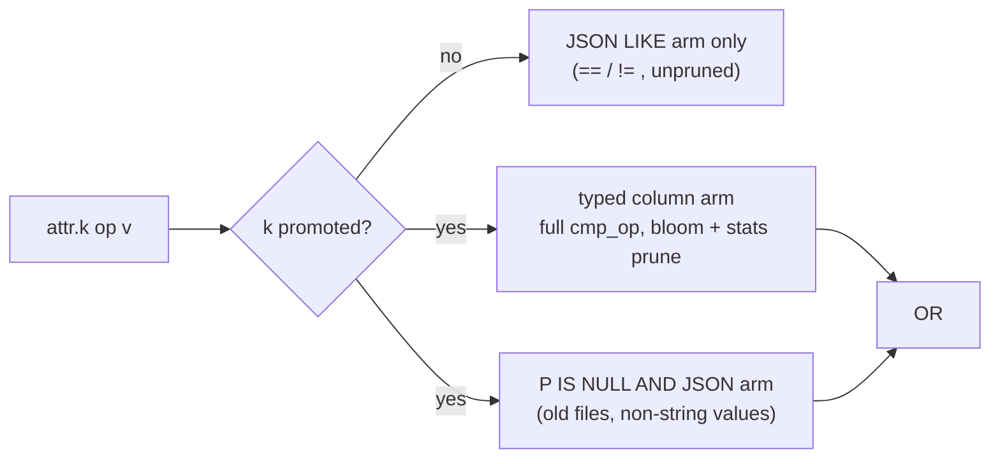

# RFC 0022 — Queryable attribute columns (RFC 0005 amendment)

## 1. Summary

Discharge the typed-attribute amendment that RFC 0005 §3.3 reserved
("the gate is a concrete consumer") — the consumer exists: the RFC 0002
DSL exposes `service`, `resource.<key>`, and `attr.<key>` as first-class
fields, and today they compile to a substring `LIKE` over the
canonical-JSON attribute columns (#146, tracked by #147). That stopgap
is correct for string equality and nothing else: no row-group pruning,
and ordering / regex comparisons are rejected.

This RFC adds a **promoted attribute column set** to the RFC 0005 data
schema:

- Each promoted key is projected at write time into its own `OPTIONAL`
  Utf8 column (dictionary + page index + bloom filter), named literally
  after the DSL path (`resource.service.name`, `attr.http.method`).
- The promoted set always contains the resource key `service.name`
  (OTel's primary correlation dimension, the DSL's bare `service`
  field); operators extend it via the RFC 0020 config file.
- DSL predicates on promoted keys compile to the typed column with the
  **full `cmp_op` set** (ordering + regex) and row-group pruning; a
  hybrid fallback arm keeps results correct on pre-amendment files and
  on non-string values. Non-promoted keys keep the RFC 0002 `LIKE`
  behaviour unchanged.
- The JSON columns (`attributes`, `resource_attributes`) remain the
  **source of truth**. Promoted columns are query-only projections: the
  read path (RFC 0017 `LogRow`) never consumes them, so OTLP fidelity
  and reconstruction are untouched.

Sibling (out of scope here): RFC 0007 §8's reserved param-predicate
pushdown amendment.

## 2. Motivation

`service == "api" and severity >= error | count by template_id` is the
canonical Ourios query shape (RFC 0002 §1). Today the `service` half is
a `LIKE '%{"key":"service.name",…}%'` scan over `resource_attributes`
in every row group the other predicates fail to prune. Three concrete
costs:

1. **No pruning.** The JSON columns carry no useful min/max statistics
   and no bloom filters (RFC 0005 §3.6 table); an attribute-only query
   reads the full corpus. That is exactly the failure mode the pillar-2
   thesis exists to avoid (CLAUDE.md §2, benchmark gates B1/B2).
2. **Operator gap.** Substring-on-JSON can only do exact
   key+string-value matching, so the DSL rejects ordering and regex on
   attributes (`InvalidQuery`) — a visible feature cliff between
   `severity_text =~ "..."` and `attr.http.route =~ "..."`.
3. **The reservation is due.** RFC 0005 §3.3 deliberately deferred the
   typed-attribute column set until "we have a concrete consumer"; the
   DSL surface and #146's stopgap are that consumer.

## 3. Proposed design

### 3.1 Promoted columns in the data schema

For each promoted key, the writer appends one column to the RFC 0005
§3.2 data schema:

| Property | Value |
|---|---|
| Name | The DSL path, literally: `resource.<key>` or `attr.<key>` (so `resource.service.name`, `attr.http.method`) |
| Arrow / Parquet type | `Utf8` / `BYTE_ARRAY` (UTF-8), `OPTIONAL` |
| Value | The attribute's **string value**, exactly as stored in the JSON column — no truncation, no normalisation |
| `NULL` when | The key is absent on the record, **or** its value is not a string `AnyValue` |
| Encodings | Dictionary **yes**, page index **yes**, bloom filter **yes** (extends the §3.6 table) |

Rules:

- **`service.name` is always promoted.** The effective promoted set is
  `{resource: ["service.name"] ∪ configured, log: configured}`.
- **String values only.** A promoted key whose value is an int, bool,
  double, bytes, array, or kvlist projects `NULL`; predicates fall
  through to the JSON arm (§3.3), which is precisely the stopgap's
  semantics for values it cannot match. Typed numeric promotion is a
  future extension (§7).
- **No truncation.** Truncating a projected value would make `==`
  silently miss; the projection is byte-faithful or `NULL`. The
  cardinality/size exposure this creates is handled by telemetry, not
  by lying (§3.5).
- **Projection, not truth.** `attributes` / `resource_attributes` keep
  their RFC 0005 §3.3 contract unchanged. The RFC 0017 read path
  (`LogRow`, rendering, OTLP fidelity) continues to decode from the
  JSON columns only — a divergence between a promoted cell and the
  JSON is impossible to observe through the read path, and the §5
  round-trip suites stay the oracle for fidelity.

Column-name note: literal dots in column names are valid in Parquet and
Arrow; on the DataFusion side every reference goes through
unqualified-column construction (the DataFrame API), never through the
SQL identifier parser, so no mangling scheme (and therefore no
collision handling) is needed. The `resource.` / `attr.` prefixes are
reserved column-name namespaces in the data schema from this RFC on.

### 3.2 Configuration (RFC 0020)

```yaml
storage:
  promoted_attributes:
    resource: [k8s.namespace.name]   # service.name is implicit, always on
    log: [http.method, http.status_code]
```

- Keys are plain attribute-key strings, taken literally (no globbing).
- The set applies to **new files at write time**; it is not
  retroactive. Files written under different sets coexist (§3.4).
- Defaults: empty beyond the implicit `service.name` — promotion
  beyond that is an explicit operator decision because each promoted
  key costs file bytes on every row (§3.5).
- Per-tenant sets are deferred (§7); the knob is global, consistent
  with every other RFC 0020 setting.

### 3.3 Predicate compilation

For a DSL comparison on a **promoted** key, the compiler emits a
two-arm expression (`P` = promoted column, `J` = the JSON arm — the
existing #146 `LIKE` fragment machinery):

```text
match_expr(op, v) :=
      (P op v)                       -- typed arm: full cmp_op set, prunable
   OR (P IS NULL AND J(op, v))       -- fallback arm: pre-amendment files,
                                     --   non-string values
```

with the same missing-field semantics the DSL uses everywhere: `NULL`
never matches, and `!=` requires the key present with a different
value (`P IS NOT NULL AND P != v`, mirrored in the JSON arm's presence
guard).

Why the fallback arm is cheap where it matters:

- **Post-amendment files, key present on every row:** the row group's
  `P` null-count is 0, so `P IS NULL` prunes the entire fallback arm
  and the typed arm's dictionary/bloom/min-max stats do the work — this
  is the steady-state fast path.
- **Pre-amendment files:** `P` is absent; the RFC 0005 §3.9
  missing-column carve-out reads it as all-`NULL`, the typed arm
  matches nothing, and the JSON arm reproduces today's exact
  behaviour. **No historical file is rewritten and no query returns
  different rows than the stopgap** (only ordering/regex, which the
  stopgap rejected outright, are newly answerable — and they are
  answerable only on promoted keys).
- **Mixed row groups** (some rows lack the key / hold non-string
  values): the fallback arm scans that row group's JSON — correctness
  costs a scan exactly where a scan is the only correct answer.

Operator set on promoted keys: the full RFC 0002 `cmp_op` —
`== != < <= > >=` (lexicographic, as for every other string field) plus
`=~` / `!~`. The ordering and regex arms apply **only** to the typed
column; on the JSON arm they remain rejected, so a query using them is
answered from promoted data plus `NULL`-fallback semantics — the RFC
0002 rejection text moves from "attributes don't support this" to
"non-promoted attributes don't support this".

Non-promoted keys: compile exactly as today (#146). No behaviour
change.



### 3.4 Schema evolution and migration plan (CLAUDE.md §3.5)

- All promoted columns are `OPTIONAL` and additive — the §3.9
  missing-column carve-out covers every pre-amendment file, and the
  unknown-column rule covers post-amendment files read by older
  binaries. This is the same evolution class as RFC 0018's columns.
- **No rewrite of historical data.** The §3.3 fallback arm is the
  migration plan: old files answer correctly (identically to today)
  without touching them. Compaction (RFC 0009) naturally re-projects
  rows it rewrites using the *current* promoted set, so history
  converges toward pruneability as a side effect, but nothing depends
  on that.
- **Changing the promoted set** between deploys is safe by the same
  rules: a key removed from the set stops being projected in new files
  (old files keep the column; the compiler still emits the two-arm
  expression whenever the scanned union schema carries the column), a
  key added starts `NULL`-backed in history. Scan-time schema union
  across files with different promoted sets is the ordinary §3.9 case.

### 3.5 Hazards (CLAUDE.md §4)

- **Cardinality / file bloat (hazard #2).** A promoted key with
  unbounded values (request IDs, URLs with query strings) bloats the
  dictionary and the bloom filter of its column. Mitigations: the set
  is opt-in per key (the failure is contained to an explicit operator
  decision), and the writer emits per-promoted-column byte telemetry
  (via the weaver registry, §3.6) so the tradeoff is observable. No
  truncation (§3.1) and no automatic demotion — predictability over
  cleverness; revisit if telemetry shows real-world foot-guns.
- **Small-file / wide-schema pressure (hazard #4).** Each promoted key
  adds one column chunk per row group. The config default (empty beyond
  `service.name`) keeps the floor where RFC 0005 left it.
- **Query DSL leakage (hazard #6).** The DSL surface is unchanged —
  the same field paths gain operators and speed; nothing about column
  names or promotion leaks into query syntax.

### 3.6 Telemetry

Per the weaver-registry discipline: a
`ourios.storage.parquet.promoted.bytes` counter (attribute: promoted
column name), following the existing `ourios.storage.parquet.*`
namespace (`metric.ourios.storage.parquet.file.size`), recording
projected bytes per flush alongside the existing writer metrics. Query-side pruning is
already observable through the RFC 0016 scanned/pruned row-group
counters — RFC0022.5 uses them as its oracle.

## 4. Alternatives considered

- **`MAP<STRING,STRING>` column** (the sketch in RFC 0005 §3.3).
  One column regardless of set size, but Parquet statistics and bloom
  filters on a map's value leaf are not key-scoped, and DataFusion has
  no map-key predicate pushdown — it prunes nothing. Pruning is the
  entire point (#147's ❌ list); rejected.
- **Full flattening (a column per key ever seen).** Schema explosion
  under attribute-key churn, unbounded wide-schema pressure, and every
  file carries every key's column chunk. The explicit promoted set is
  the deliberate, operator-owned subset of this.
- **Name mangling (`attr__http_method`).** Avoids dots in column names
  but needs an escaping scheme plus collision handling
  (`http.method` vs `http_method`), and the mangled names leak into
  every diagnostic. Literal names cost only unqualified-column
  construction on the DataFusion side; chosen.
- **JSON path expressions at query time** (DataFusion UDF over the
  JSON column). Fixes the operator gap but not pruning; strictly worse
  than the two-arm compile for the same implementation weight.
- **Rewrite history at cutover.** A compaction-style backfill would
  make pruning retroactive but couples the amendment to a corpus-wide
  rewrite (cost, object-store churn, §3.6 truth-of-storage risk during
  the swap). The fallback arm delivers correctness without it;
  convergence via ordinary compaction is free.

## 5. Acceptance criteria

Scenario ids `RFC0022.<m>`.

> **Scenario RFC0022.1 — `service.name` is always projected.**
> Given records whose resource attributes carry `service.name` as a
> string (plus records where it is absent or non-string),
> When the writer flushes them,
> Then the file carries an `OPTIONAL` Utf8 `resource.service.name`
> column whose cells equal the JSON values byte-for-byte where the
> value is a string and are `NULL` otherwise, and the
> `resource_attributes` JSON column is byte-identical to a
> pre-amendment writer's output.

> **Scenario RFC0022.2 — configured keys project the same way.**
> Given `storage.promoted_attributes` naming a resource key and a log
> key,
> When records carrying those keys (string and non-string) are
> flushed,
> Then `resource.<key>` / `attr.<key>` columns exist with the §3.1
> projection semantics, and a key *not* in the set produces no column.

> **Scenario RFC0022.3 — old files answer identically (§3.9 / §3.4).**
> Given a scan spanning a pre-amendment file (no promoted columns) and
> a post-amendment file,
> When `service == X` / `attr.<k> == X` / `!=` queries run,
> Then the result set equals the pure-`LIKE` compile's result set on
> the same data, row for row.

> **Scenario RFC0022.4 — full operator set on promoted keys only.**
> Given a promoted key and a non-promoted key,
> When ordering (`<`, `>=`, …) and regex (`=~`, `!~`) predicates are
> issued against each,
> Then the promoted key answers them (with `NULL`-never-matches
> semantics), and the non-promoted key still rejects them with
> `InvalidQuery`, `==`/`!=` continuing to work as today.

> **Scenario RFC0022.5 — promoted predicates prune (pillar 2).**
> Given a multi-row-group corpus where a promoted key's value is
> concentrated in a minority of row groups,
> When a selective equality query on that key runs,
> Then the RFC 0016 scanned/pruned counters show pruned > 0 (scanned <
> total), and B1/B2 gates are unchanged (indicative ci-runner;
> authoritative on maintainer opt-in, per the standing bench policy).

> **Scenario RFC0022.6 — the read path is projection-blind (§3.3).**
> Given files with promoted columns, including a hand-forged file
> where a promoted cell disagrees with the JSON,
> When rows are returned through the RFC 0017 read path,
> Then every OTLP field round-trips from the JSON columns exactly as
> before — the forged promoted cell is invisible — and the existing
> full-fidelity suites pass unchanged.

> **Scenario RFC0022.7 — promoted-set drift across deploys (§3.4).**
> Given three files written under promoted sets `{}`, `{a}`, `{a,b}`
> for keys `a`,`b`,
> When one scan spans all three and predicates on `a` and `b` run,
> Then the scan unions schemas without error and each predicate
> returns the correct rows from every file (typed arm where the column
> exists and is non-`NULL`, JSON arm otherwise).

## 6. Testing strategy

Per CLAUDE.md §6.2. RFC0022.1/.2 are writer unit + footer-inspection
tests in `ourios-parquet` (encodings asserted from the Parquet
metadata, as the RFC 0005 §3.6 suites do). RFC0022.3/.4/.7 are querier
acceptance tests over generated old/new file mixes — .3 reuses the
pre-amendment fixture discipline RFC 0021 §6 established (a committed
file written before the schema change). RFC0022.6 extends the RFC 0017
fidelity suites with a forged-divergence file. RFC0022.5 is a
deterministic pruning test in the shape of `rfc0007_1_*` (counters, not
wall-clock), plus the indicative bench dispatch. Property tests: the
projection function (`AnyValue` → cell) round-trips against the
canonical-JSON encoder for arbitrary string values (proptest, shared
generators with the RFC 0001 §6.1 codec suite).

## 7. Open questions

1. **Typed numeric promotion.** `attr.http.status_code >= 500` compares
   lexicographically on the string projection ("500" ≥ "500" works;
   cross-magnitude comparisons don't). A future `Int64`-typed promotion
   class (per-key type declaration in config) would fix ordering for
   numeric attributes; deferred until a consumer demands it — the
   string projection already answers equality and regex.
2. **Per-tenant promoted sets.** Global-only in this RFC. Multi-tenant
   operators with divergent schemas may want scoping; the column
   mechanism doesn't change, only config addressing.
3. **Automatic demotion / cardinality guards.** Telemetry-first (§3.5);
   revisit if promoted-column bloat shows up in practice.
4. **Bloom filter sizing.** Writer defaults initially; per-key tuning
   is config surface we can add without schema impact.

## 8. References

- #147 (this amendment's tracking issue), #146 (the `LIKE` stopgap PR),
  RFC 0002 (#143 epic) — the DSL field surface.
- RFC 0005 §3.2 (data schema), §3.3 (`AnyValue` encoding rule + the
  reserved amendment this RFC discharges), §3.6 (encodings table this
  RFC extends), §3.9 (evolution rules the migration plan leans on).
- RFC 0016 (scanned/pruned counters — the RFC0022.5 oracle).
- RFC 0017 (the projection-blind read path in RFC0022.6).
- RFC 0020 (the `storage.promoted_attributes` config surface).
- RFC 0007 §8 (the sibling param-pushdown reservation, untouched).
- CLAUDE.md §2 pillar 2, §3.5 schema-migration invariant, §4 hazards
  #2/#4/#6.
