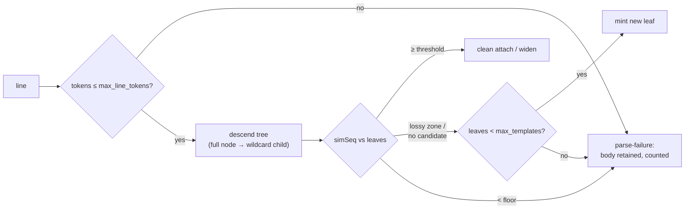

# RFC 0023 — Bounded template memory (RFC 0001 amendment)

## 1. Summary

The miner's per-tenant template store grows without bound. The first
10–100 GiB scale run (2026-07-04, LogHub HDFS_v2 — 16 GiB / 71 M
lines of Hadoop daemon logs, on `baseline-8vcpu-32gib`) was
OOM-killed at **31.5 GiB RSS** during the B2 store build: the miner
had minted **≥ 56,000 templates by the 1.8 GiB mark** (the busiest
covering only 0.67 % of rows), with memory growing roughly linearly
at ~2× corpus bytes. The bench-side suspects were eliminated first —
the corpus loader streams (#350) and the harness's quadratic snapshot
capture was fixed (#351) — leaving the miner's tree itself as the
proven cause.

This is not bench-only: the production ingester runs the same
`MinerCluster`, so **a single tenant shipping shape-diverse logs
(stack traces, multi-format daemon output) can OOM an ingester pod.**
That is a direct hit on hazards #1 and #2. Upstream Drain3 carries
`max_children` and a cluster cap for exactly this input class;
`MinerConfig` today has neither.

This RFC adds three configurable bounds — a per-node fan-out cap, a
per-tenant template ceiling, and a per-line token cap — with one
overflow rule everywhere: **fail honestly (parse-failure path, body
retained, counted and observable), never force-merge.** The §3.1
no-silent-merge invariant is load-bearing throughout.

## 2. Motivation

- **Hazard #2 (cardinality blowup), tree edition.** RFC 0001 §6
  bounds *parameter* bytes (`param_byte_limit`) but nothing bounds the
  number of leaves or the token width of a stored template. A corpus
  whose lines are structurally diverse (HDFS_v2's node logs interleave
  block events, GC lines, and multi-hundred-token stack traces) mints
  a new leaf every few lines forever.
- **Measured, not hypothetical.** The scale-run evidence chain:
  streaming loader held 1.3 GiB flat for hours (loader exonerated);
  gdb stack samples during the slow phase landed in bench-harness
  snapshot capture (CPU pathology fixed in #351, miner CPU
  exonerated); the rerun then OOM-killed at 31.5 GiB anon RSS
  (`dmesg`), while 1.1 GiB and 1.8 GiB subsets completed — with the
  1.8 GiB subset showing template ids ≥ 56,199. Linear growth at
  ~2×  corpus bytes extrapolates exactly to the observed kill.
- **The fragmentation itself is a correctness smell.** 56 k templates
  with the busiest at 0.67 % of rows means pillar #2's logical
  reduction (50–200×) has failed on this corpus *shape*: pruning value
  collapses along with memory. A bounded miner turns that failure
  mode from "process dies" into "observable degradation with bodies
  retained".

## 3. Design

### 3.1 Three bounds, one overflow rule

All three are `MinerConfig` fields, enforced per tenant (the tree is
per-tenant, `CLAUDE.md` §3.7). Overflow **never** attaches a line to
a template it did not match (§3.1 no-silent-merge); it takes the
RFC 0001 §6.3 parse-failure path: `template_id = NO_TEMPLATE`, body
retained verbatim, counted.

1. **`max_node_children`** (default **100**, Drain3's default) — cap
   on an internal prefix node's distinct-token children. When a node
   is full, unseen tokens route through a `<*>` wildcard child
   (minted on first overflow) instead of a new branch. This bounds
   tree *width*. Routing is not merging: leaf attach below the
   wildcard child stays `simSeq`-gated exactly as everywhere else —
   a line that matches no leaf at or above the floor still mints its
   own leaf (subject to bound 2) or fails parse.
2. **`max_templates`** (default **20,000**) — per-tenant ceiling on
   Drain-tree leaves. At the ceiling, both minting paths (the §6.3
   lossy-zone new leaf and the no-candidate new leaf) divert to
   parse-failure. The first ceiling hit per tenant logs a structured
   warning; every diverted line increments the parse-failure counter
   with a `reason` attribute (§3.4). Existing leaves keep widening
   normally — the ceiling stops *growth*, not matching.
3. **`max_line_tokens`** (default **512**) — lines that tokenize past
   the cap go straight to parse-failure with the body retained. This
   bounds stored-template token *width* (a 900-token stack-trace line
   today mints a 900-token template) and, with bound 2, makes worst-
   case tree memory a computable product instead of an open-ended
   sum.

### 3.2 Why fail-honest instead of Drain3's alternatives

Drain3 under pressure either force-merges into the nearest cluster or
LRU-evicts old clusters (`max_clusters`). Both are wrong here:

- **Force-merge** is precisely the §3.1 corruption the project treats
  as its worst failure: a search for one event returning another's
  rows. Rejected outright.
- **LRU eviction** invalidates `template_id`s already written into
  Parquet: the read-time registry (RFC 0017) renders rows from the
  audit-derived template history, and eviction either breaks those
  renders or demands tombstone machinery in the audit stream. That
  cost isn't justified before a real tenant needs template *churn*
  (as opposed to a cap); deferred to §7.

Parse-failure with body retention is already a first-class,
bit-faithful path (RFC 0001 §6.3, C1 excludes it by construction and
the body column preserves the line exactly), so overflow degrades to
"unmined but fully stored and searchable" — the honest floor.

### 3.3 What does not change

- **No schema change.** Parquet layout, `template_id` semantics, and
  every existing file are untouched (`CLAUDE.md` §3.5 satisfied
  trivially).
- **Healthy corpora are unaffected.** HDFS_v1, the OTel-Demo
  captures, and the seed corpus mine to well under 5 % of the default
  ceiling with fan-out far below 100; defaults must be invisible
  there (RFC0023.5 pins byte-identical template sets).
- **Existing knobs keep their meaning.** `similarity_threshold`,
  `similarity_floor`, `param_byte_limit`, `prefix_depth` are
  untouched; the new bounds compose with them.

### 3.4 Telemetry (weaver registry, per the standing discipline)

- `ourios.miner.parse_failures` (existing counter) gains a
  **`ourios.miner.parse_failure.reason`** attribute — values
  `below_floor` | `line_too_long` | `template_ceiling` — following
  the OTel "error.type on an existing instrument" convention rather
  than minting per-cause counters.
- `ourios.miner.template.count` (existing gauge) is the ceiling's
  observable: `count == max_templates` plus a non-zero
  `template_ceiling` failure rate is the operator's saturation
  signal.
- Exact registry entries are settled in `semconv/registry/` at
  implementation time via `weaver registry generate`, as always.

### 3.5 Configuration surface

The bounds land as programmatic `MinerConfig` fields with the
defaults above. Exposure in the RFC 0020 config file (a `miner.*`
section) is a small follow-up schema extension in the RFC 0020
evolution style — the same pattern `storage.promoted_attributes`
used (RFC 0022 §3.2) — and is not required for this RFC to go
`green`: defaults protect every deployment immediately.

## 4. Alternatives considered

- **Byte-budget accounting** (cap tree bytes, not counts). More
  direct, but the trigger becomes opaque ("why did mining stop at
  17:42?") and the accounting itself is invasive. Count × width caps
  give the same asymptotic bound with explainable, testable knobs.
- **Force-merge under pressure** (Drain3 default-ish). Violates §3.1;
  rejected — see §3.2.
- **LRU eviction** (`max_clusters`). Breaks written-data guarantees;
  deferred — see §3.2 / §7.
- **Do nothing, document the limit.** Leaves the ingester
  OOM-able by a single tenant's log shape — an operational DoS vector
  (hazard #2) — and leaves the 10–100 GiB thesis gates unmeasurable.

## 5. Acceptance criteria

Scenario ids `RFC0023.<m>`.

> **Scenario RFC0023.1 — the ceiling holds and never merges.**
> Given a `MinerConfig` with a small `max_templates` and a corpus
> that would mint more,
> When the corpus is ingested,
> Then the tenant's template count plateaus at the ceiling, every
> would-mint line takes the parse-failure path with its body
> retained, and no overflow line is attached to any existing
> template (no silent merge: template row sets are identical to an
> uncapped run truncated at the ceiling).

> **Scenario RFC0023.2 — overflow lines stay stored and searchable.**
> Given ceiling-overflow lines from RFC0023.1 written to Parquet,
> When the bodies are read back,
> Then each round-trips bit-identically through the body column.

> **Scenario RFC0023.3 — node fan-out caps via wildcard routing.**
> Given a corpus whose lines present more than `max_node_children`
> distinct tokens at one prefix level,
> When ingested,
> Then the node's child count never exceeds the cap, later tokens
> route through the wildcard child, and attach under that child
> remains threshold-gated (a below-floor line still fails parse
> rather than merging).

> **Scenario RFC0023.4 — the long-line guard.**
> Given a line tokenizing past `max_line_tokens`,
> When ingested,
> Then it takes the parse-failure path, its body round-trips
> bit-identically, and no template of that width exists in the tree.

> **Scenario RFC0023.5 — defaults are invisible on healthy corpora.**
> Given the default bounds,
> When the corpus suites (HDFS_v1, seed, OTel-Demo captures) run,
> Then the mined template sets are identical to an unbounded run
> (C1/C2 and the reconstruction property suites pass unchanged).

> **Scenario RFC0023.6 — saturation is observable.**
> Given a ceiling-saturated tenant,
> When telemetry is scraped,
> Then `ourios.miner.parse_failures` carries
> `reason = template_ceiling` increments and
> `ourios.miner.template.count` reads the ceiling value.

> **Scenario RFC0023.7 — the scale run completes (the falsifier).**
> Given LogHub HDFS_v2 (16 GiB) on `baseline-8vcpu-32gib` under
> default bounds,
> When the B1/B2 store builds run,
> Then mining completes with peak RSS under 8 GiB and the query
> benches produce results (indicative ci-runner first, authoritative
> on maintainer opt-in, per the standing bench policy). If bounded
> mining still cannot complete this corpus, the design is wrong —
> reopen.

## 6. Testing strategy

Per `CLAUDE.md` §6.2. RFC0023.1/.3/.4 are miner unit + property tests
(`proptest` over adversarial token streams for the no-silent-merge
half: an overflow line's row must never carry another template's id).
RFC0023.2 rides the existing writer round-trip suites. RFC0023.5 is
the existing corpus gate rerun under defaults — the "tests are
specifications" tripwire for this whole RFC: no existing suite may be
weakened to make the bounds fit. RFC0023.6 uses the in-memory meter
harness the other miner-metric tests use. RFC0023.7 reuses the scale
runner (`scratch/baseline/`) with its peak-RSS sampler.

## 7. Open questions

1. **Eviction / template aging.** Long-lived tenants with genuine
   template churn (deploys renaming log sites) will eventually fill
   any ceiling with dead templates. An aging mechanism needs audit
   tombstones + registry support; deferred until a consumer exists.
2. **Per-tenant overrides.** Global defaults now, consistent with
   every RFC 0020 knob; revisit with multi-tenant operations.
3. **Ceiling-hit audit event.** A system-scoped audit event (the
   RFC 0008 §9 deferred family) would give drift queries visibility
   into *when* saturation began; metrics-only for now.
4. **`miner.*` config-file section** — §3.5 follow-up.

## 8. References

- Scale-run evidence (2026-07-04): attempt logs + subset probes
  retained by the maintainer; summarized in `docs/benchmarks.md` §9.10
  and §1 above. Bench-side fixes: #350 (streaming corpus loads),
  #351 (snapshot-capture skip).
- Drain3 (`logpai/Drain3`): `max_children`, `max_clusters` — the
  upstream mechanisms this RFC adapts (adopting the first, rejecting
  the second's eviction semantics for §3.2's reasons).
- RFC 0001 §6.2 (tree walk), §6.3 (three-zone model + parse-failure
  path this RFC reuses as its overflow floor).
- `CLAUDE.md` §2 pillar 2, §3.1 (no silent merges), §3.7 (per-tenant
  scoping), §4 hazards #1/#2.
