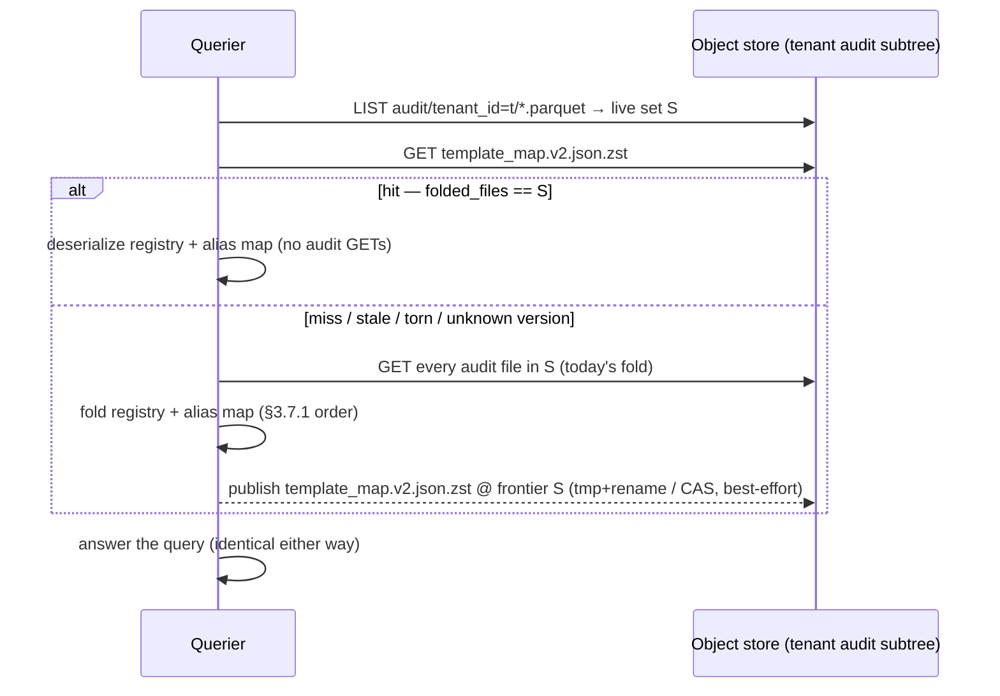

# RFC 0033 — Cached template-map artifact

## 1. Summary

Discharges the RFC 0005 §3.7.1 deferral: a **per-tenant cached
fold of the audit stream** — one artifact carrying both the RFC 0017
§3.2 template registry and the RFC 0005 §3.7.1 alias map — published
to object storage next to the audit files it is derived from. The
audit stream **remains the source of truth**; the artifact is a
derived acceleration, valid only when the exact audit-file set it
folded equals the tenant's live audit-file listing, discardable at
any time, and bypassed (fresh fold, exactly today's behaviour)
whenever absent, stale, torn, or unreadable. Publication follows the
RFC 0009 §3.4 write-tmp-then-atomic-swap precedent; the writer is
the querier itself, write-through after a cache-miss derivation.
This replaces a per-query read of the tenant's entire audit history
— measured at a constant 513,862 bytes per body-rendering query in
RFC 0031 comparative run #8 — with one small object GET.

## 2. Motivation

### 2.1 The deferral condition has been met — and measured

RFC 0005 §3.7.1 pinned v1 as "no persisted per-tenant artifact: the
audit stream *is* the alias store", and deferred the cached map with
an explicit escape hatch — "a pure recovery/latency cache over this
derivation", to be designed when it measurably matters. RFC 0017
§3.6 took the same stance for the template registry: "O(audit
events), the same cost profile as the alias map, acceptable for v1."

It now measurably matters. RFC 0031's honest total-bytes accounting
(§3.6, measurement-fidelity amendment 2026-07-12) counts the
registry derivation into every comparative query's `bytes_read`, and
comparative run #8 (2026-07-12, otel-demo-v8 corpus, 4.9 M records)
measured it at a **constant 513,862 bytes per query**: every query
that renders bodies calls
`template_registry::derive_template_registry_measured`, which walks
`audit_scan::read_all_events` over the tenant's **entire** audit
subtree — every audit Parquet file, full-object GETs on the S3
backend — before answering. The alias map
(`alias_store::derive_alias_map`) folds the same full stream the
same way at query-compile time whenever the DSL uses
`resolves_to`.

Three properties make this a tax worth an RFC rather than a shrug:

1. **It is per-query.** The fold is derived once per executed query
   (RFC 0017 §3.2), so the 514 KB is paid on every body-rendering
   query, not amortised.
2. **It grows with tenant age, not query selectivity.** The audit
   stream is append-only; every widening, type expansion, creation,
   and alias assertion in the tenant's history adds to it. A
   selective query over a day of data pays for the tenant's entire
   template history. This is the inverse of the pruning thesis
   (`CLAUDE.md` §2 pillar #2): the data scan shrinks with
   selectivity while the registry scan only ever grows.
3. **It is now inside the headline metric.** RFC 0031's L-gates
   gate on total bytes read from object storage. A constant
   ~514 KB floor under every Ourios query is a direct, growing
   drag on the project's existential comparison.

### 2.2 Why this layer

The fix belongs at the derivation seam, not in the fold semantics:
`derive_template_registry` / `derive_alias_map` already sit behind
narrow functions whose contract is "the fold of the tenant's audit
history in the §3.7.1 total order". Caching the *result* of that
contract keyed on the *exact inputs* changes no query-visible
semantics — the same "v1 full-replay now, accelerate later, no
format change" shape RFC 0001 §6.9 pinned for the miner snapshot and
RFC 0005 §3.7.1 explicitly promised for this artifact.

## 3. Proposed design

### 3.1 One artifact, not two

The registry and the alias map are folds of the **same** append-only
audit stream, resolved through the same `audit_scan::audit_files`
walk, with the same total fold order and the same validity domain
(the exact set of audit files folded). They ship as **one artifact**:

- One freshness check (one LIST comparison) instead of two.
- One atomic publish, so the two folds can never disagree about
  which frontier they reflect — a split artifact could serve a
  registry at frontier *F1* and an alias map at *F2* in the same
  query.
- The dominant cost being replaced is the shared
  `read_all_events` byte scan, not the per-fold CPU; splitting
  buys nothing there.

The alternative (two artifacts, independently refreshed) is recorded
in §4.

### 3.2 The artifact — format and location

A single JSON object per tenant, named **`template_map.json`**
(**legacy v1 encoding** — key and transport encoding superseded by
the 2026-07-13 amendment at the end of this section; the JSON
*structure* below is unchanged, but v2 carries `format_version: 2`
and ships zstd-compressed at the v2 key), living at the root of the
tenant's audit subtree:

```text
audit/tenant_id=<percent-encoded>/template_map.json
```

- **Object storage per `CLAUDE.md` §3.6** — the artifact lives on
  the same store as the audit files it folds; local disk holds no
  copy the store does not.
- **Tenant-scoped path per `CLAUDE.md` §3.7** — under the same
  `tenant_id=` partition key the audit walk is already scoped to.
- **Invisible to every existing reader by construction**: the local
  audit walk collects only `*.parquet` entries and the S3 listing
  filters `ends_with(".parquet")` (`audit_scan.rs`), so a JSON
  object in the subtree contributes nothing to any deployed
  binary's scan. This is the additive-artifact property §3.6
  relies on.

JSON follows the `manifest.json` precedent (RFC 0009 §3.4): small,
human-inspectable, `serde`-round-tripped, no Parquet machinery for a
kilobyte-scale object. Content:

```json
{
  "format_version": 1,
  "tenant_id": "acme",
  "folded_files": ["year=2026/month=07/day=11/….parquet", "…"],
  "registry": [
    { "template_id": 7, "version": 1, "template": "user <*> logged in" },
    { "template_id": 7, "version": 2, "template": "user <*> logged <*>" }
  ],
  "alias_map": [
    { "representative": 3, "members": [3, 9, 12] }
  ]
}
```

- `folded_files` — the **frontier**: the exact audit `*.parquet`
  file set the folds consumed, as store-relative keys under the
  tenant's audit root, sorted lexicographically. Audit files are
  immutable once committed (uncommitted writers use `*.parquet.tmp`,
  which the walk already ignores), so set equality is a complete
  validity condition — no per-file ETags needed.
- `registry` — the RFC 0017 §3.2 `(template_id, version) → tokens`
  map, template encoded in the canonical space-joined
  `format_template` form the audit stream itself stores (the exact
  input `parse_template` already consumes), so the artifact adds no
  second token encoding to the system.
- `alias_map` — the folded RFC 0001 §6.7 equivalence classes, one
  entry per class, `representative = min(members)` as §6.7 defines.
  Storing the *folded* classes rather than the event log keeps the
  reader a deserialization, not a re-fold.
- `tenant_id` — the row-vs-path discipline (RFC 0005 §3.9,
  `CLAUDE.md` §3.7) applied to the artifact: a reader MUST verify
  it matches the tenant whose path it was fetched from and fail
  loudly on mismatch, exactly as `read_all_events` does for audit
  rows.
- `format_version` — evolution hook: a reader encountering an
  unknown version treats the artifact as **absent** (fresh fold,
  then republish at its own version), mirroring the RFC 0005 §3.9
  unknown-column tolerance. No migration of old artifacts is ever
  required because the artifact is derived and discardable.

**Size bound.** The registry is bounded by RFC 0023's bounded
template memory (per-tenant template count is capped) times the
per-template version count; templates are token strings, not log
data. The alias map is rare operator actions. The artifact is
therefore expected to be kilobytes-to-low-megabytes, and on any
tenant with meaningful history substantially smaller than the audit
stream it folds (which carries the same templates *plus* envelopes,
samples, hashes, and full history) — but this is a measured
expectation, not a guarantee: on a very small tenant the frontier
list and JSON envelope can exceed the audit bytes. The publisher
therefore **abstains** when the serialized artifact is not smaller
than the audit bytes just folded (nothing to win) or exceeds a
configured size ceiling; the exact ceiling is an open question
(§7). Abstention costs nothing — the no-artifact path is today's
behaviour.

> **Amendment (2026-07-13, run #20 / §9.14): compressed artifact
> encoding — `format_version` 2.** Comparative run #20
> (`docs/benchmarks.md` §9.14) showed the v1 encoding losing to its
> own guard on the headline corpus: on otel-demo-v8 the uncompressed
> JSON of every `(template_id, version)` canonical template meets or
> exceeds the 513,862 B *zstd-compressed Parquet* fold it must
> undercut, so the size abstention correctly refused every publish
> and the corpus never ran warm (RFC0033.6's corpus arm
> undischarged, status `green → red`). The defect is transport
> encoding, not structure; this amendment changes only how the bytes
> ship.
>
> - **Encoding.** The artifact body is the §3.2 JSON object,
>   zstd-compressed as a single frame. The JSON structure, field
>   meanings, canonical sort orders, and validation rules above are
>   **unchanged** — only the bytes on the wire are. The compression
>   level is the crate default (3), an implementation constant, not
>   configuration: the object is kilobyte-scale and written once per
>   miss, the template-string JSON is highly redundant (the same
>   strings zstd-compress into the 513,862 B audit Parquet *with*
>   their full event history alongside), so the needed
>   order-of-magnitude win does not hinge on the level; raise the
>   constant in code if run #21 measures the ratio marginal.
> - **Key: `template_map.v2.json.zst`**, same tenant audit root
>   (`audit/tenant_id=<enc>/template_map.v2.json.zst`) — the version
>   moves **into the key**. A pre-amendment reader GETs only
>   `template_map.json`, so for it the v2 artifact is *literal
>   absence* — genuine fresh fold, correct by §3.3's design, with
>   honest telemetry. A post-amendment reader GETs only the v2 key.
>   Both keys stay invisible to every audit walk by construction
>   (local walk keeps only `extension == "parquet"` entries, S3
>   listing filters `ends_with(".parquet")` — `audit_scan.rs`; the
>   filter ignores any number of non-Parquet keys, so a second one
>   changes nothing). Future encoding-affecting bumps repeat the
>   pattern: new key, new in-body version, best-effort delete of the
>   predecessor (§3.4 amendment).
> - **Rejected: same key, magic-frame sniff.** The alternative keeps
>   `template_map.json` and has readers sniff the zstd frame magic
>   (`0xFD2FB528`) before JSON parse. It is *correct* — an old
>   reader GETs the compressed body, fails JSON parse, classifies
>   **Torn**, folds fresh, self-heals — but it lies twice: §3.7
>   pins `torn` as the RFC 0008-style *corruption* signal, so a
>   mixed-version fleet would page on healthy state for as long as
>   one old binary keeps querying; and §3.3's `UnknownVersion`
>   disposition — designed for exactly this evolution — is
>   unreachable there, because the parse fails before the version
>   probe runs. A `.json` key carrying zstd bytes also misnames the
>   object. The one cost of the new-key route — a bounded second
>   key during the mixed-version window, deleted best-effort — is
>   cheaper than a permanently lying corruption signal.
> - **`format_version: 2`, in the decompressed body.** The version
>   names the whole artifact contract *including* the transport
>   encoding, not just the JSON shape: `TEMPLATE_MAP_FORMAT_VERSION`
>   becomes 2, and the probe runs on the decompressed bytes as
>   defense-in-depth — a v1 body planted at the v2 key (or a
>   decompressed v2 body at the v1 key) classifies `UnknownVersion`
>   → treated as absent, harmless, per §3.3's rule.
> - **Dispositions at the v2 key** (§3.3 table unchanged in
>   spirit): not a zstd frame, failed decompression, or
>   post-decompression parse/validation failure → **Torn**;
>   decompressed `format_version` ≠ 2 → **`UnknownVersion`**;
>   `tenant_id` mismatch → loud failure. Everything else as
>   tabulated.
> - **Abstention, restated (unchanged in spirit).** Publish iff the
>   **compressed** artifact byte size is smaller than the audit
>   bytes just folded: the comparison is between the bytes a warm
>   GET would pay and the bytes the fold just paid — the v1 rule
>   applied to the bytes actually shipped.
> - **Telemetry (§3.7).** The artifact-size histogram records the
>   **compressed** (published-object) bytes — the GET cost, which
>   is what the instrument always measured (it records the
>   published bytes, and those are now compressed). Lookup and
>   publish outcome values are unchanged.
> - **Reading rule.** References to `template_map.json` elsewhere
>   in this RFC (§3.3–§3.5, §5, the §3.4 diagram) read as the
>   versioned key post-amendment; the local tmp is
>   `template_map.v2.json.zst.tmp` (extension `tmp`, ignored by the
>   walk as before).
> - **Dependency.** Zero new dependencies: `zstd` 0.13 is already
>   compiled into every querier build (`parquet` 58's `zstd`
>   feature via `ourios-parquet`, and `arrow-ipc`), and
>   `ourios-bench` already binds the crate directly as the A1
>   reference codec (RFC 0006 §3.4.1). Adding `zstd = "0.13"` to
>   `ourios-querier` introduces no new transitive crate and passes
>   the existing cargo-deny license gate unchanged.
> - **Validation: comparative run #21, before merge.** The
>   amendment is validated by a comparative dispatch from the
>   implementation branch **before** it merges (the
>   measure-before-merge workflow), and the harness MUST print each
>   pair's publish outcome explicitly — `published` (with the
>   compressed size), `abstained` (with the would-be size vs. the
>   folded audit bytes), `lost_race`, or `error` — so run #20's
>   ambiguity (abstention and publish IO failure both leaving the
>   same "no artifact" label) cannot recur.

### 3.3 Freshness — the frontier check

The audit stream is append-only, so cache validity is exactly:

> the artifact's `folded_files` set **equals** the tenant's live
> audit-file listing at read time.

The read path becomes:

1. List the tenant's audit `*.parquet` set (the existing
   `audit_files` walk / prefix LIST — no GETs).
2. GET `template_map.json`. If absent, torn (JSON parse failure),
   unknown `format_version`, or `tenant_id`-mismatched — see
   dispositions below.
3. If `folded_files` == the live set (set equality; both sides are
   sorted-unique already): **cache hit** — deserialize, use.
4. Otherwise (new files appended, or files removed by a future
   retention/GC): **stale** — fall back to the fresh fold over the
   live set, exactly today's `read_all_events` path, then
   write-through (§3.5).

Dispositions, pinned:

| Condition | Disposition |
|---|---|
| Artifact absent | Fresh fold (today's behaviour), write-through |
| Frontier ≠ live set | Fresh fold, write-through at the new frontier |
| Torn / unparseable JSON | Treat as absent; fresh fold, write-through overwrites; emit telemetry (§3.7) |
| Unknown `format_version` | Treat as absent (forward compat) |
| `tenant_id` mismatch | **Fail the query loudly** — corrupt or foreign object under the tenant's root, same stance as the audit row-vs-path backstop |

The first four never produce a wrong answer — every non-hit path is
the v1 fold. The stale-cache fallback is *re-derive, never serve
stale*: a hit reflects exactly the events a fresh fold at the same
listing would, so the RFC 0005 §3.7.1 consistency bound
(audit-flush visibility) is unchanged by this RFC. The only ordering
requirement is LIST-before-GET-is-compared: the frontier comparison
uses one listing, taken once, for both the validity check and the
fallback fold, so a file appearing mid-query affects a cached and an
uncached query identically.

> **Amendment (2026-07-13, run #20 / §9.14).** At the v2 key (§3.2
> amendment), "torn / unparseable JSON" includes a missing zstd
> frame or a failed decompression, and the unknown-`format_version`
> probe runs on the *decompressed* bytes. The table's dispositions
> and the LIST-before-GET rule are otherwise unchanged. Note the
> version-in-key choice means a pre-amendment reader never fetches
> a v2 artifact at all: for old binaries the encoding bump manifests
> as literal absence — the cleanest possible realization of the
> unknown-version-is-absent rule this table was designed around.

### 3.4 Atomic publish — the RFC 0009 §3.4 precedent

The artifact is published the way the compaction manifest is
committed:

- **Local backend**: write `template_map.json.tmp`, `rename` into
  place (`Manifest::write_atomic` shape). A crash mid-write leaves
  the prior artifact (or its absence) authoritative and a harmless
  `.tmp` for the GC sweep; the rename is the only visibility point.
- **S3 backend**: single-object conditional put
  (`Manifest::publish_cas` shape). Object stores make the whole PUT
  visible atomically; the conditional (create / ETag-match)
  precondition prevents interleaved writers from tearing each
  other.

Unlike the manifest, a **lost race is harmless here**: every writer
publishes a correct fold of *some* frontier, the reader verifies the
frontier independently at every read (§3.3), and a superseded
artifact is simply detected stale on the next query and rewritten.
So on CAS conflict the loser discards its write and moves on — no
retry loop, no error. The manifest needed CAS to prevent *lost
updates* of authoritative state; the cache needs only *atomicity of
the object itself*, and gets CAS cheaply because the primitive
already exists.

> **Amendment (2026-07-13, run #20 / §9.14).** The publish targets
> the v2 key (`template_map.v2.json.zst`; local tmp
> `template_map.v2.json.zst.tmp`, same rename; same CAS ladder on
> S3, the expectation being the v2 key's observed ETag or
> create-if-absent), and on a successful publish best-effort
> **deletes** the stale v1 `template_map.json` key. The delete is
> unconditional (no CAS needed — any v1 artifact is derived and
> discardable by definition) and never a query failure; a crash or
> failure between publish and delete leaves both keys, which is
> harmless: each reader population GETs only its own key and
> verifies the frontier at every read, and the next successful v2
> publish retries the delete implicitly. During a mixed-version
> window an old binary's write-through may republish the v1 key (on
> tenants where the uncompressed artifact still beats the fold);
> correctness is unaffected — each version population maintains its
> own cache — and hygiene converges once old binaries retire.



### 3.5 Who writes it — querier write-through

**Position: the querier publishes, write-through, after every
cache-miss derivation.** After a fresh fold (miss or stale), the
querier serializes the fold it already holds plus the frontier it
already listed, and publishes best-effort — a publish failure is
telemetry, never a query failure.

**Both folds, one scan — never a partial artifact.** The two
derivation call sites are asymmetric (body rendering derives only
the registry; only `resolves_to` queries derive the alias map), so
a naive write-through after a registry-only miss would publish an
artifact with an empty alias fold that a later alias query would
trust. The miss path therefore folds **both** maps from the single
`read_all_events` capture it already paid for — the marginal cost
is CPU over in-memory events, zero extra IO — and publication of a
partially populated artifact is forbidden by construction.
RFC0033.1's property test covers both folds, and RFC0033.6's
integration arm includes a body-rendering query followed by a
`resolves_to` query against the artifact the first one published.

Rationale:

- **Zero extra derivation work.** The fold and the frontier are in
  hand at exactly the moment of publish; no component re-derives
  anything to warm the cache.
- **No ingest-path coupling.** The WAL-before-ack hot path
  (`CLAUDE.md` §3.4) gains no IO, no new failure mode, and no
  knowledge of reader-side fold semantics.
- **Warms exactly where it pays.** Tenants that query get a warm
  cache after the first miss; tenants that never query never pay a
  publish.
- **Self-healing.** Any wrong, torn, or ancient artifact costs one
  fresh fold and is overwritten on the same query.

The consequence to own honestly: on an actively-mutating tenant
(templates still being widened), every mutation staleness-misses the
next query, which pays one fresh fold plus one publish. That is
today's cost plus a small PUT — never worse than v1 by more than the
publish — and template mutation decays as a tenant's template set
converges (the miner's convergence thesis, RFC 0001). The
ingester-side write-through at mutation time is the recorded
alternative (§4, §7).

### 3.6 Back-compat — additive and advisory (`CLAUDE.md` §3.5)

This RFC changes **no Parquet schema**: no columns added, removed,
renamed, or retyped. The artifact is a new single JSON object whose
name no existing code path matches (§3.2). Concretely:

- **Old binaries, new stores**: deployed readers filter
  `*.parquet`; they never see the artifact and behave byte-for-byte
  as today.
- **New binaries, old stores**: artifact absent → fresh fold,
  today's behaviour, then write-through.
- **Deletion at any time**: an operator (or a GC policy) may delete
  `template_map.json` unconditionally; the sole cost is one
  re-derivation. Nothing durable depends on it.
- **The audit stream remains the single source of truth** for
  template and alias history — this RFC makes that normative for
  the cache: no code path may treat the artifact as authoritative
  over the stream, and any doubt (parse failure, unknown version,
  frontier mismatch) resolves by folding the stream.

### 3.7 Observability (`CLAUDE.md` §6.3)

Via OTel meters on the existing querier metrics path, names to be
minted through the semconv registry (`weaver`):

- cache lookups, keyed by outcome
  (`hit` / `miss` / `stale` / `torn` / `unknown_version`) — the
  torn/unknown outcomes are the RFC 0008-style corruption signal
  for a derived artifact;
- publishes, keyed by outcome (`published` / `lost_race` /
  `error`);
- the artifact byte size at publish (the number RFC0033.6 gates
  on).

`QueryResult::registry_bytes_read` is today documented as bytes
fetched from the tenant's **audit stream**; a cache hit fetches the
artifact instead, and the artifact carries the alias fold and
frontier alongside the registry. At green this RFC therefore
**amends the field's contract** (and RFC 0031 §3.6's wording) to
*template-map acquisition bytes*: the total bytes fetched to obtain
body-rendering capability, whatever the source — the audit-stream
fold on a miss, the artifact GET on a hit. One field, one honest
meaning, no separate channel; the comparative harness needs no code
change, and the alternative (a separate artifact-bytes field with
the old field pinned to audit-stream-only) is recorded in §4.

## 4. Alternatives considered

**Two artifacts (registry and alias map separately).** Independent
refresh would let an alias assertion invalidate only the alias
artifact. Rejected: both folds share one byte-dominant input scan
and one validity domain; splitting doubles the freshness checks and
publish points, and admits frontier divergence between the two folds
inside a single query (§3.1). Alias events are also so rare that
independent refresh buys nothing measurable.

**Ingester write-through at template-mutation time.** The component
that *emits* the audit event updates the artifact in the same
breath, so queries never miss. Rejected for v1: it puts derived-
artifact IO and reader-side fold semantics on the ingest path
(against §3.4's discipline of keeping the hot path minimal), it
publishes on every widening for tenants nobody queries, and under
ingester/querier role separation the ingester would need the
querier's fold code. Recorded as the natural v2 if miss-rate
telemetry (§3.7) shows mutation-driven staleness dominating. §7.

**A background refresher (compactor-style loop).** A periodic task
re-folds and republishes per tenant. Rejected: it adds a scheduling
component and a staleness *window* policy for something the
write-through gets for free at the moment of demand, with the
freshness check making the window irrelevant to correctness anyway.

**Parquet instead of JSON for the artifact.** Consistency with the
data plane and columnar compression. Rejected: the object is
kilobyte-scale, read whole or not at all, never predicate-pushed;
`manifest.json` set the precedent that flat derived metadata is
JSON. Parquet here is machinery without a query.

**Incremental fold on staleness (fold only the new files onto the
cached state).** Attractive — staleness usually means a few appended
files. Rejected *as the pinned behaviour* because it is not
generally equivalent to a fresh fold: the §3.7.1 total order sorts
by event timestamp *across* files, and an appended file may carry an
event timestamped before already-folded events (clock skew, late
flush), which an append-only incremental fold would order
incorrectly. A guarded fast path (apply only when the new files'
minimum timestamp ≥ the folded maximum, recorded in the artifact)
stays open in §7; the unconditional fallback is the fresh fold.

**Do nothing (keep the v1 fold).** The RFC 0005 §3.7.1 deferral was
explicitly conditioned on measurement; run #8 produced the number
(§2.1). A constant per-query floor that grows with tenant age and
sits inside the RFC 0031 headline metric fails the condition.

## 5. Acceptance criteria

> **Scenario RFC0033.1 — Cached fold ≡ fresh fold (property)**
> - **Given** any generated per-tenant audit-event history (template
>   creations/widenings/type-expansions/rejections and alias
>   assertions/retractions, arbitrary timestamps including
>   same-nanosecond ties), flushed to one or more audit Parquet
>   files
> - **When** the fold is derived fresh and published, and a second
>   read resolves it through the artifact (frontier equal, cache
>   hit)
> - **Then** the cache-hit registry equals the fresh
>   `derive_template_registry` result and the cache-hit alias map
>   equals the fresh `derive_alias_map` result, for every key
> - **And** the query answer produced through either path is
>   identical.

> **Scenario RFC0033.2 — Staleness is detected and never served**
> - **Given** a published artifact at frontier *S*
> - **When** new audit events are flushed (one or more new audit
>   files appear) and a query runs
> - **Then** the frontier check fails, the artifact is bypassed, and
>   the answer equals the no-cache fold over the live set —
>   including events in the new files
> - **And** the querier republishes at the new frontier, and a
>   subsequent unchanged-store query is a cache hit
> - **And** the same holds when files *disappear* from the live set
>   (frontier is set equality, not subset).

> **Scenario RFC0033.3 — Crash/tear safety around the publish**
> - **Given** a publish interrupted mid-write (simulated: a stray
>   `template_map.json.tmp`, a truncated/corrupt
>   `template_map.json`, or an S3 CAS loss to a concurrent writer)
> - **When** the next query runs
> - **Then** a stray `.tmp` is ignored, a torn artifact is treated
>   as absent (fresh fold — the query succeeds with the correct
>   answer, no error surfaced), a CAS loss discards the losing
>   write without failing its query
> - **And** the torn-artifact case emits the §3.7 `torn` outcome
> - **And** the fresh fold's write-through overwrites the torn
>   artifact, so the store self-heals.

> **Scenario RFC0033.4 — Additive and advisory (back-compat)**
> - **Given** a store with no artifact (old data) and a binary with
>   cache support
> - **When** a body-rendering query runs
> - **Then** the result is identical to the pre-RFC binary's result
>   and the fold reads the audit stream exactly as today
> - **And** deleting the artifact between two queries changes
>   neither query's answer
> - **And** the artifact's presence changes nothing a `*.parquet`
>   scan sees: the audit file walk/listing over a store carrying the
>   artifact returns the same file set as without it.

> **Scenario RFC0033.5 — Tenant isolation**
> - **Given** two tenants with distinct template/alias histories and
>   published artifacts
> - **When** each tenant queries
> - **Then** each cache hit serves only that tenant's registry and
>   alias map (paths tenant-scoped under `tenant_id=<enc>`)
> - **And** an artifact whose body `tenant_id` differs from the
>   tenant of the path it was fetched from fails the query loudly
>   (the row-vs-path stance), never silently serving or ignoring
>   foreign data.

> **Scenario RFC0033.6 — The measured tax collapses (RFC 0031
> channel)**
> - **Given** the RFC 0031 headline-corpus shape (otel-demo-v8,
>   4.9 M records — run #8 baseline: `registry_bytes_read` =
>   513,862 B constant per query) ingested, and a warm published
>   artifact
> - **When** a body-rendering query runs cache-warm
> - **Then** `QueryResult::registry_bytes_read` equals the artifact
>   object's byte size exactly (the only registry-path GET is the
>   artifact)
> - **And** the ratio `warm.registry_bytes_read /
>   cold.registry_bytes_read ≤ 1/2` on that corpus — the gate is
>   the ratio, not an absolute byte count, so it holds as the
>   corpus and baseline evolve
> - **And** both numbers are recorded in `docs/benchmarks.md`
>   alongside the run #8 baseline.

**Amendment (2026-07-14, run #21 / §9.15): the corpus ratio gate is
`≤ 1/2`, superseding the original `≤ 1/10`.** The 1/10 was calibrated
when the artifact was assumed kilobyte-scale; run #21 measured the
v2 (zstd) artifact at 187,904 B against the 513,862 B fold —
warm/cold ≈ 1/2.73 — and revealed the actual structure: the artifact
is **O(live template state)** while the fold is **O(audit history)**.
The fold grows append-only forever (every widening event carries both
old and new template text); the artifact is bounded by the tenant's
template cardinality. On a young corpus like otel-demo-v8 history has
not yet outgrown state, so a fixed 1/10 measures the corpus's age,
not the design. The `≤ 1/2` floor asserts a real margin (comfortably
past the §3.2 abstention bound of `< 1`), and the ratio only improves
as a tenant ages. The uncredited wins stay recorded alongside: one
GET replaces the whole audit-tree walk (request count, latency), and
the honest per-query total drops by the fold-minus-artifact delta.
zstd-level tuning beyond the default is a §7 open question, not a
requirement.

**Run #20 note (2026-07-13, §9.14):** undischarged on the corpus.
The dispatch shows every pair cold with **no artifact published** —
consistent with §3.2's size abstention: the artifact is uncompressed
JSON of every `(template_id, version)` canonical template, while the
513,862 B it must beat is the zstd-compressed Parquet of the same
strings, so on otel-demo-v8 the guard correctly refuses a publish
that would make warm acquisition cost *more* bytes than the fold.
The local-shape arm (`rfc0033_6_measured_tax_collapses`, 55.8×)
stands; this corpus arm needs a compressed artifact encoding
(`format_version` 2 — cheap by §3.3's own rule: unknown versions are
treated as absent, no migration) before the gate can be measured.
The scenario stays as written; the RFC status returns to `red` until
it passes.

**Amendment pointer (2026-07-13):** the compressed encoding this
note calls for is specified in the §3.2 amendment. The scenario text
above needs **no change**: the "artifact object's byte size" a warm
GET pays *is* the compressed object's size, and the ratio gate is
encoding-agnostic. Validation is comparative run #21, dispatched
from the implementation branch before merge (measure-before-merge),
with the harness printing each pair's publish outcome — `published`
(compressed size) / `abstained` (would-be size vs. folded audit
bytes) / `lost_race` / `error` — so run #20's abstention-vs-failure
ambiguity cannot recur.

> **Scenario RFC0033.7 — Observable outcomes**
> - **Given** a served querier with the OTel metrics pipeline
>   (RFC 0016) active
> - **When** queries drive a miss, a hit, a staleness, and a torn
>   artifact
> - **Then** the §3.7 lookup-outcome and publish-outcome
>   instruments record each with the correct outcome attribute,
>   and the publish-size instrument records the artifact size
> - **And** the instrument names exist in the semconv registry
>   (weaver-generated constants, no hand-written flat names).

## 6. Testing strategy

Mapped to `CLAUDE.md` §6.2:

- **RFC0033.1** — `proptest`: generated event histories (the
  RFC 0024 generator discipline), round-tripped through real audit
  Parquet files on the local backend; equivalence asserted per key.
  This is the invariant test — the cache must be a pure
  memoization.
- **RFC0033.2, RFC0033.3, RFC0033.4, RFC0033.5** — integration
  tests in `crates/ourios-querier/tests/` against both backends
  (local root; S3 via the existing localstack harness, RFC 0019),
  scenario ids referenced from the test code.
- **RFC0033.6** — the RFC 0031 comparative harness
  (`ourios-bench`), cold-vs-warm on the headline corpus; the ratio
  is the gate, the absolute numbers are recorded.
- **RFC0033.7** — the RFC 0016 metrics-pipeline test shape
  (in-memory exporter), plus the semconv no-diff CI gate.

> **Amendment (2026-07-13).** §6 is structurally unchanged by the
> compressed encoding: the same tests exercise the v2 artifact
> (round-trip and torn-classification now run through the
> compressed body; RFC0033.6's local arm asserts warm acquisition
> bytes equal the artifact's byte size exactly, which holds
> unchanged because the GET *is* the compressed object). The one
> addition is run #21's harness printing publish outcomes (§3.2
> amendment / the Scenario RFC0033.6 run-#20 note's pointer).

## 7. Open questions

- [ ] **zstd level beyond the default** (2026-07-14 amendment): run
  #21's 187,904 B artifact used level 3; a higher level shrinks the
  warm GET further at once-per-miss CPU cost. Measure only if the
  §9.15 numbers stop satisfying — the ratio floor passes without it.
- [ ] **Guarded incremental fold on staleness**: apply new files on
  top of the cached fold only when their minimum event timestamp ≥
  the artifact's recorded maximum folded timestamp (else fresh
  fold). Worth it, or is the fresh fold on miss cheap enough
  forever?
- [ ] **Ingester write-through at template-mutation time** (the §4
  alternative): adopt if §3.7 miss-rate telemetry shows
  mutation-driven staleness dominating on live tenants? Requires an
  ingester/querier code-sharing decision.
- [ ] **Hard size guard**: should a publish above a byte threshold
  be skipped (cache abstention) rather than published, and what is
  the threshold? RFC 0023 bounds the registry, but versions
  accumulate per template over tenant lifetime.
- [ ] **Frontier growth**: `folded_files` lists every audit file;
  a very old tenant's frontier list could itself grow large. Fold
  the frontier to a digest (sorted-keys hash) once measured to
  matter?
- [ ] **Retention/GC of audit files**: no audit retention exists
  today; when it lands, deleting folded files shrinks the live set
  and correctly staleness-misses (RFC0033.2), but the *fresh
  re-fold loses history* — that is a property of audit retention
  itself, to be pinned by the retention RFC, not by this cache.
- [ ] **Should the freshness LIST count into RFC 0031
  `bytes_read`?** Today neither backend counts listing overhead;
  the comparative-fairness call belongs to RFC 0031's harness.
- [ ] **Drift queries (RFC 0010)** intentionally do not use the
  artifact (they need raw events, not the fold) — confirm no future
  consumer is tempted to.
- [ ] **Legacy v1 key hygiene** (raised by the 2026-07-13
  amendment): the v2 publish best-effort-deletes
  `template_map.json`; once no pre-amendment binaries remain, keep
  the delete as permanent hygiene (one cheap idempotent DELETE) or
  drop it?

## 8. References

- RFC 0005 §3.7.1 — the deferral this RFC discharges; §3.7 audit
  schema; §3.9 row-vs-path backstop.
- RFC 0017 §3.2 (registry fold), §3.5 (version keying), §3.6 (the
  performance stance being revised).
- RFC 0009 §3.4 — the per-partition manifest: the atomic-publish
  precedent (`write_atomic` / `publish_cas`,
  `crates/ourios-parquet/src/manifest.rs`) this artifact follows.
- RFC 0031 §3.6 — the honest total-bytes channel and
  `registry_bytes_read`; comparative run #8 (2026-07-12,
  otel-demo-v8, 4.9 M records): 513,862 B constant per query.
- RFC 0001 §6.7 (alias semantics), §6.9 (the "full-replay now,
  accelerate later" precedent).
- RFC 0019 §3.3 — the hybrid local/S3 audit scan the freshness
  check reuses.
- RFC 0023 — bounded template memory (the artifact's size-bound
  argument).
- RFC 0006 §3.4.1 / `crates/ourios-bench` — the workspace's
  existing `zstd` (0.13) binding, the A1 reference codec; the
  2026-07-13 compressed-encoding amendment reuses the same crate,
  zero new dependencies.
- `docs/benchmarks.md` §9.14 — comparative run #20 (2026-07-13):
  the abstention finding the compressed-encoding amendment answers.
- `CLAUDE.md` §3.5 (schema/migration — satisfied additively), §3.6
  (object storage is the source of truth), §3.7 (per-tenant
  scoping), §6.3 (observability).
- Code: `crates/ourios-querier/src/audit_scan.rs`,
  `crates/ourios-querier/src/template_registry.rs`,
  `crates/ourios-querier/src/alias_store.rs`.
