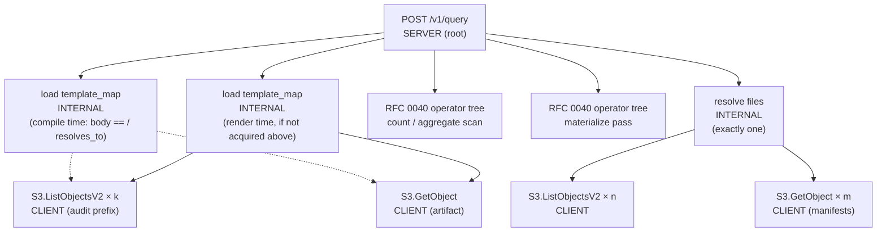

# RFC 0038 — Self-tracing — the OTel traces signal, disciplined to request scope

> **Amendment 2026-09-28 — query-phase and object-store client spans
> (`drafted`).** Adds two `INTERNAL` children of `POST /v1/query`
> (`resolve files`, `load template_map`) and per-request `CLIENT` spans for
> the S3 backend's object-store calls made under them (§3.7). Amends
> RFC0038.1's query arm and adds RFC0038.8–.11 (§5). The accepted text
> below is left as written; each place this amendment changes carries an
> in-place note, and §9 records the history. The frontmatter stays
> `accepted` for the seven original criteria. The amended RFC0038.1 and the
> new scenarios are `drafted` until review confirms they are testable, then
> move through `specified`, `red` and `green` on their own. Refs #853.

> **Status: `accepted` (2026-08-25, maintainer sign-off).** Terminal —
> the completed-backlog batch flip. Where a thesis-gate applies it
> stands passing in `docs/benchmarks.md` §7; elsewhere `validated` is
> vacuous for this surface (RFC 0008 precedent).
>
> **Status: `green` (2026-07-24).** All seven §5 acceptance criteria are
> implemented and pass: RFC0038.1 (request-scope spans + log correlation,
> #614/#615/#616/#617), RFC0038.2 (ingest O(1), #615), RFC0038.3 (spawn-boundary
> context, #617), RFC0038.4 (traces configured via the universal OTel SDK env
> vars — no bespoke Ourios surface — with the `OTEL_TRACES_EXPORTER=none`
> disable mapping tested), RFC0038.5 (loop guard, #614), RFC0038.6 (flush on
> shutdown, #614), RFC0038.7 (canonical GenAI/MCP span attributes with the
> genai-relocation live-check exemption, §3.6; exemption tracked by #622). §3.4
> was amended to lean on the universal OTel env vars instead of a bespoke
> config-file sampler surface (maintainer decision, 2026-07-24).

## 1. Summary

Ourios dogfoods two of the three OpenTelemetry signals about itself — logs
(via the `tracing` → OTLP appender bridge) and metrics — but not **traces**.
The consequence is concrete: its own log records carry no `trace_id` /
`span_id`, so a warning from the MCP handler cannot be correlated to the
request that caused it. This RFC adds the traces signal, fulfilling
`CLAUDE.md` §6.3 ("every RPC is traced"), which `docs/roadmap.md` records as
deliberately deferred at the first milestone. The commitment is **spans on
request-scoped operations only** — one per query, per MCP tool call, per OTLP
`Export` batch, and per compaction sweep — and a hard rule that the per-record
ingest hot path mints **no spans**. Trace correlation on logs follows for
free, because the log-appender bridge stamps the active span's ids onto every
record it emits.

> **Amendment 2026-09-28.** "One per query" now means one query *root*.
> Under it are two `INTERNAL` phase spans and, on the S3 backend, one
> `CLIENT` span per object-store request those phases make (§3.7). The
> ingest hot path still mints no spans.

## 2. Motivation

**Why now.** A telemetry backend whose own logs cannot be trace-correlated is
a credibility gap, and the missing signal was noticed in Ourios's own
dogfooded logs (an rmcp error line with empty `trace_id`/`span_id`). §6.3 has
always required it; the deferral was a scope call, not a design decision.

**Why at this layer.** Traces are a process-global concern owned by
`ourios-telemetry`, the single crate that holds the OTel SDK (RFC 0001 §6.8's
export-architecture split: library crates depend on the API only). Adding a
`SdkTracerProvider` + a `tracing-opentelemetry` layer there is the one place
the change belongs.

**Why the discipline is load-bearing.** Ourios's thesis is query performance,
and its ingest path processes records at high throughput. OpenTelemetry's own
guidance is unambiguous that per-item instrumentation on such a path is wrong:
the Collector coding guidelines say to *"avoid outputting logs per a received
or processed data item … for such high-frequency events instead of logging
consider adding an internal metric,"* and the trace-span guidance restricts
spans to operations that are *significant, have duration, and involve
out-of-process calls* — explicitly **not** short in-process work or
point-in-time occurrences. A span (and its context propagation) per log record
would tax exactly the path the project optimises. So the RFC's central act is
drawing the line, defensibly, between request scope (spans) and record scope
(metrics, which already exist).

## 3. Proposed design

### 3.1 The instrumentation boundary

There is **zero** span instrumentation in the tree today; the change is purely
additive. The boundary:

| Gets exactly one span | Signal | Anchor |
|---|---|---|
| A logs query (`POST /v1/query`) | server span, root | `querier.rs` `handle_query` |
| Each MCP tool call (`query_logs`, `list_templates`, `template_drift`) | span, child of rmcp's own `serve_inner` span | `mcp.rs` `#[tool]` fns |
| One OTLP **Export batch** (gRPC or HTTP) | server span at the shared choke point | `receiver/pipeline.rs` `ingest_bound` |
| One compaction **sweep** | internal span | `compactor.rs` sweep tick |

| Never gets a span (metrics only — already present) |
|---|
| The miner per-record `ingest` / `ingest_mined` / `ingest_structured` |
| The encode-pool per-record `emit_concurrent` worker loop |
| The record-sink per-partition `flush_*` / `drain_*` (async, decoupled from the request) |
| Tenant fan-out's per-`ResourceLogs` loop |

The per-Export-batch span is the correct coarse boundary (OTel's messaging
convention blesses one "Receive/Process" span for a whole batch); it encloses
fan-out + WAL commit + miner hand-off **as a whole**, at zero per-record cost.
Within it, the WAL **group-commit** — the one genuinely I/O-bound,
latency-bearing step (a batched fsync; hazard §3.4 WAL durability-vs-latency) —
gets a single **child** span (`commit wal`, `INTERNAL` kind). It has
duration and a meaningful boundary, which OTel's guidance says makes it a span
rather than an event (an event is a point in time and cannot carry the commit
*latency*, which is the whole reason to instrument it). This is the trace's one
sub-span; the per-record loops below it stay bare.
The record-sink flush is genuinely asynchronous — its work outlives the batch
that produced it — so it correctly has **no** span; we do **not** thread batch
context into the buffer to link flushes back (that is the throughput killer to
avoid). Serialize/encode detail, if ever wanted, is a span **event**, not a
span. Per-record observability stays in the metrics the hot path already emits.

Span boundaries coincide with the timing brackets metrics already measure
(`Instant::now()` … `record_ok/err`/`record_sweep`/WAL-commit timing), so a
span is "the causal, parent-child view over the same points metrics already
measure" — minimal new code.

> **Amendment 2026-09-28 — the query span gets phase children (§3.7).**
> The table above gives a logs query exactly one span. Issue #853 showed
> what that costs: in a 110 s query, the scan was under a second, and about
> 30 s before it and 75 s after it fell under no span at all. The query row
> now reads: one `SERVER` root, plus two `INTERNAL` children for the phases
> that make network calls (file-set resolution, template-map acquisition),
> plus, on the S3 backend only, one `CLIENT` span per object-store HTTP
> request made inside those two phases. The RFC 0040 operator tree is
> unchanged. The MCP, Export-batch and sweep rows are unchanged, and so is
> the "never gets a span" table: none of the new spans is per record. The
> discipline is the same one §2 draws. A phase gets a span because it has
> duration and crosses the process boundary, not because it is a step.

### 3.2 The tracer, in the bootstrap

`ourios-telemetry::init` builds a `SdkTracerProvider` (OTLP `SpanExporter`,
batch processor) alongside the existing meter and logger providers, under the
same "build all fallible steps before installing globals" discipline, and
installs it via `global::set_tracer_provider`. The subscriber registry gains a
`tracing-opentelemetry` `OpenTelemetryLayer` next to the existing appender
bridge and `fmt` layer. Binding `tracing` spans to OTel spans is what makes
the ids exist; the **log-appender bridge then stamps `trace_id`/`span_id` onto
every emitted log record automatically** — no per-call-site change for
correlation.

Two hazards, both flagged for the implementer:

1. **The telemetry-induced-telemetry loop guard must extend to traces.** The
   existing bridge already mutes the exporter's own `tonic`/`hyper`/`h2`/
   `tower`/`opentelemetry*` events; the trace layer needs the **same** filter,
   or the OTLP exporter's transport spans feed back into the exporter.
2. **`TelemetryGuard` must flush the tracer on shutdown** (SIGTERM / `Drop` /
   the subscriber-already-installed teardown branch), so batched spans are not
   lost on exit — the same treatment the logger provider gets.

### 3.3 Span context across the async boundary

The three non-MCP span sites hand work to a detached task — the gRPC/HTTP
receivers `tokio::spawn` the ingest, and the compactor `spawn_blocking`s the
sweep. `tokio::spawn` does **not** propagate span context. Each span is
therefore either opened **inside** the spawned callee (`ingest_bound`, the
sweep body) or the spawned future is `.instrument(Span::current())`-wrapped at
the call site. This RFC prefers opening the span inside the callee (one choke
point, no per-transport duplication). This is the single highest-risk detail
and carries its own acceptance scenario (RFC0038.3).

The MCP tool spans need no such care: rmcp already creates a `serve_inner`
span around dispatch, which — once the trace layer exists — becomes their
parent and starts exporting for free. The querier and OTLP paths have no such
inherited root and get Ourios-created roots.

> **Amendment 2026-09-28 — two more boundaries: the blocking pool and the
> store bridge (§3.7.4).** The query path now crosses two more boundaries
> that drop context. Resolution and template-map acquisition run on
> tokio's blocking pool (`Querier::spawn_blocking_io`, which re-enters the
> caller's span). Each synchronous store call is then spawned onto the
> store's bridge runtime (`block_on_off_runtime` in
> `crates/ourios-parquet/src/store.rs`). §3.7.4 fixes how the parent context
> crosses both. It also records a test-harness gap found in #858. A
> `WithSubscriber`-scoped subscriber is the default dispatcher only on the
> thread that polls the scoped future, so it never sees a span *opened* on a
> blocking-pool thread or a bridge worker. The production subscriber is
> global and does see it. A scoped harness therefore passes a test that
> production would fail, and RFC0038.9 closes that gap.

### 3.4 Configuration and sampling

Sampling is the *second* line of defense (the first is not minting hot-path
spans). The default is **`parentbased_always_on`** — the OTel SDK default, and
the right one here: OTel's guidance says to consider sampling only above
~1000 traces/sec and to *avoid* it at "tens of small traces per second or
lower," which is where Ourios's disciplined span count (per query / MCP call /
Export **batch** / sweep — never per record) sits; and as a self-hosted,
air-gapped binary there is no per-span vendor cost to manage. The one
volume-sensitive span is the per-Export-batch one under heavy ingest, and the
standard `OTEL_TRACES_SAMPLER` / `OTEL_TRACES_SAMPLER_ARG` knob (e.g.
`parentbased_traceidratio` at `0.1`) is the operator's lever for exactly that —
Export batches are independent root traces, so ratio-sampling them loses no
cross-request correlation.

**Lean on the universal OTel SDK env vars — no bespoke Ourios config.** These
env vars are the config contract operators already know; inventing a parallel
Ourios surface for the same thing is drift and a second way to configure one
knob. So Ourios configures traces entirely through the standard SDK vars and
does not couple a unique config to them:

- **Sampler:** Ourios does **not** call `.with_sampler(...)`. The SDK resolves
  the sampler from `OTEL_TRACES_SAMPLER` / `OTEL_TRACES_SAMPLER_ARG` (any
  standard sampler name; default `parentbased_always_on`). Invalid values are
  logged and ignored by the SDK per the env-var spec — Ourios does not add its
  own validation or precedence layer.
- **Disable:** the standard per-signal switch `OTEL_TRACES_EXPORTER=none` turns
  the traces pipeline off, restoring today's logs-plus-metrics posture exactly
  (no tracer, no `trace_id` on logs). `init()` reads it directly — Ourios plays
  the "autoconfigure" role Go's `autoexport` / Java's autoconfigure play, since
  the Rust SDK's manual exporter construction reads no exporter-selector var
  (#618). `TelemetryConfig.traces_enabled` (default on) remains a programmatic
  override on top; `OTEL_SDK_DISABLED=true` disables all three signals together.
- **Endpoint / transport:** `OTEL_EXPORTER_OTLP_ENDPOINT` and the other
  `OTEL_EXPORTER_OTLP_*` vars, already read by the SDK exporter.

There is no `telemetry.traces.*` config-file section and no file-vs-env
precedence: the SDK's own env resolution is authoritative.

### 3.5 Span names and attributes

Names are fixed here (low cardinality, ids as attributes not names) and follow
OTel's span-naming guidance: the `{action} {target}` pattern, no static
namespace prefix in the name (the `ourios.*` dotted style is for *metrics*, not
spans; a span's origin is the `service.name` resource attribute, so an
`ourios.` prefix would be exactly the redundant static text the spec says to
drop). The MCP tool spans adopt the GenAI convention's `execute_tool
{tool.name}` form, so Ourios's own agent-facing tool calls interoperate with
GenAI-aware backends. So the §5 contract is complete:

| Operation | Span name | Kind |
|---|---|---|
| Logs query | `POST /v1/query` (HTTP `{method} {route}`) | `SERVER` |
| MCP tool call | `execute_tool query_logs` / `execute_tool list_templates` / `execute_tool template_drift` (GenAI `execute_tool {tool.name}`) | `INTERNAL` (child of rmcp `serve_inner`) |
| OTLP Export batch | `ingest logs` | `SERVER` |
| WAL group-commit | `commit wal` | `INTERNAL` (child of the batch) |
| Compaction sweep | `sweep partitions` | `INTERNAL` |

Required attributes are low-cardinality and set at span start (so they are
available to sampling): the query and MCP spans carry `ourios.tenant` (the
query span also the standard `http.request.method` / `http.route` /
`http.response.status_code`); the ingest-batch span carries the batch's record
count and the number of distinct tenants it fanned out to (counts, not ids);
the sweep span carries the partitions/files swept. Tenant and other identifiers
are **attributes**, never part of the span name, keeping names low-cardinality.

> **Amendment 2026-09-28 — three more span names (§3.7).** The table above
> gains these rows. Their attributes are in §3.7.2 and §3.7.3.
>
> | Operation | Span name | Kind |
> |---|---|---|
> | File-set resolution (listing + manifest reads) | `resolve files` | `INTERNAL` (child of `POST /v1/query`) |
> | Template-map acquisition (RFC 0033) | `load template_map` | `INTERNAL` (child of `POST /v1/query`) |
> | One object-store HTTP request (S3 backend) | `S3.{Operation}`, e.g. `S3.ListObjectsV2`, `S3.GetObject` | `CLIENT` (child of one of the two above) |
>
> The first two follow this section's `{action} {target}` rule. The
> `CLIENT` names follow the upstream `Service.Operation` rule for AWS-API
> spans, not `{action} {target}`: an upstream convention, where one exists,
> takes precedence over a local pattern (the GenAI `execute_tool` names above
> are the same kind of case).

### 3.6 GenAI/MCP semantic-convention attributes on the tool spans

The MCP tool spans are Ourios's agent-observability surface: an agent driving
the `/mcp` tools should see them exactly as it sees any GenAI tool call. Each
`execute_tool {tool}` span therefore carries the canonical OTel attributes —
`gen_ai.operation.name = execute_tool`, `gen_ai.tool.name` (the tool), and
`mcp.method.name = tools/call`, plus `mcp.session.id` recorded from the
forwarded `mcp-session-id` header so an agent's calls within one session
correlate. The span name follows the GenAI `{gen_ai.operation.name}
{gen_ai.tool.name}` form (`execute_tool query_logs` etc.); because
`#[tracing::instrument]` requires a static name literal, the name and the two
attributes are written separately per tool rather than one derived from the
other, so the MCP-span unit test asserts **both** the name and the attribute
values together — a drift between them fails the test.

These four attributes **moved** out of core semantic-conventions to the separate
[`semantic-conventions-genai`](https://github.com/open-telemetry/semantic-conventions-genai)
registry; in our pinned dependency (semconv v1.42.0) they survive only as
**deprecated** "Moved to …" stubs, which `weaver registry live-check` reports as
`violation`s. weaver cannot take a second registry dependency (`not yet
implemented: Multiple dependencies is not supported yet`), and v1.42.0 still
ships the `gen-ai`/`mcp` model besides — so a second dependency would also
collide on group ids. The live-check job therefore gates on a **filtered**
violation count that exempts *only* the genai-relocation deprecation for the
`gen_ai.*`/`mcp.*` namespaces; every other violation (including any other
deprecation on those keys) still fails. Issue #622 tracks collapsing this into a
single genai dependency once upstream deletes its v1.42 copies.

Driving an MCP call through live-check also surfaces `rmcp`'s **own** internal
instrumentation (bare `session_id` / `peer_info` / `notification` fields on
events at `rmcp` source lines) — non-semconv third-party noise, not Ourios
signal. That is muted at the source, alongside the export-stack loop guard, in
`ourios-telemetry`'s `guarded_env_filter` (`rmcp=off`); Ourios's own
`execute_tool` span (target `ourios_server::mcp`) is unaffected.

### 3.7 Query-phase and object-store client spans (Amendment 2026-09-28)

> This section is new in the 2026-09-28 amendment (`drafted`). It amends
> §3.1, §3.3 and §3.5 as the in-place notes there say, and RFC0038.1 as the
> note in §5 says.

**Why.** Issue #853 traced a 110 s query that returned no rows. The trace
had the `POST /v1/query` root and the RFC 0040 operator tree, and the
operators took under a second in total. About 30 s before the scan and 75 s
after it fell under no span. The first gap was later attributed to
file-set resolution listing the tenant's whole history (fixed in #858); the
second is still unattributed. #858 added and then removed `resolve files`
and `load template_map` spans, because RFC0038.1 fixed a served query at
exactly one span. This section specifies them, plus the object-store
requests beneath them.

The rule for what gets a span is OpenTelemetry's, as in §2. The Tracing API
says child spans "represent sub-operations which require more detailed
observability" and should measure the sub-operation's own timing
([Span](https://opentelemetry.io/docs/specs/otel/trace/api/#span)). The
semantic-convention authoring guide says to define spans for operations
that have duration and involve network calls. It says not to define them
for short in-process operations such as serialization or parsing, or for
point-in-time occurrences, which are events
([defining spans](https://opentelemetry.io/docs/specs/semconv/how-to-write-conventions/#defining-spans)).

#### 3.7.1 The span tree

A query run through MCP never passes through the HTTP handler. Its root is
the `execute_tool query_logs` span (§3.5), which is itself the child of
rmcp's `serve_inner`, and the same children below hang from that span
instead. Wherever this section says `POST /v1/query` as a parent, read
"the query's root span", which is one of those two.

Children of the query's root span, in the order they start:

- **`load template_map`** appears **at most once** per query. It opens
  around the one RFC 0033 acquisition (`template_map::load_or_derive`)
  wherever that runs. At compile time, a `body ==` / `!=` or `resolves_to`
  predicate needs the map. At render time, the materialize pass decoded at
  least one row and the map was not acquired at compile time. The two
  `load template_map` boxes in the diagram are these two alternatives. The
  querier reuses a compile-time acquisition at render time, so no query
  opens both. A query that needs no map (a zero-row query with neither
  predicate, like #853's) opens none.
- **`resolve files`** appears **exactly once** per query that invokes
  file-set resolution, which is every query that compiles. It opens around
  `Querier::resolve_data_urls`: the window-scoped listing and the
  per-partition manifest reads, through to the finished table URLs. When
  resolution finds no live file, the query returns without a scan and
  without operator spans. The span is still emitted, with
  `ourios.file_set.live_files = 0`, since the listing and manifest work it
  covers still ran.
- **The RFC 0040 operator spans** are unchanged: one tree per executed
  physical plan.
- On the **S3 backend**, `resolve files` and `load template_map` each
  parent one `CLIENT` span per HTTP request the phase makes (§3.7.3). On
  the local backend they parent none.

Both `INTERNAL` spans are emitted on **both backends**. On the local
backend, resolution is a `std::fs` walk and not a network call, but the tree
should not change shape with the backend. The phase has real duration on
local disk too, and one span name per phase keeps dashboards
backend-agnostic. That the phase makes network calls is the reason it
qualifies on S3. It is not a condition on emitting the span.

**What does not get a span, and why.** Each of these is in-process work
with no network call, so each stays span-free under the guidance above:

- **DSL parsing and compilation** take microseconds of CPU and are pure
  functions of the request body.
- **Row materialization** is building `LogRow`s from decoded batches
  (`LogRow::from_records`) in memory. The *scan* that feeds it is a
  DataFusion plan, already timed by its RFC 0040 operator tree.
- **Template rendering** (template + params → body, `CLAUDE.md` §3.3)
  runs per row in memory. A span here would also be per row, which §3.1
  forbids.
- **The DataFusion scan's own object-store reads** are covered by the
  RFC 0040 operator spans (`DataSourceExec`). DataFusion issues them from
  its own spawned tasks, which carry no Ourios context, so §3.7.3 emits no
  `CLIENT` span for them (see the scoping rule there).

If one of these is later measured to matter, for example rendering on a
very large result, it gets an **attribute** on `POST /v1/query` or a span
**event**, not a span. Its name goes through the ourios-semconv registry
(§3.7.5). This amendment defines no such name.

With these spans in place, time under `POST /v1/query` that no child
covers can only be in-process work, or scan I/O already inside an operator
span. That is how they would have attributed #853's gaps: the pre-scan gap
directly, as `resolve files` with its request and object counts. The
post-scan gap either as `load template_map` or, if neither phase covers it,
narrowed to the in-process steps above.

#### 3.7.2 The two `INTERNAL` spans

| | `resolve files` | `load template_map` |
|---|---|---|
| Kind | `INTERNAL` | `INTERNAL` |
| Parent | the query's root: `POST /v1/query` (HTTP) or `execute_tool query_logs` (MCP) | same as `resolve files` |
| Opens / ends | around `resolve_data_urls`, from before the first listing to the finished URLs | around `template_map::load_or_derive` |
| Status | `Error` iff the phase returns an error (the query then fails with it); `Unset` otherwise | same |
| Required attributes | `ourios.tenant`; `ourios.file_set.list_request_count`, `ourios.file_set.listed_objects`, `ourios.file_set.manifest_read_count`, `ourios.file_set.live_files` (§3.7.5) | `ourios.tenant`; `ourios.template_map.lookup.outcome` (`hit` / `miss` / `stale` / `torn` / `unknown_version`, the existing RFC 0033 §3.7 attribute and values) |

The four `ourios.file_set.*` counts are set when the phase ends, and are
set on both backends. `list_request_count` counts **store listing calls**
(each `list_*` call on the `Store`, or each directory read on the local
walk). It does not count HTTP pages: one S3 listing call can take several
`ListObjectsV2` requests, and those show as separate `CLIENT` spans. A
`Store` call returning an error still counts, and the counts are set on the
error path too. These are counts of work done, not identifiers, so they
stay low-cardinality attributes as §3.5 requires. Status handling follows
[Recording errors](https://opentelemetry.io/docs/specs/semconv/general/recording-errors/).
A child `CLIENT` span that failed (a `404` on an absent manifest, say)
does not make its phase `Error` if the phase handled that outcome as
normal.

#### 3.7.3 Object-store `CLIENT` spans (S3 backend)

These follow the upstream object-store conventions
([S3](https://opentelemetry.io/docs/specs/semconv/object-stores/s3/),
[AWS SDK](https://opentelemetry.io/docs/specs/semconv/cloud-providers/aws-sdk/)),
which are at `Development` stability.

- **Seam.** They are emitted inside `Store::s3`'s backend, by an
  `object_store` `HttpConnector` passed to
  `AmazonS3Builder::with_http_connector`. It wraps the default
  `ReqwestConnector`'s `HttpService`. This sits below every `Store` method
  and below `Store::object_store()`, so one wrapper sees every HTTP request
  the backend makes: pagination pages and `object_store`'s internal retries
  included. That is what "per request" means here. An `ObjectStore`-level
  wrapper (like `Store::wrap_backend`) would see one call where the wire
  saw several, so it is rejected (§4 note). Requests to anything other than
  the configured bucket endpoint (credential or instance-metadata
  endpoints, if they share the connector) emit no span.
- **Kind.** `CLIENT`, per [SpanKind](https://opentelemetry.io/docs/specs/otel/trace/api/#spankind):
  an outgoing call whose caller waits for the response.
- **Name.** `S3.{Operation}`, the AWS API operation the request
  performs, derived from the HTTP method and query string:
  `GET` with `list-type=2` → `ListObjectsV2`; `GET` → `GetObject`
  (ranged or not); `HEAD` → `HeadObject`; `PUT` with `x-amz-copy-source` →
  `CopyObject`; `PUT` with `partNumber` → `UploadPart`; `PUT` →
  `PutObject` (conditional or not); `POST` with `uploads` →
  `CreateMultipartUpload`; `POST` with `uploadId` →
  `CompleteMultipartUpload`; `POST` with `delete` → `DeleteObjects`;
  `DELETE` with `uploadId` → `AbortMultipartUpload`; `DELETE` →
  `DeleteObject`. A request matching none of these is named `S3` alone
  (the service, per the general "most general low-cardinality string"
  rule) and still gets a span.
- **Attributes.** The AWS SDK span definition as pinned (§3.7.5):
  `rpc.system = "aws-api"` (`Required` there), `rpc.service = "S3"`, and
  `rpc.method` = the bare operation (`GetObject`, `ListObjectsV2`), as that
  definition gives it ("the name of the operation … as returned by the AWS
  SDK", examples `GetItem`, `PutItem`); `aws.s3.bucket`;
  `aws.s3.key` on object operations (the full object key as sent, `Store`
  prefix included; never set on `ListObjectsV2`); `aws.request_id` from
  the `x-amz-request-id` response header when present; `cloud.region` when
  the store is configured with one; `server.address` / `server.port` from
  the endpoint. `url.full` is **not** recorded: the query string can carry
  continuation tokens, and the key already sits in `aws.s3.key`.
  At v1.42.0 the registry deprecates `rpc.system` (renamed to
  `rpc.system.name`) and `rpc.service` (folded into a fully-qualified
  `rpc.method`), while the AWS SDK span definition still requires the old
  shape, and `rpc.system.name` has no `aws-api` member yet. Upstream is
  mid-migration. Ourios follows the span definition, not the half-migrated
  registry (§3.7.5, §7). Upstream names only; nothing here is
  Ourios-defined.
- **Status.** Per [Recording errors](https://opentelemetry.io/docs/specs/semconv/general/recording-errors/):
  `Error` with `error.type` set to the HTTP status code (e.g. `"404"`,
  `"412"`) on any response `>= 400`, or to the transport error class on a
  request that got no response. Otherwise `Unset`. Expected outcomes such as a
  `404` on an absent manifest or a `412` on a lost CAS mark the `CLIENT`
  span `Error`, as the request did fail. The phase above decides whether
  that failed the operation (§3.7.2).
- **S3-compatible, non-AWS endpoints.** Ourios is S3-compatible, not
  AWS-specific (RFC 0019 §9). An S3-compatible endpoint implements the same
  S3 API operations over the same wire protocol, so the spans keep
  `rpc.system = "aws-api"` and the `S3.{Operation}` names. The convention
  marks the value `Required` whatever the backend, because it names the
  wire protocol, not the deployment:
  `aws-api` names the protocol spoken, not who runs the endpoint. The
  endpoint is identified by `server.address`. `cloud.provider` is never set,
  because Ourios cannot know it, and `cloud.region` only echoes
  configuration. This reading is an open question (§7) for when upstream
  says anything specific about S3-compatible stores.
- **Local backend.** `LocalFileSystem` makes no network call, so it emits
  no `CLIENT` span and no other span. Local I/O time stays inside the
  `INTERNAL` phase spans.

**Scoping: only under a query phase, only when sampled.** A `CLIENT` span
is emitted only when the request's context carries **both** a valid,
sampled parent span **and** a query-phase marker. `resolve files` and
`load template_map` install the marker when they open, as a value in the
OTel `Context` they attach. With no marker there is no span. So:

- the ingest record sink's `PUT`s, the compactor's reads and writes, and
  the audit sink emit **no** `CLIENT` spans. RFC0038.1's ingest and sweep
  arms keep their exact span counts, and §3.1's rule that the async
  record-sink flush has no span stands;
- no `CLIENT` span is ever a **root**: an unsampled or context-less request
  makes nothing, instead of starting a fresh trace per request under
  `parentbased_always_on`;
- DataFusion's scan reads carry no marker and no parent, so they emit
  none (§3.7.1).

Extending `CLIENT` spans to the sweep is left open (§7): a sweep over a
large backlog can make thousands of requests, and that trade-off deserves
its own look.

**Always on, not opt-in or separately sampled.** Under that scope the
spans follow the trace's own sampling decision and have no switch of their
own. Under `resolve files` the count is bounded by the query's window.
After #858, a windowed query's resolution makes one delimited listing per Hive level it
visits, one recursive listing per in-window partition it covers whole, and
at most one manifest GET per in-window partition. Acquisition makes the
RFC 0033 audit listing (one request per page of about 1000 keys, plus
retries) and one artifact GET. That count is **not** bounded by the query:
it grows with the tenant's audit history, because the audit listing is
neither windowed nor capped (the open RFC 0033 fork on #853, left
unbounded by RFC 0058 §3.4.3). The spans still record it, since that is
exactly the fan-out an operator needs to see in a #853-style incident.
The fix for its size is to bound the listing, not to hide it from the
trace. §3.4's lever, `OTEL_TRACES_SAMPLER`, is the one volume control, as
for every other span. A bespoke toggle would be the second configuration
surface §3.4 rejects. **Capping how many requests a query may make is not
a tracing concern.** It belongs to RFC 0058 (query resource limits); see
§3.7.6.

**Tenant IDs in keys.** `aws.s3.key` carries tenant-partitioned paths
(`data/tenant_id=<enc>/year=…/….parquet`, `audit/tenant_id=<enc>/…`), so
the tenant ID appears in the attribute. That is acceptable. §3.5 already
puts the tenant on the query span as `ourios.tenant`, so the same
identifier at the same trust level is already in self-telemetry. Ourios's
own traces go to the operator's collector, not to any tenant. The rest of
a key is partition time and a generated file name, never record content.
The key is an attribute, never part of the span name, so names stay
low-cardinality.

#### 3.7.4 Carrying context across the blocking pool and the bridge

1. **Blocking pool.** `resolve files` and `load template_map` are opened
   on the calling async task, and each is closed when its phase's future
   completes. The blocking closure **must** re-enter the span, which
   `spawn_blocking_io` already does, **and must attach the span's OTel
   `Context`** carrying the query-phase marker for the duration of the
   closure. Attaching the `Context` is new.
2. **Store bridge.** `block_on_off_runtime` captures
   `opentelemetry::Context::current()` on the calling thread and runs the
   spawned future under it (`FutureExt::with_context`), so the
   `HttpService` wrapper on a bridge worker sees the parent and the marker.
   `ourios-parquet` needs only the `opentelemetry` **API** for this,
   consistent with RFC 0001 §6.8. The SDK stays in `ourios-telemetry`.
3. **Harness.** A test that asserts on spans opened on either kind of
   thread must use a **process-global** subscriber and tracer provider, in
   its own test binary so the global install does not leak into the shared
   harness. That is the pattern `crates/ourios-server/tests/rfc0038_1_mcp_span.rs`
   already uses for the MCP arm. RFC0038.9 makes this a criterion, with a
   canary proving that the harness sees a span opened inside
   `spawn_blocking`.

#### 3.7.5 Names and the registry

Upstream attributes are used where they exist: `rpc.system`,
`rpc.service`, `rpc.method`, `aws.s3.bucket`, `aws.s3.key`, `aws.request_id`,
`cloud.region`, `server.address`, `server.port`, `error.type`. No upstream
attribute counts listed objects or list requests.
`db.response.returned_rows` counts rows a database operation returns, and
reusing it would collide with that meaning (the RFC 0040 §3.3 argument).
Two existing Ourios attributes are reused: `ourios.tenant` and
`ourios.template_map.lookup.outcome`.

**New names, added to the ourios-semconv registry** (a registry change in
that repo, a `semconv/REGISTRY_REF` bump here, and regenerated
`ourios-semconv` constants; no name written inline in code):

| Name | Type | Unit | Brief |
|---|---|---|---|
| `ourios.file_set.list_request_count` | int | `{request}` | Store listing calls made by one file-set resolution. |
| `ourios.file_set.listed_objects` | int | `{object}` | Objects returned across those listing calls, before window and manifest filtering. |
| `ourios.file_set.manifest_read_count` | int | `{request}` | Manifest reads made by one file-set resolution. |
| `ourios.file_set.live_files` | int | `{file}` | Live data files the resolution hands to the scan. |

They follow the upstream naming rules
([attribute naming](https://opentelemetry.io/docs/specs/semconv/general/naming/)):
lowercase dot-separated namespaces with snake_case components, and the
project namespace `ourios.` first. `ourios.file_set` is a namespace and
never an attribute itself. Counts use the upstream `_count` suffix pattern
(`http.request.resend_count`, `messaging.batch.message_count`), and
returned quantities mirror `db.response.returned_rows`. All are
`stability: development`. Only attributes go to the registry. The span
names `resolve files` and `load template_map` are fixed in this RFC, as
§3.5 fixes every other Ourios span name, and `ourios-semconv` generates
no span constants. The `CLIENT` spans use upstream attributes only.

**Pinning the `Development` upstream conventions.** `semconv/REGISTRY_REF`
pins a tag of the ourios-semconv registry. That registry's manifest pins
the upstream semantic-conventions version it depends on (v1.42.0 today,
§3.6), so the one ref fixes which upstream S3 / AWS-SDK / RPC attribute
set live-check validates against. Weaver runs with `--future` and reports
`stability: development` as improvement-level advice, which passes. What
fails is a violation: an unknown or **deprecated** name. So the
`Development` status is pinned by the ref, not by a live-check exemption.
If an upstream bump renames one of these attributes, as it did
`rpc.system` → `rpc.system.name`, the next ref bump makes live-check fail
until the emitter follows. The bump and the code change then land
together, deliberately. **One narrow exemption is needed.** At the pinned
v1.42.0, the AWS SDK span definition (`span.aws.client`) itself requires
`rpc.system` and uses `rpc.service`, both deprecated in the same release's
registry. Live-check therefore exempts exactly those two names, on
`CLIENT` spans named `S3.*` only, in the same shape as the §3.6 genai
exemption. The exemption is removed by the ref bump that moves the AWS SDK
definition to `rpc.system.name` and a fully-qualified `rpc.method`, and
the emitter changes in that same bump. If the pinned upstream version does not define
an attribute used here, that is a registry-bump prerequisite for
implementation, not a reason to invent a local name.

#### 3.7.6 Relation to #853, RFC 0040 and RFC 0058

- **#853.** These spans cover the two gaps #853 could not attribute.
  #858 fixed the listing cost itself; this amendment makes the next
  such cost visible in a trace instead of only through an OOM kill.
- **RFC 0040.** Unchanged. Operator spans stay children (transitively) of
  `POST /v1/query` and siblings of the phase spans. They are never
  children of `resolve files` or `load template_map`: the scan does not
  run inside either phase. RFC0040.1's "transitively parented to the query
  span" still holds. The scan's own object-store reads remain RFC 0040's
  to represent (§3.7.1).
- **RFC 0058 (query resource limits, drafted in parallel).** No overlap:
  this amendment observes and does not limit. It defines no budget, cap,
  rejection or configuration, and no `CLIENT`-span cap either, because the
  sampler is the only volume control. Any limit on objects listed, requests
  made or memory used is RFC 0058's. The `ourios.file_set.*` counts are
  what such a limit would be measured against, and if RFC 0058 rejects a
  query mid-phase, the phase span ends `Error` under §3.7.2's rule with no
  change here. Whatever RFC 0058 adds to its own error type and signal is
  its own.

## 4. Alternatives considered

**Correlation-only (a tracer that generates ids but exports no spans).** The
appender bridge needs only an active OTel span context to stamp ids, so we
could install the tracer + layer but attach no span exporter — cheaper, and it
fixes the reported symptom. Rejected as a half-step: once the tracer and layer
exist, the exporter is a few lines more and delivers the actual traces signal
§6.3 asks for; shipping ids that point at spans nobody can see is worse
ergonomics than either extreme.

**Full auto-instrumentation (span everything, sample hard).** Wrap every
function / the per-record path in spans and lean on a low sample ratio to
control cost. Rejected: sampling reduces *export* volume but not span
*creation* + context-propagation cost on the hot path, and it muddies traces
with per-record noise that OTel's own guidance says to model as metrics. The
metrics already exist; duplicating them as spans is pure cost.

**Do nothing / keep traces deferred.** Rejected: it leaves §6.3 unmet and the
self-logs uncorrelatable, and the deferral's original rationale (first-
milestone scope) has expired.

**tracing's `trace_id` via a non-OTel mechanism (e.g. a request-id field).**
Rejected: it would not interoperate with the OTel traces signal a user's
Collector expects, and Ourios's whole posture is OTel-native.

> **Amendment 2026-09-28 — alternatives for the query-phase spans (§3.7).**
>
> **Keep one span; put phase timings on it as attributes.** Durations and
> counts per phase on `POST /v1/query` would cost no new span names. But
> the object-store requests could only be summarised, never placed on the
> timeline, and #853's question was *when* the time went. A duration
> attribute also cannot show two phases overlapping, or where a gap sits
> between them. Rejected. The counts are kept, as attributes on the phase
> spans (§3.7.2).
>
> **Span events for phase boundaries.** An event is a point in time and
> carries no duration (§3.1 made the same argument for `commit wal`).
> Rejected.
>
> **`CLIENT` spans from an `ObjectStore` wrapper (`Store::wrap_backend`).**
> Simpler to write, and it would also see the DataFusion scan's reads. But
> an `ObjectStore` call is not a request: one `list` can take several
> `ListObjectsV2` pages, and `object_store` retries inside the call. Spans at
> that layer would be named for S3 operations while timing something else,
> and would carry no `aws.request_id`. Rejected in favour of the
> `HttpConnector` seam (§3.7.3).
>
> **`CLIENT` spans opt-in, or on their own sampling ratio.** Rejected for the
> reasons in §3.7.3. The count follows the query's work (bounded by the window
> under `resolve files`, by audit history under `load template_map` until
> RFC 0033 bounds that listing), the trace
> sampler already governs volume, and a separate knob is the bespoke
> surface §3.4 rejects.
>
> **Emit `CLIENT` spans for every store request, including ingest and
> compaction.** Rejected for now. It would change RFC0038.1's ingest and
> sweep arms, and without a parent the record-sink flush would mint root
> spans. §7 keeps compaction open.

## 5. Acceptance criteria

> **Scenario RFC0038.1 — request-scoped operations open exactly one span, and
> their logs carry the trace context.**
> **Given** a server with traces enabled and an always-on sampler,
> **When** a logs query, an MCP `query_logs` call, a single OTLP `Export`
> batch, and a compaction sweep each execute,
> **Then** each produces the expected span(s): one server span for the query,
> one child-of-`serve_inner` span for the MCP call, one internal span for the
> sweep, and — for the Export — one server batch span with a single
> `commit wal` child span (and no further sub-spans), **And** any log
> record emitted within that operation carries the operation's
> `trace_id`/`span_id` (the correlation the reported gap was about).

> **Amendment 2026-09-28 — RFC0038.1's query arm (§3.7).** For the logs
> query, "one server span" is replaced by the §3.7.1 tree. The server span
> is the root. A query that compiles has **exactly one** `resolve files`
> child (also when it finds no live file and so runs no scan), **at most one**
> `load template_map` child (exactly one iff the query acquires the RFC
> 0033 map), and the RFC 0040 operator spans. On the S3 backend, each phase
> span also parents one `CLIENT` span per object-store HTTP request it
> makes. No other span is produced. The same children appear under the MCP
> `execute_tool query_logs` span when an agent runs a query through MCP;
> that tool span stays the one child of `serve_inner`. The ingest and sweep
> arms, and the log-correlation clause, are unchanged. A log emitted inside
> a phase (on the blocking pool included) carries the query's `trace_id`.
> The test for this arm must satisfy RFC0038.9.

> **Scenario RFC0038.2 — the ingest hot path mints no per-record spans.**
> **Given** traces enabled and an always-on sampler,
> **When** one `Export` batch of N records is ingested,
> **Then** the number of spans produced by the ingest path is bounded by the
> batch/commit structure and is **independent of N** (O(1) in the record
> count, not O(N)) — the miner, encode-pool, and record-sink inner loops
> create none — **And** the ingest-throughput benchmark shows no regression
> attributable to tracing beyond the per-batch span (a documented ceiling).

> **Scenario RFC0038.3 — span context survives the spawn boundary.**
> **Given** the receiver's `tokio::spawn`ed ingest and the compactor's
> `spawn_blocking`ed sweep,
> **When** each runs,
> **Then** the batch/sweep span is present and correctly parented (not
> orphaned), so records/log lines produced under it resolve to the batch's
> trace — verified by asserting the emitted log's `trace_id` equals the span's
> (the `tokio::spawn` context-loss trap is closed).

> **Scenario RFC0038.4 — traces configure through the universal OTel SDK env
> vars, and disabling is the standard per-signal switch.**
> **Given** the standard `OTEL_TRACES_SAMPLER` / `OTEL_TRACES_SAMPLER_ARG` and
> `OTEL_TRACES_EXPORTER` env vars (no bespoke Ourios config surface),
> **When** the sampler is left unset; set via env `parentbased_traceidratio` at
> a ratio; and `OTEL_TRACES_EXPORTER=none`,
> **Then** the default samples (root) traces (`parentbased_always_on`, the SDK
> default — Ourios does **not** override the sampler); the env ratio sampler
> exports the configured fraction (the SDK's own resolution, which Ourios does
> not alter); and `OTEL_TRACES_EXPORTER=none` (honored by `init()`) installs
> **no** tracer and stamps **no** `trace_id`/`span_id` on log
> records — the observable, runtime logs-plus-metrics-only behaviour (no
> throughput change). (Sampler resolution and invalid-value handling are the
> SDK's universal, upstream-tested behaviour; Ourios tests only its own mapping
> of `OTEL_TRACES_EXPORTER=none` to the disable path.)

> **Scenario RFC0038.5 — no telemetry-induced-telemetry loop.**
> **Given** the OTLP span exporter's own transport stack (`tonic`/`hyper`/…)
> emits spans/events,
> **When** traces are enabled,
> **Then** those exporter-internal spans are muted by the same loop-guard
> filter that mutes them for the logs bridge — exporting a span does not
> generate more spans about the export.

> **Scenario RFC0038.6 — spans flush on shutdown.**
> **Given** a batch span processor with buffered spans,
> **When** the server shuts down (SIGTERM / `TelemetryGuard::shutdown` /
> `Drop`),
> **Then** the tracer provider is flushed alongside the logger and meter
> providers, and no acknowledged-window span is dropped on a clean exit.

> **Scenario RFC0038.7 — MCP tool spans carry the canonical GenAI/MCP
> attributes, and only their relocation is exempted from live-check.**
> **Given** the `/mcp` tool surface with traces enabled,
> **When** an agent invokes a tool over an established MCP session,
> **Then** the `execute_tool {tool}` span carries `gen_ai.operation.name =
> execute_tool`, `gen_ai.tool.name` (the invoked tool), `mcp.method.name =
> tools/call`, and `mcp.session.id` (the caller's session), **And**
> `weaver registry live-check` over the emitted telemetry reports no violation
> other than the sanctioned "moved to semantic-conventions-genai" deprecation
> for the `gen_ai.*`/`mcp.*` namespaces — every other drift still fails the gate
> (§3.6; the exemption's removal is tracked by #622).

The following scenarios are added by the 2026-09-28 amendment (§3.7) and
are `drafted`.

> **Scenario RFC0038.8 — a windowed query on S3 produces the §3.7.1 span
> tree.**
> **Given** traces enabled with an always-on sampler, an S3-backed server
> (localstack through testcontainers, as the `s3 integration (localstack)`
> job's RFC 0019 tests use), and a tenant with data files in hour
> partitions both inside and outside a query window, with manifests and
> audit files present,
> **When** a windowed query that matches no rows and whose predicate uses
> neither `body ==` / `!=` nor `resolves_to` runs, then a windowed query
> that returns rows and so acquires the template map, and then a windowed
> query for a tenant with no live file in the window,
> **Then** each trace's root is `POST /v1/query`, with exactly one
> `resolve files` child. The zero-row trace has **no** `load template_map`
> span, and the row-returning trace has exactly one. The no-file trace has
> a `resolve files` span with `ourios.file_set.live_files = 0` and no
> operator span. The phase spans carry
> `ourios.tenant` and the §3.7.2 attributes. `ourios.file_set.listed_objects`
> and `ourios.file_set.live_files` equal the counts the fixture implies.
> `load template_map` carries `ourios.template_map.lookup.outcome`,
> **And** every `CLIENT` span is a child of `resolve files` or `load
> template_map`, has a §3.7.3 name (`S3.ListObjectsV2`, `S3.GetObject`,
> …), `rpc.system = "aws-api"`, `rpc.service = "S3"`, `rpc.method` equal to
> the bare operation, `aws.s3.bucket`,
> `server.address`, and `aws.s3.key` exactly on the object operations. The
> number of `S3.ListObjectsV2` spans under `resolve files` equals
> `ourios.file_set.list_request_count` (the fixture stays under one page per
> listing). Every `CLIENT` span lies within its parent's interval,
> **And** `resolve files` ends before the first RFC 0040 operator span
> starts, and no `CLIENT` span exists for the scan's own reads.
> **And** a `CLIENT` span for a request answered `404` has status `Error`
> and `error.type = "404"`, while its phase span stays `Unset`.

> **Scenario RFC0038.9 — the span harness sees spans opened off the calling
> thread.**
> **Given** the harness used by RFC0038.1's query arm and RFC0038.8,
> **When** a canary test opens a span inside `tokio::task::spawn_blocking`,
> and another inside a future run through the store bridge,
> **Then** the harness exports both spans, correctly parented. This proves
> it installs a process-global subscriber and tracer provider, as
> production does, and not a `WithSubscriber`-scoped one that is blind
> there (§3.3 note, §3.7.4),
> **And** the harness lives in its own test binary so the global install
> does not reach other tests (the `rfc0038_1_mcp_span.rs` pattern).

> **Scenario RFC0038.10 — `CLIENT` spans appear only under a query phase,
> and never as roots.**
> **Given** traces enabled and an S3-backed server,
> **When** an OTLP `Export` batch is ingested and flushed to Parquet, a
> compaction sweep runs, and a query runs whose trace is sampled out
> (`parentbased_traceidratio` at `0.0`),
> **Then** no `CLIENT` span is exported for any of them. The `Export` and
> sweep produce exactly the spans RFC0038.1 already fixes for them, and no
> exported span is a root `CLIENT` span,
> **And** on the local backend, the RFC0038.8 queries produce the same
> `INTERNAL` spans and attributes and zero `CLIENT` spans.

> **Scenario RFC0038.11 — live-check covers the new names.**
> **Given** the `live-check (weaver)` CI job, with the §3.7.5 names
> registered in ourios-semconv at the tag `semconv/REGISTRY_REF` pins,
> **When** the job runs a second, S3-backed server leg (an S3-compatible
> container) and drives a windowed query that returns rows,
> **Then** weaver's report contains a `resolve files` span, a
> `load template_map` span and at least one `S3.*` `CLIENT` span. The job
> **fails** if any of the three is missing, since the S3 leg is
> deterministic, unlike the best-effort MCP handshake,
> **And** the report has no violation for any `ourios.file_set.*` name or
> for the upstream `rpc.*` / `aws.*` / `cloud.region` / `server.*` /
> `error.type` attributes, apart from the §3.7.5 exemption: the deprecated
> `rpc.system` and `rpc.service` on `S3.*` `CLIENT` spans, which the pinned
> `span.aws.client` definition requires. A deprecated-name finding for
> those two names anywhere else, or for any other name, fails the job.
> `stability: development` shows only as advice, and the §3.6 genai
> exemption is not widened to cover any of these names.

## 6. Testing strategy

Mapped to `CLAUDE.md` §6.2:

- **RFC0038.1 / .3 / .5 / .6** — integration tests in `ourios-server` /
  `ourios-ingester` using an in-memory span exporter (SDK test exporter):
  drive a query, an MCP tool call, an `Export`, and a sweep; assert span
  count/name/parentage and that a co-emitted log's `trace_id` matches. A
  dedicated case asserts the spawn-boundary parentage (.3) and the loop-guard
  muting (.5), and a shutdown case asserts the flush (.6).
- **RFC0038.2** — a span-count assertion parameterised over batch size N
  (spans are O(1) in N), plus a `criterion` guard on the ingest
  (`OTLP → WAL`, `WAL → Parquet`) hot-path benchmarks confirming no
  per-record tracing cost — a regression there blocks merge (§6.2 benchmarks).
- **RFC0038.4** — a unit test over Ourios's own mapping: `OTEL_TRACES_EXPORTER`
  → whether the traces pipeline installs (`none` → off; unset / `otlp` / any
  other → on). Sampler resolution (`OTEL_TRACES_SAMPLER`/`_ARG`) is the SDK's
  universal, upstream-tested behaviour that Ourios no longer overrides — there
  is nothing Ourios-specific left to test there.
- **RFC0038.7** — the `ourios-server` MCP-span integration test asserts the
  `gen_ai.*`/`mcp.*` attributes (including the session id) on the emitted span;
  the `live-check` CI job proves emission-time semconv conformance, gating on
  the genai-relocation-filtered violation count so a real drift on any other
  attribute still fails (§3.6).

> **Amendment 2026-09-28 — testing the query-phase spans (§3.7).**
>
> - **RFC0038.1 (query arm) / RFC0038.8** — an `ourios-server` integration
>   test in its own binary, using the RFC0038.9 global harness over an
>   `InMemorySpanExporter`. It asserts the exact span multiset, the
>   parentage, the intervals and the attributes of §3.7.1–§3.7.3. The
>   local-backend variant runs in the normal suite. The S3 variant uses the
>   RFC 0019 localstack harness, is `#[ignore]`d, and joins the
>   `s3 integration (localstack)` job's explicit `--ignored --exact` list.
>   The existing `rfc0038_1_query_emits_one_server_span` asserts the
>   superseded one-span contract. Changing it is the contract change this
>   amendment approves (`CLAUDE.md` §6.2): it is replaced by the amended-arm
>   test in the same change that adds the spans, never weakened first.
> - **RFC0038.9** — the two canary tests (a span opened in `spawn_blocking`,
>   and one opened in a bridged store future) in the same binary. They run
>   in the normal suite, since neither needs a container.
> - **RFC0038.10** — the S3 half joins the localstack list. The local half
>   and the sampled-out case run in the normal suite. The ingest and sweep
>   assertions reuse the existing RFC0038.1 ingest and sweep tests' exact
>   counts and add "no `CLIENT` span".
> - **RFC0038.11** — the `live-check (weaver)` job gains an S3-backed server
>   leg against an S3-compatible container and a report assertion that the
>   three span kinds are present (a hard failure). The existing
>   filtered-violation gate is unchanged.
> - Unit tests for the §3.7.3 request → operation-name mapping, over
>   hand-built `HttpRequest`s, one per row plus the fallback.
> - No `criterion` guard is needed beyond RFC 0040's: the spans are per
>   query and per request, never per record (RFC0038.2's invariant). The
>   `Parquet → query result` benchmark runs on the local backend, where
>   only two spans are added.

## 7. Open questions

- [ ] Should the per-Export-batch span live on `ingest_bound` (single choke
      point, preferred) or on each transport handler (`export`/`handle_logs`)?
      §3.3 prefers the former; confirm no transport-specific attributes are
      lost.
- [ ] `tracing-opentelemetry` version alignment with the pinned
      `opentelemetry` `0.x`; confirm no version-skew with the appender/exporter
      crates before adding the dependency.

**Open questions added by the 2026-09-28 amendment (§3.7).**

- [ ] **`aws-api` for S3-compatible endpoints.** §3.7.3 keeps
      `rpc.system = "aws-api"` and `S3.{Operation}` for any endpoint that
      speaks the S3 API, and identifies the endpoint by `server.address`.
      This matches the convention: the value is `Required` and names the
      wire protocol, and no alternative is defined for non-AWS endpoints.
      Confirm.
- [x] **Which `rpc.*` shape to emit while upstream is mid-migration.** At
      the pinned v1.42.0, the AWS SDK span definition requires the
      deprecated `rpc.system = "aws-api"`, uses the deprecated
      `rpc.service`, and gives `rpc.method` as the bare operation. The
      registry has `rpc.system.name` (no `aws-api` member yet) and defines
      `rpc.method` as fully qualified. Three options:
      (a) **follow the span definition** (`rpc.system`, `rpc.service = S3`,
      bare `rpc.method`) with §3.7.5's narrow live-check exemption;
      (b) the migrated registry shape (`rpc.system.name = "aws-api"` as a
      custom value, `rpc.method = "S3/GetObject"`), which no published AWS
      convention yet describes;
      (c) both, in the spirit of the RPC conventions'
      `OTEL_SEMCONV_STABILITY_OPT_IN=rpc/dup` transition, although upstream
      does not say whether that opt-in covers the AWS SDK conventions.
      **Decided (a)** by the maintainer on 2026-09-28: it is what the
      pinned span convention specifies, and the exemption and the emitter
      both change in the ref bump that migrates it. Revisit at every
      semconv pin bump.
- [ ] **`CLIENT` spans under the compaction sweep.** Out of scope here
      (§3.7.3). A sweep over a large backlog (#807) could make thousands of
      requests. Revisit with a measurement, possibly with a per-sweep cap
      recorded as an attribute.
- [ ] **A per-phase duration metric.** Upstream span definitions usually
      come with a duration metric for the same operation. This amendment
      adds none: `ourios.query.duration` (RFC 0016) covers the whole query,
      and the spans carry the phase timing. If a metric is wanted, it is
      one histogram with a phase attribute, registered through
      ourios-semconv. It must not duplicate any per-query counters RFC 0058
      defines.
- [ ] **Status after the amendment.** This draft keeps the frontmatter
      `accepted` and tracks the amended RFC0038.1 and RFC0038.8–.11 in the
      banner and §9. The alternative is to move the RFC back to
      `specified` until they are `green`. Maintainer's call.
- [ ] **RFC 0040 cross-reference.** RFC 0040 needs no change (§3.7.6).
      Should it still get a one-line in-place note pointing at the phase
      siblings?

**Future work (out of scope here).** A reusable **DataFusion → OTel
instrumentation** — per-operator / per-`ExecutionPlan`-node sub-spans, bridging
DataFusion's existing per-operator `MetricsSet` into the trace — would deepen
the query span into an operator tree. It is a community-shaped component (a
standalone `datafusion-opentelemetry` crate, most naturally offered to
`datafusion-contrib` and announced to the OTel Rust ecosystem), best built for
Ourios's own query span first and then extracted upstream — the same
dogfood-then-give-back path as Ourios's `opentelemetry-rust` contributions.
This RFC's query span (§3.1) is exactly the parent such operator sub-spans
would attach to, so nothing here blocks it and the boundary discipline (query
scope, not ingest) already covers it.

## 8. References

- `CLAUDE.md` §6.3 (Observability of ourselves — "every RPC is traced"); §6.2
  (testing discipline, benchmarks block regressions).
- `docs/roadmap.md` (traces "deliberately deferred").
- RFC 0001 §6.8 (export architecture: API-only library crates, SDK in
  `ourios-telemetry`).
- RFC 0020 (configuration file — where the new `telemetry.*` section lands).
- OpenTelemetry — [defining spans](https://opentelemetry.io/docs/specs/semconv/how-to-write-conventions/#defining-spans)
  (significant, has duration, out-of-process; not for short in-process work);
  [Collector coding guidelines](https://github.com/open-telemetry/opentelemetry-collector/blob/main/docs/coding-guidelines.md)
  (no per-item logging/spans — use a metric); messaging spans (one
  Receive/Process span per batch; links over nested per-item spans);
  [sampling](https://opentelemetry.io/docs/concepts/sampling/) and the
  `OTEL_TRACES_SAMPLER` environment surface.
- Amendment 2026-09-28 (§3.7): issue #853 (the uninstrumented query
  phases); PR #858 (window-scoped listing, the `resolve files` /
  `load template_map` spans it removed, and the scoped-subscriber finding);
  RFC 0019 (S3-compatible backends), RFC 0033 (template-map acquisition),
  RFC 0040 (operator spans), RFC 0058 (query resource limits, drafted in
  parallel); `crates/ourios-parquet/src/store.rs` (`Store::s3`,
  `block_on_off_runtime`); `semconv/REGISTRY_REF`,
  `.github/scripts/fetch-semconv.sh` and the `live-check (weaver)` job in
  `.github/workflows/ci.yml`.
- OpenTelemetry, for the amendment:
  [Tracing API — Span](https://opentelemetry.io/docs/specs/otel/trace/api/#span)
  (child spans for sub-operations that need more detail; low-cardinality
  names, high-cardinality values as attributes);
  [SpanKind](https://opentelemetry.io/docs/specs/otel/trace/api/#spankind)
  (`INTERNAL` in-process, `CLIENT` for an awaited outgoing call);
  [defining spans](https://opentelemetry.io/docs/specs/semconv/how-to-write-conventions/#defining-spans)
  (spans for operations with duration and network calls, not for short
  in-process work or point-in-time occurrences; `{action} {target}`
  names; kind, status, attributes and a companion duration metric);
  [object stores — S3](https://opentelemetry.io/docs/specs/semconv/object-stores/s3/)
  and [AWS SDK](https://opentelemetry.io/docs/specs/semconv/cloud-providers/aws-sdk/)
  (`Development`; `CLIENT`, `Service.Operation`, `rpc.system =
  aws-api`, `rpc.service`, bare `rpc.method`, `aws.s3.bucket`, `aws.s3.key`, `aws.request_id`,
  `cloud.region`);
  [recording errors](https://opentelemetry.io/docs/specs/semconv/general/recording-errors/);
  [attribute naming](https://opentelemetry.io/docs/specs/semconv/general/naming/);
  `db.response.returned_rows` (`Development`, opt-in; not reused, §3.7.5).

## 9. Amendment history

- **2026-09-28 — query-phase and object-store client spans (`drafted`).**
  Adds §3.7: `resolve files` and `load template_map` as `INTERNAL` children
  of `POST /v1/query`, and per-request `S3.{Operation}` `CLIENT` spans
  under them on the S3 backend, scoped to query phases and to sampled
  traces. Four new `ourios.file_set.*` attributes go to the ourios-semconv
  registry; the span names are fixed in the RFC. In-place notes in §3.1, §3.3, §3.5,
  §4, §5 (RFC0038.1's query arm) and §6. New scenarios RFC0038.8–.11 and
  new open questions in §7. Motivated by #853, and by #858's removal of the
  spans RFC0038.1 then forbade. The seven original criteria stay `green`
  and the frontmatter stays `accepted` pending the §7 status question.
  Refs #853.
