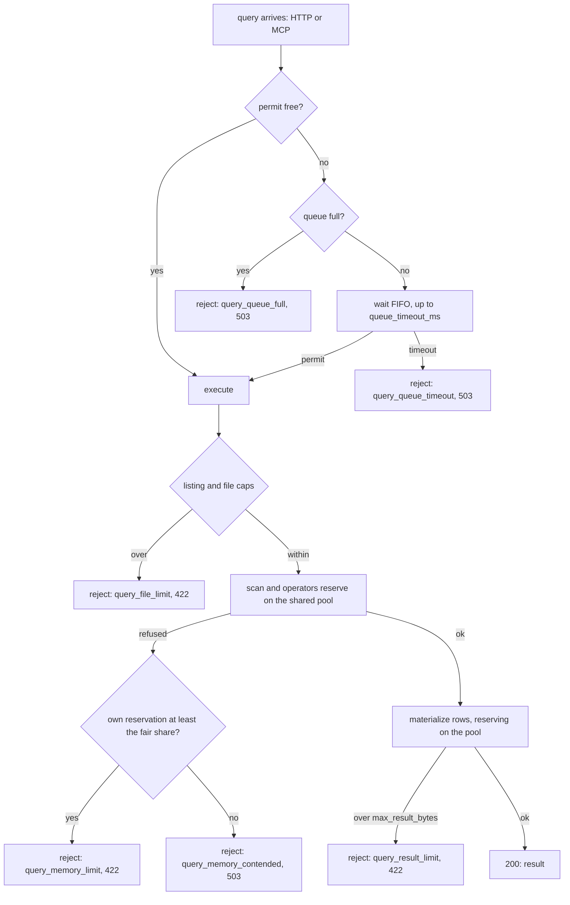

# RFC 0058 — Query resource limits

> **Status note.** `drafted`. The motivation is issue
> [#853](https://github.com/jensholdgaard/ourios/issues/853). Its two main
> causes are already fixed: #857 stops the object-store bridge spawning an OS
> thread per call, and #858 makes the data listing walk only the query
> window's partitions. This RFC is the defence in depth, so that the next
> unbounded query is **rejected** instead of taking the process down. It
> **amends** RFC 0016 §3.5 (error model) and §7 (the row cap becomes
> configuration), RFC 0027's tool-error mapping, and RFC 0020 §3.4's file
> schema, all additively. It touches `CLAUDE.md` §3.6 (object storage is the
> source of truth, via the spill decision in §3.5), §3.7 (multi-tenancy: the
> limits are per process, not per tenant, see §7), hazard #6 (no DataFusion
> text in a rejection) and §6.3 (observability). It leaves RFC 0033's
> audit-listing fork on #853 and RFC 0038's phase spans to their own
> amendments (§3.9).

## 1. Summary

The querier gets a **process-wide memory pool** shared by every query, built
on DataFusion's `RuntimeEnv` pool (a `GreedyMemoryPool`, with spilling
disabled). Its default size is derived from the process's real memory limit
(cgroup v2 `memory.max`, then physical RAM): a share of about 50% when the
querier shares the process with another role, and about 75% when it runs
alone. A **concurrency limit** admits at most `max_concurrent_queries`
queries at once. Further queries wait in a bounded FIFO queue with a timeout.
The pool cannot see most of what #853 measured, so the querier adds its own
bounds: a cap on objects listed and files resolved per query, and a
server-side ceiling on returned rows and bytes. Crossing any limit rejects
that one query with a typed `QueryError`, a specific HTTP status and MCP
error, and an `error.type` value on the existing `ourios.query.duration`
histogram.

## 2. Motivation

### 2.1 The incident

On 0.10.0, one `/v1/query` grew the server's RSS by more than 1 GB and did
not give it back, even for a query that read zero bytes of Parquet (#853).
The node ran both roles in one process under a 1.5 GB memory limit
(`MemoryMax=1536M`). One dashboard panel polling once a minute was enough to
get the process OOM-killed every few minutes. Because the receiver lives in
the same process, **every query OOM also killed ingest**. A read took down
writes.

The two causes #853 found are fixed:

- **Listing linear in tenant age.** `resolve_live_keys` listed the tenant's
  whole `data/` prefix before discarding everything outside the window. #858
  walks the Hive `year=/month=/day=/hour=` levels and lists only the window's
  partitions, on the blocking pool.
- **An OS thread per bridged call.** `block_on_off_runtime` spawned a thread
  for every sync-to-async object-store call. Thousands of short-lived threads
  each touched a glibc arena, and the freed memory was never returned. #857
  polls bridged futures on the bridge runtime instead.

### 2.2 Why that is not enough

Both fixes remove a specific cost. Neither states a limit. Today nothing in
the query path bounds memory at all:

- `exec::session()` (`crates/ourios-querier/src/exec.rs`) builds a
  `SessionContext` from a bare `SessionConfig`. The `RuntimeEnv` behind it
  uses DataFusion's default `UnboundedMemoryPool`, so no reservation ever
  fails.
- There is no concurrency limit. Ten dashboard panels are ten concurrent
  scans.
- The only bound on a result is `MAX_LIMIT = 10_000` rows in
  `crates/ourios-server/src/querier.rs` (RFC 0016 §7), a hard-coded clamp.
  There is no bound on bytes, on files resolved, or on objects listed.

So the next query shape that is expensive in a way nobody predicted (a
high-cardinality `count by`, a wide window over an uncompacted backlog (#807),
a result with very large retained bodies) meets no limit short of the kernel.
The kernel's answer is to kill the whole process, including the receiver
and whatever it had not yet published. `CLAUDE.md` §3.4 keeps acknowledged
data safe across that kill because the WAL replays it, but ingest is down
until the restart, and a restart loop is an outage.

### 2.3 Why at this layer

The protection that matters is the **total** across concurrent queries,
because the OOM killer acts on the process total. A per-query cap alone does
not bound that: four queries each under a generous per-query cap can still
exhaust the process together. The bound therefore lives where all queries
meet: one pool per process, one admission gate per process. Both sit in
`ourios-querier`, beneath both serving surfaces (the RFC 0016 HTTP API and
the RFC 0027 MCP tools), so neither surface can bypass them.

## 3. Proposed design



### 3.1 The process-wide memory pool

**One pool per process.** At querier construction, the server resolves a
pool size (§3.2) and builds one
`Arc<dyn MemoryPool>`:

```rust
TrackConsumersPool::new(GreedyMemoryPool::new(pool_bytes), NonZeroUsize::new(5).unwrap())
```

`Querier` holds it. Every query builds its `SessionContext` from a
`RuntimeEnv` whose memory pool is a thin per-query wrapper,
`QueryMemoryPool`, that delegates every `register`, `grow`, `try_grow` and
`shrink` to the shared pool and additionally counts the bytes this query
holds. The shared pool is the only place a limit is enforced. The wrapper
adds no limit of its own. It exists so that a refusal can say whose
reservation it was (§3.6). `exec::session()` becomes
`exec::session(&QueryRuntime)` and keeps its `collect_statistics = false`
override and its test. The same seam serves `run_query_with`, `run` and
`run_drift` (`drift.rs` calls `exec::session()` too). `collect_records`
rebuilds its session state with `SessionStateBuilder::new_from_existing`,
which keeps the runtime, so the materialize pass reserves on the same pool.

**`GreedyMemoryPool`, not `FairSpillPool`.** `FairSpillPool` caps each
*spillable* consumer at `(pool − unspillable) / num_spillable`. That
division only makes sense when spilling is the relief valve: the operator at
its share spills and carries on. With spilling disabled (§3.5), the fair
share becomes an early rejection while the rest of the pool sits free. A
single `count by` query runs one `GroupedHashAggregateStream` per partition
(`target_partitions` defaults to the CPU count), each a spillable consumer.
On an 8-core node, `FairSpillPool` would refuse that query at one eighth of
the pool even with nothing else running. `GreedyMemoryPool` lets a query
use the whole pool when it is alone and refuses on the process total, which
is the quantity the OOM killer acts on. Fairness *between* queries comes
from the admission gate (§3.3), not from the pool. `TrackConsumersPool`
records the top five consumers for the server-side log of a refusal. It
never reaches the response (§3.6).

**What the pool sees, stated plainly.** A DataFusion pool accounts only
**explicit operator reservations**: hash aggregates, sorts, joins, and
repartition buffers. It does **not** see:

- the listing and manifest reads in `file_set.rs`, including the key
  vectors a listing builds;
- the sync-bridge threads and whatever glibc arena fragmentation they
  leave behind (#857 removes the thread-per-call pattern, not the
  allocator's retention);
- Parquet decode buffers in `DataSourceExec` (the Parquet opener does not
  reserve);
- the batches `execute_plan` collects, and row decode and rendering in
  `collect_records`;
- the RFC 0033 template-map acquisition.

Of #853's measured growth, the pool would have caught almost none: that
query read zero bytes and ran no large operator. §3.4 adds the querier's own
bounds for these, and wherever the querier can size a buffer, it reserves
that buffer on the **same** pool rather than tracking it separately (§3.4.3).
What remains unaccounted is the headroom the §3.2 shares must leave.

### 3.2 The derived default size

The pool size resolves in this order:

1. `querier.limits.memory_pool_bytes`, if set (§3.7). Explicit bytes always
   win.
2. Otherwise `share × effective_limit`, where `share` is
   `querier.limits.memory_pool_fraction` if set, else the default share
   below.

**`effective_limit`** is the smaller of the cgroup memory limit and physical
RAM (`MemTotal` in `/proc/meminfo`). A cgroup limit above physical RAM is
meaningless, and a missing cgroup limit falls back to RAM.

**cgroup v2 (the design target).** The server reads `/proc/self/cgroup`. On
a unified hierarchy that holds a single `0::<path>` line. For the process's
cgroup directory `<mount>/<path>` and **each ancestor up to the mount root**,
the server reads `memory.max` and `memory.high`, ignoring the literal `max`
and absent files, and takes the minimum. Ancestors matter because a limit on
a parent slice applies to every child. `memory.high` counts because the
kernel throttles and reclaims hard above it, and a pool sized past it would
run the process in that regime. The walk covers both deployment shapes:

- **systemd unit**, as in #853: `MemoryMax=1536M` sets `memory.max` on
  `/system.slice/ourios.service`, and `MemoryHigh=` sets `memory.high`.
- **container with a cgroup namespace** (the default for containerd on v2):
  `/proc/self/cgroup` reads `0::/`, and the container's own
  `/sys/fs/cgroup/memory.max` is the limit Kubernetes set from
  `resources.limits.memory`.

**cgroup v1 matters only as a fallback.** Kubernetes has held v1 in
maintenance mode since 1.31, systemd 256 no longer boots on it by default,
and the current releases of the major distributions default to v2. v1 is
still worth one read, because the failure it prevents is the dangerous one:
without it, a v1 container limit is invisible, the size falls through to the
node's physical RAM, and the pool is sized for memory the process cannot
have. So when `/proc/self/cgroup` has no `0::` line but has a `memory`
controller line, the server reads that cgroup's `memory.limit_in_bytes`
under the v1 memory mount. It treats the page-rounded `i64::MAX` sentinel as
unlimited and does not walk ancestors: a v1 container sees its own limit
file, and v1 host hierarchies are out of scope.

**Injectable paths.** All three sources (`/proc/self/cgroup`, the cgroup
mount root, `/proc/meminfo`) are fields of a `MemorySource` struct with a
`MemorySource::system()` constructor, so tests point it at a fixture tree
(RFC0058.4).

**Non-Linux builds** (macOS development) have no derived default. The pool
falls back to a fixed 1 GiB, and startup logs that it did so.

**The default share.** The querier "shares the process" when the resolved
configuration enables the receiver or compaction next to it:

| Process | Default share | At a 1.5 GiB limit |
|---|---|---|
| querier with the receiver or compactor | **0.50** | 768 MiB |
| querier only (the Helm chart's querier Deployment) | **0.75** | 1152 MiB |

§7 keeps both shares open, with the reasoning.

**Validation.** A resolved pool below **32 MiB** is a startup configuration
error: it would reject nearly every non-trivial query, and a hard failure at
boot is kinder than a silent reject-everything server.
`memory_pool_fraction` must lie in `(0, 1]`. An explicit
`memory_pool_bytes` above the detected `effective_limit` is allowed (the
operator may know better, e.g. about a limit the walk cannot see) but logs a
warning naming both figures. Startup logs the resolved size, its source
(`explicit`, `cgroup_v2`, `cgroup_v1`, `meminfo` or `fallback`) and the
share, once.

### 3.3 Admission: the concurrency limit

`Querier` holds a `tokio::sync::Semaphore` with `max_concurrent_queries`
permits (default **4**) and a counter of waiters. Every `Querier` entry
point that does storage IO acquires a permit first: `run`,
`run_query_with`, `run_drift`, and `template_registry` (the RFC 0027
`list_templates` fold). Both serving surfaces therefore share one gate.

- **A free permit** → the query runs immediately.
- **No free permit, fewer than `max_queued_queries` waiters** (default
  **16**) → the query waits. Tokio's semaphore is FIFO-fair, so waiters are
  admitted in arrival order.
- **No free permit, queue full** → rejected at once with
  `QueryError::Overloaded { cause: QueueFull }`, without waiting.
- **Waited `queue_timeout_ms`** (default **10 000**) without a permit →
  rejected with `QueryError::Overloaded { cause: QueueTimeout }`.

The permit is an RAII guard held for the whole engine call and released when
it returns or its future is dropped. A client that disconnects mid-wait or
mid-query frees its slot. The engine call ends before the server serializes
the response. The response's size is bounded by §3.4.3, not by the permit.

The `ourios.query.duration` histogram keeps measuring the full request, so
queue wait is inside it. A rejected query's duration is its time in the
queue.

**No `Retry-After`.** An admission rejection is a `503` without a
`Retry-After` header. The server cannot predict when a permit frees, and a
fixed value would be a guess every client synchronizes on. Clients back off
under their own policy, as RFC 9110 permits for a `503` without the header.

### 3.4 The querier's own bounds

These cover what §3.1's list says the pool cannot see. Checked against the
code as of this draft: apart from the 10 000-row clamp (§3.4.3), **no such
bound exists today**. The `auth.openfga.visibility.max_objects` key is an
unrelated RFC 0048 enumeration bound on authorization objects, which is why
the names below avoid `max_objects`.

#### 3.4.1 Objects listed per query

`max_listed_objects` (default **100 000**) bounds the keys a single query's
file-set resolution may enumerate, counted **incrementally** during the walk:
`window_listing`'s delimited levels and recursive sub-listings on S3, and
the `std::fs` walk on the local backend. It counts every key returned
(Parquet files, `*.parquet.tmp`, manifests, superseded files), because the
cost is the enumeration, whatever the key turns out to be. The walk aborts
at the first listing that takes the running count past the cap. It never
lists everything and checks afterwards, because by then the memory is
spent. This is what bounds the "cost grows with tenant age" shape of #853,
even under a backlog #858's window walk still has to descend into.

#### 3.4.2 Files resolved per query

`max_files` (default **10 000**) bounds the **live** file set after manifest
resolution: the URLs handed to `register_listing_table`. Each resolved file
costs a footer read for per-file schema inference (`SchemaMode::Union`), plus
at least one more footer read in the scan. A query over more files than the
cap is rejected before registration. Both caps reject with
`QueryError::LimitExceeded` (§3.6), naming the cap and telling the user to
narrow the time range.

#### 3.4.3 Rows and bytes returned

- **Rows.** The existing clamp stays a clamp: RFC 0016 §7 caps a query's own
  `limit` at `MAX_LIMIT` and injects `DEFAULT_LIMIT` when it has none. This
  RFC moves both constants into configuration as `max_rows` (default 10 000)
  and `default_rows` (default 1 000), unchanged in behaviour. A clamped
  query is not an error. The response's `count` already tells the client
  what it did not see (RFC 0017).
- **Bytes.** `max_result_bytes` (default **64 MiB**) bounds one query's
  materialized result: the rendered size of its `LogRow`s (body, attributes,
  params), or the group keys of an aggregation result. It is checked as
  batches are decoded and rows rendered, and the query fails as soon as the
  running total crosses the ceiling, never after the whole result is built.
  Exceeding it rejects with `QueryError::LimitExceeded` naming the ceiling
  and suggesting a smaller `limit` or a narrower window. Truncating instead
  would need a "truncated" field in the RFC 0016 response, which is a
  contract change this RFC does not make (§4).
- **Reserved on the pool.** `collect_records` registers a
  `MemoryConsumer("ourios_materialize")` on the query's pool and grows it by
  each collected batch's `get_array_memory_size()` and each rendered row's
  size. Result materialization, the one large buffer the querier sizes
  itself, is thereby inside the process-wide budget: four concurrent
  64 MiB results cost 256 MiB **of the pool**, not 256 MiB on top of it.
  The count and aggregate scans' collected batches are a handful of rows and
  are not worth a reservation.

The template-map acquisition (RFC 0033) stays unaccounted and uncapped here.
Its cost is the audit fold, whose listing is the open fork in §3.9. The
admission gate bounds how many run at once.

### 3.5 Spilling to local disk: off

**Recommendation: disabled.** The runtime is built with
`DiskManagerBuilder` mode `DiskManagerMode::Disabled`. This has to be
explicit, because DataFusion's **default** is `OsTmpDirectory`: bounding
the pool without disabling the disk manager would make spill-capable
operators start writing to `$TMPDIR` silently, the first time this RFC's
pool refuses them.

The trade-off:

- **For spilling:** a grouped aggregation that outgrows the pool would
  finish, slowly, instead of failing.
- **Against, on principle:** `CLAUDE.md` §3.6 makes local disk cache and WAL,
  nothing else. A spill file is scratch, not state, so it does not break the
  letter of §3.6. But it adds a third local-disk consumer to size and
  monitor.
- **Against, in practice:** on a node running both roles, spill competes
  with the WAL for the same volume, which RFC 0053's backpressure bound
  assumes it owns. In Kubernetes, spill counts against `ephemeral-storage`
  and can get the pod evicted. Where `$TMPDIR` is a tmpfs, spill is charged
  to the **memory** cgroup, which makes the OOM this RFC exists to prevent
  more likely, not less.
- **Against, on the workload:** Ourios's query shapes rarely spill. The
  count scan and a bare `count` aggregate hold a few bytes; `limit` does not
  sort; the DSL has no join and no executable `sort` stage. The only
  spill-capable operator in play is a high-cardinality `count by`, and the
  right answer there is a clear rejection telling the user to reduce the
  group cardinality.

A later RFC can add `querier.limits.spill_dir` with its own byte budget if a
real workload needs it (§7).

### 3.6 Failure behaviour

`QueryError` (`#[non_exhaustive]`, `crates/ourios-querier/src/api.rs`) gains
two variants:

```rust
/// A per-query limit refused the query; retrying unchanged will fail again.
LimitExceeded { limit: QueryLimit },
/// The querier is at capacity; the same query may succeed later.
Overloaded { cause: OverloadCause },

pub enum QueryLimit {
    Memory { held: u64, fair_share: u64, pool: u64 },
    ListedObjects { limit: u64 },
    Files { count: u64, limit: u64 },
    ResultBytes { limit: u64 },
}
pub enum OverloadCause {
    QueueFull { max_queued: u32 },
    QueueTimeout { waited_ms: u64 },
    MemoryContended { held: u64, pool: u64 },
}
```

**Classifying a pool refusal.** A reservation refusal surfaces as
`DataFusionError::ResourcesExhausted`, often wrapped (`Context`, `Shared`,
`External`). The executor classifies on `DataFusionError::find_root()`
before the generic `storage_err` mapping, so a refusal is never reported as
`Storage`. The query's `QueryMemoryPool` wrapper knows how much this query
held when refused. The **fair share** is `pool / max_concurrent_queries`.

- Held **at least** the fair share → `LimitExceeded { Memory }`. This query
  is too big on its own merits; retrying will not help.
- Held **less** → `Overloaded { MemoryContended }`. Other queries hold the
  memory, and the same query may succeed once they finish.

**Messages are Ourios-owned (hazard #6).** DataFusion's `ResourcesExhausted`
text names internal operators (`GroupedHashAggregateStream[3]`) and must not
reach a user. `Display` renders only the Ourios message; the engine text and
the top-consumer list go to the server log. Each message names the limit and
the remedy:

| Variant | `Display` (user-facing) |
|---|---|
| `Memory` | the query exceeded the querier's memory budget (it held `{held}` of a `{pool}` pool); narrow the time range, add filters, or group by fewer distinct values |
| `ListedObjects` | the query's time range covers more than `{limit}` stored objects; narrow the time range |
| `Files` | the query's time range covers `{count}` files, over the limit of `{limit}`; narrow the time range |
| `ResultBytes` | the result exceeds `{limit}` bytes; lower the `limit` or narrow the time range |
| `QueueFull` | the querier is at capacity; retry later |
| `QueueTimeout` | the query waited `{waited_ms}` ms for capacity; retry later |
| `MemoryContended` | the querier's memory is in use by other queries; retry later |

**HTTP mapping** (amends RFC 0016 §3.5). The body is the existing
`{ "error": { "kind", "message" } }`, with `message` the `Display` text
above:

| Variant | Status | `kind` |
|---|---|---|
| `LimitExceeded { Memory }` | `422` | `query_memory_limit` |
| `LimitExceeded { ListedObjects \| Files }` | `422` | `query_file_limit` |
| `LimitExceeded { ResultBytes }` | `422` | `query_result_limit` |
| `Overloaded { QueueFull }` | `503` | `query_queue_full` |
| `Overloaded { QueueTimeout }` | `503` | `query_queue_timeout` |
| `Overloaded { MemoryContended }` | `503` | `query_memory_contended` |

`422 Unprocessable Content`, not `400`: the statement is valid, and the
server declines to execute it at this size. `400` stays reserved for
statements that do not parse or validate, so a client can tell "fix the
syntax" from "ask for less". `503` for capacity, because the condition is
the server's and temporary. `413` is wrong for both, since it describes the
request body.

**MCP mapping** (amends RFC 0027's tool-error mapping, RFC0027.3, which
today maps everything but `Forbidden` to `internal_error`). The two classes are split
the same way: `LimitExceeded` → `ErrorData::invalid_request` (the caller
should ask for less), `Overloaded` → `ErrorData::internal_error`. Both carry
the `Display` text as the message and `data: { "kind": "<kind above>" }`, so
an agent can branch on the same token an HTTP client sees. It stays a tool
error, never a transport failure (RFC0027.3).

**Telemetry.** No new error metric. A rejected query is recorded on the
existing `ourios.query.duration` histogram through `record_err`, with
`error.type` set by `query_error_type`, exactly like `invalid_query` and
`storage` today. Its `error.type` value is the `kind` token in the table
above, so logs, responses and metrics share one vocabulary. An admission
rejection is recorded under the query's own `ourios.query.kind` (`logs`,
`drift` or `templates`), since the request had already been parsed. The six `error.type`
values are **proposals for the external `ourios-semconv` registry**, going
through that repository's review with the pin bump. None is hand-written as
a constant in this repository first.

Beyond `error.type`, the pool and the gate need to be visible when nothing
has failed yet (`CLAUDE.md` §6.3). The following are also proposed for the
registry, following RFC 0053 §3.3's `usage`/`limit` pattern:

| Signal | Instrument | Unit | Attributes |
|---|---|---|---|
| `ourios.query.memory.usage` | gauge | `By` | — (bytes reserved on the pool) |
| `ourios.query.memory.limit` | gauge | `By` | — (the resolved pool size) |
| `ourios.query.admission.usage` | gauge (int) | `{query}` | `ourios.query.admission.state` ∈ {`running`, `queued`} |
| `ourios.query.admission.limit` | gauge (int) | `{query}` | `ourios.query.admission.state` ∈ {`running`, `queued`} (the two configured limits) |

These are state gauges, not per-error counters. Whether they ship with this
RFC or a follow-up is open (§7).

### 3.7 Configuration

New keys under `querier.limits.*` in the RFC 0020 file, each a scalar
accepting `${env:NAME}` / `${env:NAME:-default}` substitution
(`crates/ourios-server/src/config/file.rs`), with `deny_unknown_fields`:

```yaml
querier:
  enabled: true
  http_addr: 0.0.0.0:4319
  default_window_secs: 3600
  limits:
    # Unset → derived: share × min(cgroup memory limit, physical RAM) (§3.2).
    memory_pool_bytes: ${env:OURIOS_QUERY_POOL_BYTES:-}
    # Unset → 0.5 when the process also runs the receiver or compactor, else 0.75.
    memory_pool_fraction:
    max_concurrent_queries: 4
    max_queued_queries: 16
    queue_timeout_ms: 10000
    max_listed_objects: 100000
    max_files: 10000
    default_rows: 1000        # was DEFAULT_LIMIT (RFC 0016 §7)
    max_rows: 10000           # was MAX_LIMIT (RFC 0016 §7)
    max_result_bytes: 67108864   # 64 MiB
```

An empty value (including an unset `${env:…:-}`) means "not set": the
derived or built-in default applies, as it does for the existing optional
querier keys. Validation happens once, after resolution:
`max_concurrent_queries ≥ 1`; `max_queued_queries ≥ 0` (0 disables
queueing: at capacity, reject at once); `queue_timeout_ms ≥ 1`; every
count and byte cap `≥ 1`; `default_rows ≤ max_rows`; plus the §3.2 pool
rules. Without `--config`, the same keys resolve from
`OURIOS_QUERIER_LIMITS_<KEY>` environment variables (RFC 0020 §3.2's
env-only mode), e.g. `OURIOS_QUERIER_LIMITS_MAX_CONCURRENT_QUERIES`.

**Helm chart.**

- `querier.limits` in `values.yaml` renders into the querier's config file,
  in camelCase per chart convention (`maxConcurrentQueries`,
  `memoryPoolBytes`, and so on).
- **`querier.resources.limits.memory` sets the cgroup `memory.max` the
  default derives from.** The chart's querier Deployment runs the querier
  alone, so its default pool is 75% of that limit.
- The chart ships `resources: {}`. With no memory limit, the container has
  no `memory.max`, and the pool derives from the **node's** RAM. That is too
  large for a pod that shares the node. The chart does not impose a default
  limit, since sizing is the operator's decision. Instead, `NOTES.txt` warns
  when the querier is enabled without `resources.limits.memory` or an
  explicit `limits.memoryPoolBytes`.
- `resources.requests.memory` does not set `memory.max` and plays no part
  in the derivation.

### 3.8 What this RFC does not change

- The query planner, pruning, and the RFC 0021 `collect_statistics = false`
  override.
- `target_partitions`. A query's peak memory scales with it, and the pool
  bounds the peak regardless.
- Any per-query execution timeout. A long query is bounded here by memory
  and admission, not wall-clock (§7).
- The receiver's own memory, including RFC 0014's 1 GiB sink ceiling
  (`SINK_CEILING_BYTES`), which is not derived from the process limit (§7).

### 3.9 Relation to other open work on #853

- **RFC 0033 (template-map audit listing).** #853's first comment records an
  open fork: on a row-returning query, the §3.3 freshness check lists the
  tenant's whole `audit/` prefix, and the fix is either (a) exact
  set-equality over a frontier-bounded listing or (b) a bounded staleness
  window. Either is an RFC 0033 amendment. **Out of scope here.** This RFC
  neither caps nor accounts that listing; §3.4.1's cap is on the data
  listing only.
- **RFC 0038 (self-tracing).** The phase spans #853 asks for (file-set
  resolution, template-map acquisition) conflict with RFC0038.1's
  exactly-one-span contract for a served query and need their own RFC 0038
  amendment. **Out of scope here.** This RFC adds no span. Whatever RFC 0038
  records for a failed query applies unchanged to the new variants.

## 4. Alternatives considered

**A per-query memory cap only.** Each query gets its own
`GreedyMemoryPool(n)`. This bounds one query, not the process: with no
concurrency limit, N queries each under the cap reach N × cap, and the OOM
killer acts on the sum. It also idles memory: a query running alone cannot
use what the others would have. The maintainer rejected this as the primary
mechanism, and §3.1 derives the fair share from the shared pool instead. A
per-query ceiling layered on the pool remains open (§7).

**`FairSpillPool`.** Rejected in §3.1. Its fairness divides spillable
consumers' memory on the assumption they can spill. With spilling off, it
refuses a lone multi-partition aggregate at `1/target_partitions` of the
pool. If spilling is ever enabled (§3.5), this should be revisited.

**Keep the unbounded pool, rely on the cgroup limit.** The status quo: the
kernel is the limit, and its enforcement is killing the process, receiver
included. #853 is what that looks like.

**Run the querier in its own process.** This is the right deployment for
isolation, and the Helm chart already does it: one Deployment per role. But
the single-binary, both-roles shape is supported (RFC 0020, and #853's node),
and the querier-only process still needs a bound, because OOM-killing every
in-flight query to stop one is the same failure one level down. Process
separation complements this RFC; it does not replace it.

**An RSS watchdog.** Poll the process RSS and cancel queries above a
threshold. It sees everything the pool cannot, but it acts after the fact,
races the allocator, and must guess which query to cancel. #853 also shows
that RSS does not come down after memory is freed (allocator retention), so
a watchdog could keep cancelling after the cause has gone. It may be a
useful complement later. It is not a limit.

**Switch allocator or set `MALLOC_ARENA_MAX`.** This addresses
fragmentation, the "never returns it" half of #853, not the bound. It is
orthogonal and worth measuring separately. Whatever overhead remains
belongs in the §3.2 headroom.

**Enable spilling.** Rejected for now in §3.5.

**Truncate an over-size result instead of rejecting it.** Friendlier for a
dashboard, but the RFC 0016 response has no field that says "truncated by
bytes", and adding one is a contract change. The row clamp already covers
the common case, and `count` exposes it. A byte overflow is rare enough
that a clear rejection is the honest answer.

**Streaming results (NDJSON).** RFC 0016 §7 leaves this open. Streaming
bounds the serialization buffer, not the scan, the aggregation, or the
listing, so it does not remove the need for this RFC.

## 5. Acceptance criteria

The ids are referenced from test code. Every "rejected" below means the HTTP
status, body `kind`, MCP code and `error.type` per §3.6's tables.

> **Scenario RFC0058.1 — A query that outgrows the pool is rejected, and the server keeps serving**
> - **Given** a server running both roles over a seeded tenant, with
>   `memory_pool_bytes` set small enough that a `count by` over a
>   high-cardinality `param(n)` needs more than the pool
> - **When** that query runs alone
> - **Then** it is rejected `422` `query_memory_limit`, and the message names
>   the bytes the query held and the pool size, and contains no DataFusion
>   operator name or engine text
> - **And** a small query issued immediately afterwards succeeds
> - **And** the pool's reserved bytes return to zero after the rejection
> - **And** an OTLP export sent to the same process after the rejection is
>   acknowledged

> **Scenario RFC0058.2 — The pool is shared, and contention is told apart from size**
> - **Given** `max_concurrent_queries = 2` and a pool that fits query A alone
>   and query B alone, but not both together
> - **When** A holds its reservation (a test hook pauses it) and B then
>   reserves past the remainder while holding less than the fair share
> - **Then** B is rejected `503` `query_memory_contended`, not
>   `query_memory_limit`
> - **And** the shared pool's reserved bytes never exceed its size at any
>   point of the run
> - **And** B run again after A finishes succeeds

> **Scenario RFC0058.3 — Spilling is disabled**
> - **Given** `$TMPDIR` pointed at an empty directory and RFC0058.1's pool
> - **When** RFC0058.1's query runs
> - **Then** it is rejected as in RFC0058.1, and the directory is still
>   empty afterwards

> **Scenario RFC0058.4 — The default pool derives from the real memory limit**
> - **Given** a `MemorySource` pointed at fixture trees
> - **When** the pool size resolves
> - **Then** each case gives exactly the stated result:
>   - v2, `memory.max = 1610612736` at the leaf, querier with receiver → 805306368
>   - the same, querier only → 1207959552
>   - v2, a tighter `memory.max` on an ancestor than on the leaf → the ancestor's governs
>   - v2, `memory.high` below `memory.max` → `memory.high` governs
>   - v2, `max` everywhere → `MemTotal` × share
>   - v2, a limit above `MemTotal` → `MemTotal` × share
>   - v1, `memory.limit_in_bytes = 1073741824` → 1 GiB × share
>   - v1, the unlimited sentinel → `MemTotal` × share
>   - an explicit `memory_pool_bytes` → exactly that value, whatever the fixtures say
>   - an explicit `memory_pool_fraction = 0.6` → 0.6 × the derived limit
> - **And** a resolved size below 32 MiB, and a fraction outside `(0, 1]`,
>   are startup configuration errors
> - **And** startup logs the size, its source and the share

> **Scenario RFC0058.5 — Admission waits, then rejects**
> - **Given** `max_concurrent_queries = 1`, `max_queued_queries = 1`,
>   `queue_timeout_ms = 200`, and query A holding the only permit (a gated
>   test store blocks its listing)
> - **When** B arrives, then C arrives while B waits
> - **Then** C is rejected at once `503` `query_queue_full`, and B is
>   rejected `503` `query_queue_timeout` after at least 200 ms
> - **And** neither response carries `Retry-After`
> - **And** with a long timeout instead, B and a later D queued behind it are
>   admitted in arrival order when A finishes
> - **And** a waiting query whose client disconnects leaves the queue, and
>   A's permit is released when A's future is dropped mid-execution
> - **And** the same gate applies to a `query_logs` MCP call, which is
>   refused with the §3.6 MCP code and `data.kind`

> **Scenario RFC0058.6 — The listing and file caps reject over-wide queries early**
> - **Given** the request-counting S3 test store and a tenant with more
>   in-window keys than `max_listed_objects`
> - **When** a query covers them
> - **Then** it is rejected `422` `query_file_limit`, and the walk issued no
>   listing after the one that crossed the cap
> - **And** with `max_listed_objects` above the key count but `max_files`
>   below the live file count, the query is rejected `422`
>   `query_file_limit` before any footer is read
> - **And** the local backend enforces both caps identically

> **Scenario RFC0058.7 — The result ceiling**
> - **Given** a query whose `limit` exceeds `max_rows`
> - **Then** it is clamped to `max_rows` and succeeds, with `count` the full
>   total (the existing RFC 0016 §7 behaviour, now driven by configuration)
> - **And given** rows whose rendered size exceeds `max_result_bytes`
>   within the row limit
> - **Then** the query is rejected `422` `query_result_limit`
> - **And** the same rows under a larger `max_result_bytes` are served
> - **And** during materialization the pool's reserved bytes include the
>   collected batches: a pool smaller than the result but larger than the
>   scan rejects the query as a memory limit instead of serving it

> **Scenario RFC0058.8 — Configuration**
> - **Given** each `querier.limits.*` key set in a config file, once
>   literally and once through `${env:VAR}`
> - **Then** the resolved querier configuration carries the value
> - **And** an unknown key under `querier.limits` is a startup error
> - **And** each §3.7 validation rule rejects its invalid value at startup
> - **And** the Helm chart renders `querier.limits` values into the
>   querier's config file, and `NOTES.txt` carries the warning when
>   `querier.resources.limits.memory` and `limits.memoryPoolBytes` are both
>   unset

> **Scenario RFC0058.9 — Telemetry is `error.type` on the existing histogram**
> - **Given** the in-memory metric exporter
> - **When** each of the six rejections in §3.6 is triggered once, over HTTP
>   and over MCP
> - **Then** each is one `ourios.query.duration` data point carrying that
>   rejection's `error.type` value
> - **And** no other metric name is emitted for the rejection
> - **And** the attribute values pass `weaver registry live-check` against
>   the pinned registry

## 6. Testing strategy

Per `CLAUDE.md` §6.2, mapped to the §5 ids.

- **RFC0058.1, .2, .3, .7 (pool).** Integration tests in `ourios-querier`
  over the local fixture store with an injected small pool. The
  high-cardinality `count by` fixture comes from `ourios-testgen`. RFC0058.2
  needs a deterministic interleaving: a test-only pause hook inside the
  first query's scan, released after the second query's refusal. A
  timing-based race would pass by luck. RFC0058.1's "OTLP still acked" leg is
  an `ourios-server` test with both roles in one process. A `proptest` over
  arbitrary sequences of reserve/release on the shared pool from concurrent
  wrappers asserts that the pool total equals the sum of the wrappers' own
  counts, and never exceeds the size. That invariant is what makes the
  contended-versus-limit split honest.
- **RFC0058.4 (derived default).** Pure unit tests over fixture directories
  in a `tempdir` (`proc/self/cgroup`, a cgroup tree, `proc/meminfo`), one per
  case. No test reads the host's real `/sys`.
- **RFC0058.5 (admission).** `tokio::test` with paused time for the timeout
  legs, and the gated store to hold a permit. The disconnect leg drops the
  request future and asserts the waiter count.
- **RFC0058.6 (caps).** The existing `Call::List` / `Call::ListDelimited`
  request-counting store (`file_set.rs` tests) asserts where the walk stopped.
  The local leg uses a fixture directory tree.
- **RFC0058.7, .8.** The existing `apply_limit` tests keep passing unchanged
  against the constants' new configured defaults. New config-resolution
  tests mirror the `querier.default_window_secs` ones. The chart legs extend
  `deploy/helm/render-tests.sh`, the chart render assertions CI already runs.
- **RFC0058.9.** The in-memory exporter pattern the querier metrics already
  use, plus `weaver registry live-check`.
- **Benchmarks.** The pool wrapper and the permit are on the hot path of
  every query. The `ourios-bench` query benchmarks run before and after, and
  a regression beyond noise blocks, per `CLAUDE.md` §6.2.

Maturity, per `docs/rfcs/README.md`: `green` is RFC0058.1–.9 passing in CI.
This RFC touches no thesis gate in `docs/benchmarks.md` §7. `validated`
additionally requires a replay of #853's shape on a 1.5 GiB node running
both roles: the dashboard poll plus a deliberately over-wide query must
produce rejections and no OOM kill over at least an hour, with RSS staying
under the limit.

## 7. Open questions

- [ ] **The two default shares (0.50 shared, 0.75 querier-only).** The first
      real test is a 1.5 GiB node running both roles, where 0.50 gives a
      768 MiB pool. The reasoning, and where it is weak:
  - The pool bounds *tracked* memory only. The remainder must hold the
    process baseline (#853 measured 110–138 MB idle with ingest running), the
    receiver's sinks, allocator overhead, and everything §3.1 lists as
    unaccounted. At 0.50 that remainder is 768 MiB. At 0.75 on a
    querier-only process it is 384 MiB, which is enough because there is no
    receiver.
  - **The receiver's sink ceiling is not derived.** RFC 0014's hard ceiling
    is a fixed 1 GiB (`SINK_CEILING_BYTES`). On a 1.5 GiB node, a sink near
    its ceiling plus a full 768 MiB pool exceeds the limit. At #853's
    ~1 record/s the sinks flush by age long before that, so 0.50 is safe in
    practice, but it is not a guarantee. Deriving the sink ceiling from the
    same `MemorySource` is the natural follow-up and would be an RFC 0014
    amendment.
  - Is 0.50 too generous for a both-roles node, given that the thing being
    protected is ingest? 0.40 leaves more room for the unaccounted part and
    costs only aggregation headroom.
  - Should the share scale with the limit (a fixed baseline reserve plus a
    fraction), since the baseline is roughly constant and dominates on small
    nodes?
- [ ] **`max_concurrent_queries = 4`.** Enough for a dashboard's panels to
      mostly run rather than queue. The fair share is `pool / 4` (192 MiB at
      768 MiB). Should the default scale with CPUs, or stay fixed?
- [ ] **The cap values.** `max_listed_objects = 100 000`, `max_files =
      10 000`, `max_result_bytes = 64 MiB`, `max_queued_queries = 16`,
      `queue_timeout_ms = 10 000`. None is measured yet. The file cap
      interacts with #807: until compaction reduces file counts, a wide
      window over an uncompacted backlog may hit it legitimately, and the
      message then points at a window the user did not think was wide.
- [ ] **Per-tenant limits.** The pool and the gate are per process, so one
      tenant's dashboards can starve another's (`CLAUDE.md` §3.7). A
      per-tenant share of the permits, or a per-tenant pool slice, is a
      natural second step. Out of scope until the per-process limits exist.
- [ ] **A per-query ceiling on the pool.** §3.1 lets a lone query use the
      whole pool. A per-query cap (for instance, a fixed fraction) would
      stop one large query from turning every concurrent query into
      `query_memory_contended`, at the cost of refusing it while memory sits
      free.
- [ ] **The state gauges in §3.6.** Ship them with this RFC, or leave only
      `error.type` now and add the gauges with a follow-up registry bump?
- [ ] **A wall-clock query timeout.** Not proposed here. A query that is
      cheap in memory but slow still holds a permit indefinitely.
- [ ] **Spilling.** Revisit only if a real `count by` workload keeps hitting
      `query_memory_limit` with a pool that cannot grow (§3.5).

## 8. References

- Issue #853: the incident and its first comment (the RFC 0033 fork, the
  RFC 0038 conflict).
- #857 (bridged futures polled on the bridge runtime), #858 (window-scoped
  listing): the fixes this RFC backs up.
- #807: compaction not reducing file counts, which is what makes the file
  caps bite.
- RFC 0014 §3.4: the receiver's sink ceiling (§7).
- RFC 0016 §3.5, §3.6, §7: the error model, the query metrics, and the row
  default and cap this RFC amends.
- RFC 0017: `count` alongside capped rows.
- RFC 0020 §3.2–§3.4: the configuration file and substitution.
- RFC 0021 §3.2a: the `collect_statistics` override `exec::session` keeps.
- RFC 0027, RFC0027.3: MCP tool errors.
- RFC 0033 §3.3: the template-map freshness listing (out of scope, §3.9).
- RFC 0038, RFC0038.1: one span per served query (out of scope, §3.9).
- RFC 0048: `auth.openfga.visibility.max_objects`, the unrelated key the
  names here avoid.
- RFC 0053 §3.3: the `usage`/`limit` gauge pattern.
- DataFusion 55: `MemoryPool`, `GreedyMemoryPool`, `FairSpillPool`,
  `TrackConsumersPool`, `RuntimeEnvBuilder::with_memory_pool`,
  `DiskManagerMode::Disabled`, `DataFusionError::ResourcesExhausted`.
- Linux cgroup v2 (`memory.max`, `memory.high`, `/proc/self/cgroup`), and
  cgroup v1 `memory.limit_in_bytes`.
- RFC 9110 §15.5.21 (`422`), §15.6.4 (`503`), §10.2.3 (`Retry-After`).
- `CLAUDE.md` §3.4, §3.6, §3.7, §4 hazard #6, §6.2, §6.3.
